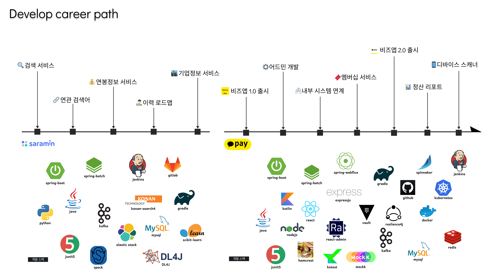

# 🦆 My Profile

<figure style="margin: 0 auto; max-width:200px; width: 80%;">

</figure> 

👨 Deokhwa Kim  
🎂 30 age  
👨‍💻 Backend Engineer  
💳 Kakaopay Corp

 
 

# 🪃 Career Path

 

## 💸카카오페이

<table>
<tr>
<td>
period
</td>
<td>
2020. 06 ~</td>
</tr>
<tr>
<td>
team
</td>
<td>
결제클랜 - 비즈니스 서비스</td>
</tr>
<tr>
<td>
tech
</td>
<td>
spring kotlin java mysql redis kafka github react
</td>
</tr>
</table>

 

### 멤버십 적립 스캐너 개발
- QR체크인 기기를 인증하여 카카오페이 멤버십을 사용하는 서비스
- 인증체계 설계 및 기기관리, 알림서비스 개발

 

### 비즈니스앱 2.0 출시
- 카카오페이와 여신 및 배달앱 매출 장부관리 서비스
- 카카오페이 결제관리 및 알림 서비스
- 매장관리와 카카오페이 멤버십 서비스

 

### 모바일 지역화폐
- 지역화폐 키트 활성화 및 결제관리 기능

 

### 어드민 개발
- 비즈니스앱의 내부관리 어드민 서비스
- 멤버십 심사 관리 프로세스

 

### 비즈니스앱 1.0 출시
- 소상공인 키트 결제관리 및 알림 서비스

 
 

## 🧑‍💼사람인에이치알

<table>
<tr>
<td>
period
</td>
<td>
2017. 01 ~ 2020. 06</td>
</tr>
<tr>
<td>
team
</td>
<td>
사람인LAB - 빅데이터</td>
</tr>
<tr>
<td>
tech
</td>
<td>
spring java python elastic gitlab scikit-learn
</td>
</tr>
</table>

 
 

## 🌐Communities

**Open Source**
- [R2dbc-h2 contributor 참여](https://github.com/r2dbc/r2dbc-h2)  