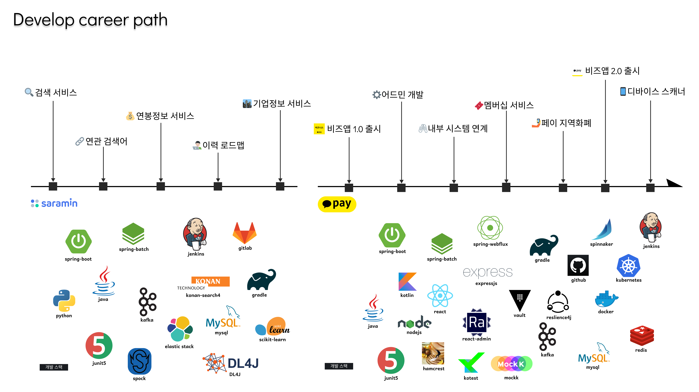

# 🦆 My Profile

<figure style="margin: 0 auto; max-width:350px; width: 80%;">

</figure> 

👨 Deokhwa Kim  
🎂 30 age  
👨‍💻 Backend Engineer  
💳 Kakaopay Corp

 
 

# 🪃 Career Path

 

## 💸카카오페이

<table>
<tr>
<td>
period
</td>
<td>
2020. 06 ~</td>
</tr>
<tr>
<td>
team
</td>
<td>
결제클랜 - 비즈니스 서비스</td>
</tr>
<tr>
<td>
tech
</td>
<td>
spring kotlin java mysql redis kafka github react
</td>
</tr>
</table>

 

### 멤버십 적립 스캐너 개발  
기기에 비즈니스앱을 설치하여 카카오페이 멤버십을 사용하는 서비스  
> - 카카오페이 계정 연동 신규 인증체계 설계 및 개발  
> - 스캐너 기기관리와 신규 알림 서비스 개발   

 

### 비즈니스앱 2.0 출시  
매장의 카카오페이 가맹점, 카드결제, 현금결제, 배달앱등 다양한 매출을 통합적으로 지원하는 장부관리 서비스  
> - 매출정보 결제관리 및 알림 서비스 개발 (kafka, kpusher)  
> - 매장정보와 직원관리 및 카카오페이 멤버십 서비스 설계 개발  
> - circuit breaker와 feign을 통해 계정, 정산, 매장, 결제등 다양한 플랫폼 연동  

 

### 모바일 지역화폐  
카카오페이를 통해 지역화폐를 사용할 수 있도록 지원하는 서비스  
> - 계정 인증 및 결제 키트 활성화 서비스  
> - 오프라인 결제 조회 및 취소 서비스  

 

### 어드민 개발  
비즈니스앱의 VOC 및 QA에 필요한 데이터 관리와 멤버십 심사 지원  
> - react-admin로 프로젝트를 구축하여 생산성 높은 환경 구성  
> - 계정계와 서비스를 express-proxy로 동시 연동한 보안 구성  

 

### 비즈니스앱 1.0 출시  
소상공인을 지원하는 키트 결제관리 및 알림 서비스  
> - spring-batch와 impala를 통한 리포트 배치 서비스 개발  
> - webflux 기반의 react 프로그래밍 개발  

 
 

## 🧑‍💼사람인에이치알  

<table>
<tr>
<td>
period
</td>
<td>
2017. 01 ~ 2020. 06</td>
</tr>
<tr>
<td>
team
</td>
<td>
사람인LAB - 빅데이터</td>
</tr>
<tr>
<td>
tech
</td>
<td>
spring java python elastic konan gitlab scikit-learn  
</td>
</tr>
</table>

 

### 사람인 검색 시스템   
공고 및 기업 검색 API 시스템 개발  
> - 사용자 특성을 이용한 맞춤 검색 랭킹 지원 (지역, 직종, 경력등)  
> - 기업 특성 분류 및 다양한 상세 검색 조건 개발  
> - 브랜드 확대 자동완성 서비스 개발  
> - 로그, 공고등 데이터를 활용한 LSA, Glove, Word2Vec등의 알고리즘 모델링으로 연관검색 서비스 개발  

 

### 연봉정보 서비스  
다양한 연봉정보로 모델링을 통한 40만 기업 연봉정보 추정시스템 개발  
> - KCB, 국민연금, 이력서 데이터를 통한 데이터셋 구성  
> - 기업정보의 특징 및 이용가능 데이터셋 생성 및 필터  
> - 기계학습을 통한 연봉정보 모델링 구현 (XGboost, RandomForest)  
> - 기업 연봉정보를 경력, 연차, 직종별로 추론하는 시스템 개발  

 

### 기업 큐레이션 및 트랜드 분석  
400만 기업의 특성을 활용한 큐레이션 서비스와 채용시장 트렌드 분석  
> - 22가지 특성으로 기업의 큐레이션 태그 산출과 검색 서비스 개발    
> - 뉴스 데이터를 통해 기업의 트랜드 분석  
> - 채용시장 데이터를 수집하여 내부분석 환경구성  

 

### 데이터 분석 서비스  
이직 로드맵 서비스와 검색 tag 다이나믹 프라이싱 구성  
> - 경력사항과 기타 데이터를 활용한 이직 Flow 분석 시스템 개발  
> - 데이터 정규화와 신뢰 가중치를 부여로 서비스 품질 향상  
> - 유저 검색 및 노출 데이터를 분석한 검색 tag 가격 다변화  

 

## 🌐Communities  

**Open Source**  
- [r2dbc-h2 contributor 참여](https://github.com/r2dbc/r2dbc-h2)  

**Open Library**  
- [drcode](https://github.com/renuevo/drcode)  
- [drcode-kotlin](https://github.com/renuevo/drcode_kotlin)  