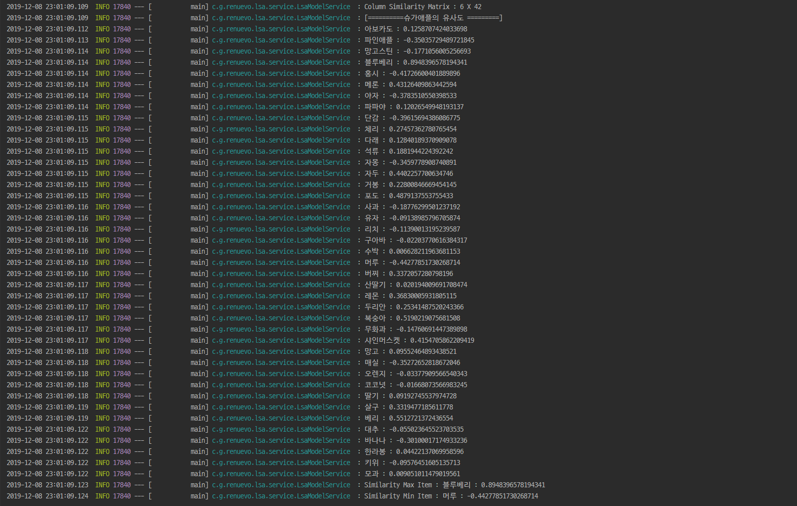

해당 포스팅은 이전에 `2016년 트럼프 대선 당시 사용된 전략`속에 사용된 `IT기술`을 조사한 자료가 있어서 포스팅 하게 되었습니다  

<br/>

***이 포스팅은 확실한 명확한 해답이 아니며 여러 의견을 분석한 자료를 토대로 작성되었습니다***  

## 사건 요약
1. 2014년 심리학 박사 알렉산더 코겐 교수(Dr. Aleksandr `Kogan`)가 ‘this is your digital life’로 부르는 성격 테스트 서비스를 설계했다  
2. 소셜 로그인이 필요했던 앱은 페이스북 정책상 허점을 이용해 사용자 뿐 아니라 가입된 27만 명의 페이스북 친구 네트워크 정보까지 알 수 있었고 이런 식으로 5천만 명의 데이터가 수집됐다  
3. 이를 인지한 페이스북은 데이터 삭제를 요구했으나 와이어드가 확인한 결과 2017년에도 여전히 접속할 수 있다  
4. 이 데이터는 심리학적 프로파일을 만드는 데 사용할 수 있으며 코겐이 소속된 회사 CA가 이를 바탕으로 2016년 대선 트럼프 캠프에 리포트를 제공했다는 의혹이 언론에서 불거졌다  

## 요약
1. 페이스북 소셜 로그인으로 사용자의 정보접근권한을 부여 받음  
2. 권한을 토대로 사용자 및 친구들의 같이 좋아요한 친구등의 데이터까지 수집  
3. 좋아요 페이지 및 특정 거주지역, 종교, 나이등을 토대로 성격 프로파일링 데이터로 사용됨  


<span class='img_caption'>source : [신문과 방송 블로그](http://blog.naver.com/PostView.nhn?blogId=kpfjra_&logNo=221260402045&categoryNo=13&parentCategoryNo=0)</span>


## 프로파일링 데이터를 사용할때 사용된 기술들  

**유저 프로파일링**에 대해서는 `2가지`의 기술을 접목해서 사용하였습니다  

<br/>

**첫 번째**는 [BIG FIVE](https://ko.wikipedia.org/wiki/5%EA%B0%80%EC%A7%80_%EC%84%B1%EA%B2%A9_%ED%8A%B9%EC%84%B1_%EC%9A%94%EC%86%8C)라는 성격유형 검사입니다  
케임브리지 애널리티카는 사용자의 `BIG FIVE`심리검사와 `거주지역, 종교, 나이` 통해 사용자를 샘플링 하였고 `좋아요`를 표시한 포스팅과 관계분석를 분석하여  
32만여명의 데이터를 통해 5000만명의 친구들까지 분석할 수 있는 데이터 셋을 생성할 수 있었습니다     

<br/>

**두 번째**는 [LSA](https://en.wikipedia.org/wiki/Latent_semantic_analysis)라는 알고리즘입니다  

**1. co-occurrence matrix [(동시발생 행렬)](https://en.wikipedia.org/wiki/Co-occurrence_matrix)**   
앞서 말씀드린 데이터셋 구축에서 사용된 `kogan`의 자체 알고리즘을 전문가들은  
`multi step co-occurrence matrix`를 활용한 알고리즘으로 예측 하고 있습니다  
**동시발생 행렬(co-occurrence matrix)이란** 매트릭스 값은 동시 발생하는 부분만을 의미론적으로 같은 패턴을 가지는 그룹을 만들 수 있다는 것으로  
이 과정을 multi-step으로 진행하여 내부 값을 정규화하여 데이터셋을 생성한 것으로 예상 됩니다  


**2. SVD [(차원축소)](https://ko.wikipedia.org/wiki/%ED%8A%B9%EC%9D%B4%EA%B0%92_%EB%B6%84%ED%95%B4)**  
SVD는 차원축소 개념으로 유사한 그룹을 생성될 때 쓰입니다
Netflix에서 추천 서비스에 사용한것으로 유명하며 Cambridge Analytica도 SVD를 사용하여 차원축소하여 프로파일링 했을 확률이 높습니다  
실제 모델 구축자인 kogan과 chancellor은 온전한 SVD를 사용하지 못했다는 말이 있으며  
사용자 간의 좋아요 항목 차로 인해 SVD만으로는 해결하지 못해 자신들만의 자체 알고리즘으로  `multi step co-occurrence matrix`를 사용한 것으로 보입니다  

## LSA 알고리즘 이란?
***(Latent Semantic Analysis : 잠재적의미 분석)***  
**LSA 알고리즘**은 `co-occurrence + SVD`의 조합이라고 할 수 있습니다  

즉 `차원축소`와 `동시발생빈도`를 통해 각 Item들의 유사도를 분석하는 알고리즘 입니다  
LSA는 기본적으로 DTM이나 TF-IDF 행렬에 절단된 SVD(truncated SVD)를 사용하여 차원을 축소시키고, 단어들의 잠재적인 의미를 끌어낸다는 아이디어를 갖고 있습니다  

---

## Train Data Set  

일단 처음으로 `Training Data`를 준비합니다  
이 예제에서는 Rand 함수를 써서 과일 Item을 램덤적으로 생성하게 만들었습니다  

**LsaModelService.java**  
```java
    //Train Data Set Create
    List<Set<String>> trainDataList = dataRepository.createTrainDataSet(45);
```


<span class='img_caption'>LSA Sample Data</span>

<br/>

## Train Data matrix  

다음으로 Data Set을 기반으로 Matrix를 생성합니다  
Matrix는 Row를 데이터 쌍의 개수로 생성하고 N개의 Item을 Column으로 기준을 삼아서 생성합니다  

**LsaModelService.java**  
```java
    //Train Matrix Data Set Create
    Matrix matrix = lsaModelComponent.createMatrix(trainDataList);
```
  
<span class='img_caption'>Matrix Sample</span>
<span class='img_caption'>참고로 해당 이미지는 옆이 짤렸습니다</span>

<br/>

## SVD And Reduction 

SVD(특이값 분해)로 한개의 Matrix를 3개의 Matrix로 분리합니다  
SVD에 대해 자세한 방법을 알고 싶으시면 :point_right: [공돌이의 수학정리노트](https://www.youtube.com/watch?v=cq5qlYtnLoY&feature=emb_logo)

  

Matrix 45 x 41개를 기준으로 SVD 알고리즘을 통해서 각각의 USV의 Matrix를 얻을 수 있습니다  

```text
A = USV
U : Row차원 공간에 Column만개의 단어에 대응되는 점으로 표현  
S : Column차원 공간에 Row만개의 문서에 대응되는 점으로 표현  
V : 차원의 중요도를 나타내는 대각행렬  
```

<br/>

이후 S(대각 행렬)과 U와 V 모두 각가의 대응되는 행과 열을 제거하여 차원을 축소해 줍니다  

   

이걸로 차원까지 축소된 SVD 값을 얻게 되었습니다  
이 Matrix들을 통해서 다음과 같은 조합으로 각 Item들 간의 특이값을 통한 연관성을 알 수 있습니다  

```text
1. ROW - 차원간의 유사도 U X S 행렬의 row 간의 유사도로 계산한다  
2. ROW와 Column - ROW S X V 행렬의 column 간의 유사도로 계산한다  
3. Column - USV의 각 요소가 row와 column간의 유사도이다  
```

<br/>

  
<span class='img_caption'>SVD Matrix</span>

<br/>

## LSA Sample

이후 알고 싶은 각 Matrix를 조합하여 `Cosine 유사도`를 구하면 각각의 데이터의 유사도를 찾아 낼 수 있습니다  

  
<span class='img_caption'>Item Similarity Result</span>  

모든 소스 코드 :point_right: [Renuevo github](https://github.com/renuevo/data-modeling-algorithm)

## 참고 사이트  
[내 마음을 알아주는 검색 LSA](https://sragent.tistory.com/entry/Latent-Semantic-AnalysisLSA)  
[딥 러닝을 이용한 자연어 처리 입문](https://wikidocs.net/24949)  
[Latent Semantic Analysis (LSA) Tutorial](https://technowiki.wordpress.com/2011/08/27/latent-semantic-analysis-lsa-tutorial/)  
[SVD 특이값 분해 (다크 프로그래머 블로그)](https://darkpgmr.tistory.com/106)  