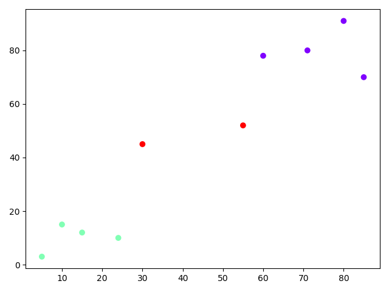
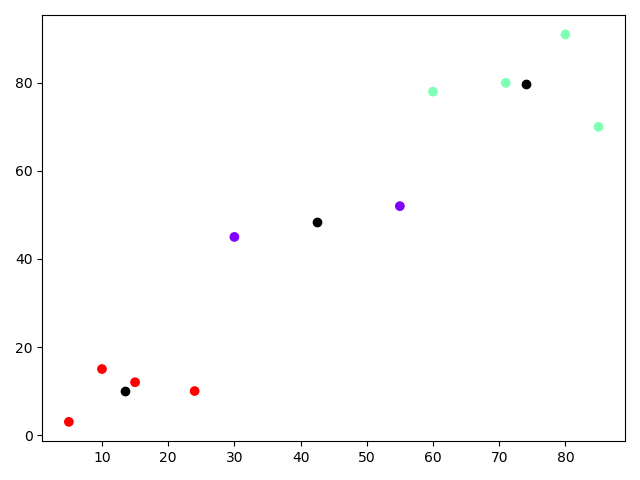
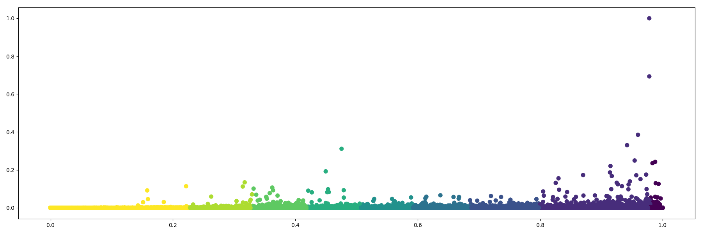

# K-평균 <span class="sub_header">(K-mean cluster)</span>
***데이터를 k개의 클러스터로 묶는 알고리즘***

이 알고리즘을 데이터를 K개의 그룹으로 묶고 싶을때 사용하는 알고리즘 중 하나입니다
방법은 간단합니다


<span class="sub_header">

출처 : [위키피디아](https://ko.wikipedia.org/wiki/K-%ED%8F%89%EA%B7%A0_%EC%95%8C%EA%B3%A0%EB%A6%AC%EC%A6%98) 

</span>


**K-mean 알고리즘 방식** 
> 1. k개의 점을 잡는다  
> 2. 데이터들을 가장 가까운 k개의 점으로 묶는다  
> 3. k점들을 묶은 데이터를 기반으로 중심점으로 이동시킨다  
> 4. 2~3의 과정을 묶음이 변화가 없을 때까지 반복한다  


---

## K-mean Sample

<br/>

#### Scikit-Learn K-mean Code
```python

import matplotlib.pyplot as plt
import numpy as np
from sklearn.cluster import KMeans


X = np.array([[5,3],
     [10,15],
     [15,12],
     [24,10],
     [30,45],
     [85,70],
     [71,80],
     [60,78],
     [55,52],
     [80,91],])


if __name__ == "__main__":
     kmeans = KMeans(n_clusters=3)  //3개의 군집 형성
     kmeans.fit(X)

     print(kmeans.labels_)  //라벨로 군집을 확인 할 수 있습니다

     plt.scatter(X[:,0],X[:,1], c=kmeans.labels_, cmap='rainbow')
     plt.show()


```

<br/>

####실행화면
```
[1 1 1 1 2 0 0 0 2 0]
```



<br/>

#### K점 확인하기
```python

     plt.scatter(kmeans.cluster_centers_[:, 0], kmeans.cluster_centers_[:, 1], color='black')

```
***plt에 다음줄을 추가하여 K점을 확인 할 수 있습니다***

<br/>

####실행화면



---
## 마무리
간단하게 K-mean 알고리즘에 대해 알아 봤습니다  
알고리즘을 보시면 알겠지만 데이터의 차원수와 처음 k 기준점의 생성 위치에 따라 군집이 달라질 수 있습니다  
k 기준점 선정에 대해서 많은 사람들이 관련 연구를 진행하였고 다양한 초기화 기법도 나왔습니다  
해당 포스팅에는 작성하지 않았습니다 혹시 필요하신분은 [위키피디아-K평균 알고리즘](https://ko.wikipedia.org/wiki/K-%ED%8F%89%EA%B7%A0_%EC%95%8C%EA%B3%A0%EB%A6%AC%EC%A6%98)을 참고하시기 바랍니다  

대규모 데이터와 같은 곳에서 사용하면 이쁘고 유용한 결과를 얻을 수 있습니다

  

위 그래프는 실제 제가 회사 데이터를 K평균으로 분류하여 유용한 데이터들입니다  
Scikit-Learn을 사용하면 간편하고 사용해보실 수 있으니 분석하실 데이터의 군집화가 필요하시다면 사용해 보시기 바랍니다  
그리고 만약 군집화를 정해진 개수 없이 하고 싶으시면 Label Propagation 알고리즘을 사용해 보시기 바랍니다