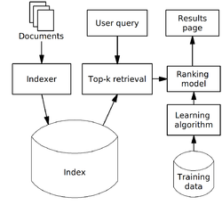
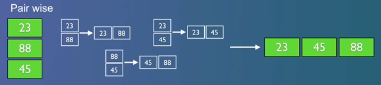
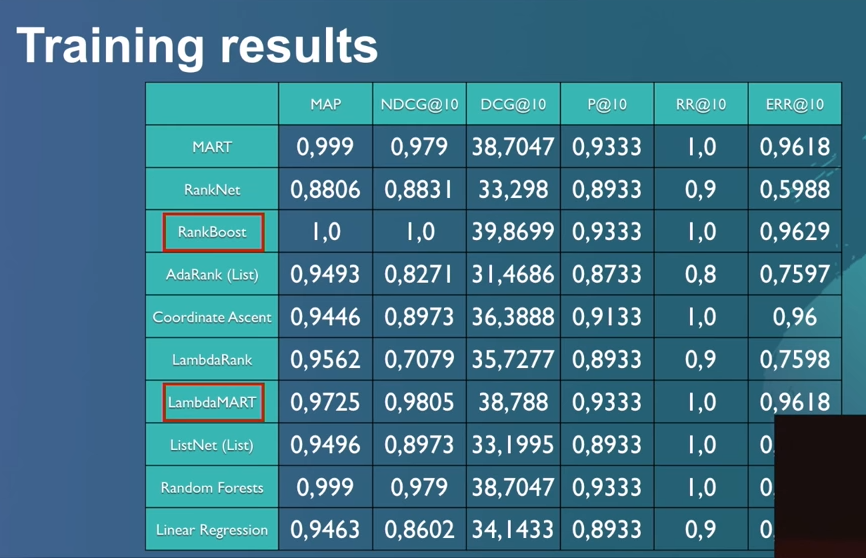

#### 스코어 정렬에 머신러닝 알고리즘을 사용
```textbox

TF-IDF와 BM25가 검색결과를 도출하는 하고 상관없는 문서를 빼는것에 초점을 둔 반면 LTR은 문서의 정렬을 하는 것에 초점을 두고 있다
TF-IDF와 BM25와 같은 알고리즘의 고도화로 불필요한 doc는 제거가 잘되고 있으니, 무엇을 먼저 보여줄것인가로 관점이 이동했다고 보면 된다

```
<br/>


<span class="img_caption">***(LTR Structure)***</span>

---

### LTR: Steps to take
```textbox
1. Create Judgement List
2. Define features for the model
3. Log features during usage
4. Training and testing the model
5. Deploying and using the model
6. Feedback loop
```

<br/>


- **point wise (Regression)** : score를 머신 러닝으로 생성
  

<br/>

- **pair wise (RankNet, LambdaMART)** : 2개씩 비교하며 order를 분류
  

<br/>

- **list wise (List Net)** : 전체리스트를 한번에 분류 
  

<br/>


---

### Judgement List (판단 리스트)

```textbox
grade,keywords,movie
4,Rambo,First Blood     # Exactly Relevant
4,Rambo,Rambo
3,Rambo,Rambo III       # Fairly Relevant
3,Rambo,Rambo First Blood Part II
2,Rambo,Rocky           # Tangentially Relevant
2,Rambo,Cobra
0,Rambo,Bambi           # Not even close...
0,Rambo,First Daughter
```

```textbox
grade,keywords,docId
4,rambo,7555
3,rambo,1370
3,rambo,1369
4,rocky,4241
```

```textbox
# grade (0-4)queryiddocIdtitle
#
# Add your keyword strings below, the feature script will
# Use them to populate your query templates
#
# qid:1: rambo
# qid:2: rocky
# qid:3: bullwinkle
#
# https://sourceforge.net/p/lemur/wiki/RankLib%20File%20Format/
#
#
4qid:1 #7555Rambo
3qid:1 #1370Rambo III
3qid:1 #1369Rambo: First Blood Part II
3qid:1 #1368First Blood
0qid:1 #136278Blood
0qid:1 #102947First Daughter
0qid:1 #13969First Daughter
0qid:1 #61645First Love
0qid:1 #14423First Sunday
0qid:1 #54156First Desires
4qid:2 #1366Rocky
3qid:2 #1246Rocky Balboa
3qid:2 #60375Rocky VI
3qid:2 #1371Rocky III
3qid:2 #1375Rocky V
3qid:2 #1374Rocky IV
0qid:2 #110123Incredible Rocky Mountain Race
0qid:2 #17711The Adventures of Rocky & Bullwinkle
0qid:2 #36685The Rocky Horror Picture Show
4qid:3 #17711The Adventures of Rocky & Bullwinkle
0qid:3 #1246Rocky Balboa
0qid:3 #60375Rocky VI
0qid:3 #1371Rocky III
0qid:3 #1375Rocky V
0qid:3 #1374Rocky IV
```

---

### model 생성

>**1. 모델의 features 정의**
>>검색 결과 및 대상의 따라 다르게 적용 할 수 있습니다  
검색 대상이 공고와 같은 데이터라면 데이터의 단어의 빈도수, 본문 내용, 직종분류등등  만약 검색 대상이 사진이라면 픽셀등으로 일반적인 머신러닝 모델링처럼 구성

>**2. log 데이터를 활용**
>>로그 데이터를 활용하여 query에 대한 클릭 이벤트 같은 데이터로 모델 구성  
  이후 검색시 같은 쿼리의 대한 클릭에 대하여 모델링 활용
  
<br/>


### Search Example

```json
POST tmdb/_search
{
  "query": {
      "sltr": {
              "params": {
                  "keywords": "rambo"
              },
              "model": "my_model", <- 모델 지정
          }
  }
}
```
*해당 쿼리는 model을 돌리면서 전체의 대한 계속적인 비교작업으로 효율이 떨어짐*
  
<br/>


### Rescore Top N

```json
POST tmdb/_search
{
  "query": {
      "match": {
          "_all": "rambo"
      }
  },        
  "rescore": {   # 결과값 도출 이후 상위 1000개의 대해서만 재정렬 진행
      "window_size": 1000,
      "query": {
          "rescore_query": {
              "sltr": {
                  "params": {
                      "keywords": "rambo"
                  },
                  "model": "my_model",
              }
          }
      }
  }
}
```
  
<br/>


### Training results


---

### 관련 참조
https://github.com/o19s/elasticsearch-learning-to-rank  
https://elasticsearch-learning-to-rank.readthedocs.io/en/latest/logging-features.html  
https://www.youtube.com/watch?v=TG7aNLgzIcM  
http://perpetual.tistory.com/67  
http://4four.us/article/2009/10/what-is-learning-to-rank  
https://inyl.github.io/search_engine/2017/02/18/solr_learning_to_rank.html  