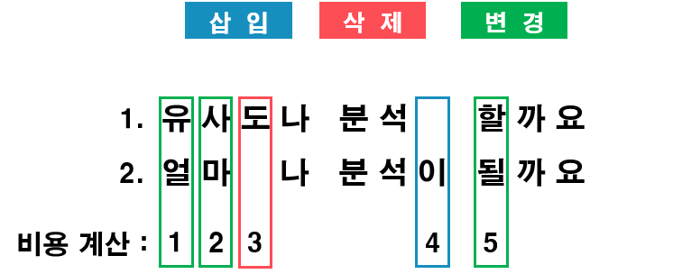

---
title: "[DataScience] Levenshtein Distance (편집거리 알고리즘) - 문장 유사도 분석을 어떻게 하는가?"
date: 2020-04-22
category: 'Data Science'
---  
# Levenshtein Distance (편집거리 알고리즘)
`Levenshtein Distance`는 러시아의 과학자 [블라디미르 리벤슈테인](https://en.wikipedia.org/wiki/Vladimir_Levenshtein)가 고안한 알고리즘  

 

## Levenshtein Distance이 무엇일까?  
오늘날 **언어학/데이터과학** 같이 폭 넓게 사용되고 있으며 **문장과 DNA 유사도 분석같은 곳에 사용되고 있습니다**  
레벤슈타인 알고리즘의 비교 이론은 간단합니다  

 

`두 비교군의 삽입, 변경, 삭제에 대한 비용을 계산합니다`  

 

이렇게 두 개의 비교군을 분석하여 연산되는 비용이 높을 수록 서로 다른겁니다  

 

## Levenshtein Distance 살펴보기 
간단한 예제를 통해 비교에 대한 비용 계산을 살펴보겠습니다  

1. 유사도나 분석 할까요  
2. 얼마나 분석이 될까요  

**이 두개의 문장을 비교해 보겠습니다**  

  
Levenshtein Distance 비교  

   

이렇게 비용을 계산하면 **5만큼 서로 다르다는 계산 결과가 나옵니다**  

 

## Levenshtein Distance 구현하기 
그럼 어떻게 이런 계산을 코드로 구현할까요?  
방법은 텍스트를 한글자씩 비교해가면서 행렬의 형태로 모든 경우의 수를 계산합니다  

