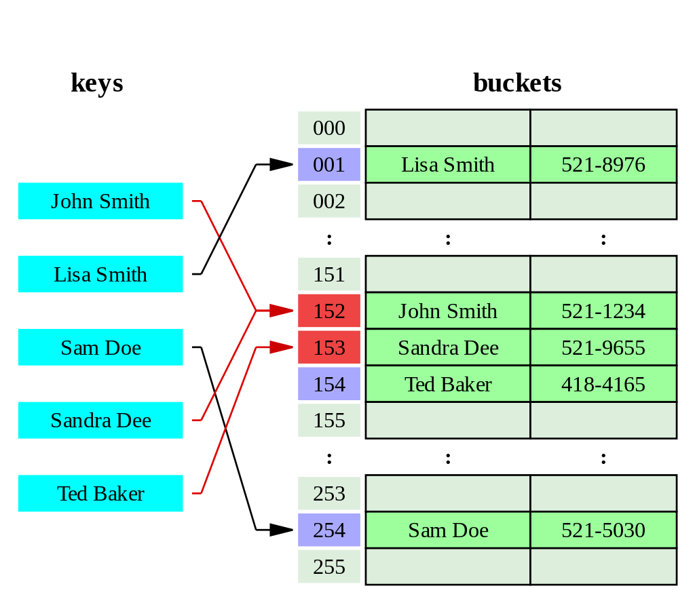

***Map 인터페이스에 대한 내부구조 알아보기***  
약간의 사연이 있어서 😢  
편리하게 사용하고 있는 Map관련 내부구조를 다시 보고 정리하면서 확인해 보려고 합니다


##간단히 비교해 보기

|                 | HashMap       | HashTable             | ConcurrentHashMap |
|-----------------|---------------|-----------------------|-------------------|
| **null able**   | ✔️            | ❌                     | ❌                 |
| **thread-safe** | ❌             | ✔️                    | ✔️                |
| **사용 환경**       | single-thread | ConcurrentHashMap을 사용 | multi-thread      | 

<br/>

##HashMap (해시맵)

###Hash 알고리즘  
먼저 key를 저장하는 hash와 관련된 내용부터 살펴 보겠습니다

```java


//String.java의 JDK11 기준 -> jdk8부터는 큰 차이가 없습니다  
public int hashCode() {
    int h = hash;
    if (h == 0 && value.length > 0) {
        hash = h = isLatin1() ? StringLatin1.hashCode(value)
                              : StringUTF16.hashCode(value);
    }
    return h;
}

//Lation1
public static int hashCode(byte[] value) {
    int h = 0;
    for (byte v : value) {
        h = 31 * h + (v & 0xff);
    }
    return h;
}

//UTF16
public static int hashCode(byte[] value) {
    int h = 0;
    int length = value.length >> 1;
    for (int i = 0; i < length; i++) {
        h = 31 * h + getChar(value, i);
    }
    return h;
}


//해시 보조
static final int hash(Object key) {
    int h;
    return (key == null) ? 0 : (h = key.hashCode()) ^ (h >>> 16);
}

```

기본적으로 key의 hashCode() 값을 기반으로 보조 해시함수로 비트연산자를 활용하여 계산합니다

<br/>

hashCode()의 경우 char를 돌면서 31을 곱하면서 계산합니다  
짝수를 곱할 경우 내부연산에서 곱을 왼쪽으로 이동하는 쉬프트 연산으로 계산하면서  
overflow가 되고 0만 가득차게 될 수 있기 때문에 홀수와 소수인 31을 관행적으로 사용한다고 합니다

<br/>

보조해시 함수를 `test`를 예를 들어 설명하겠습니다
> 1. test의 hashCode()는 3556498이고 bit값은 `1101100100010010010010`입니다
> 2. bit연산으로 (h >>> 16)으로 앞의 6자리만을 남깁니다 `110110`
> 3. 1번과 2번의 값을 xor 연산하여 3556516을 도출합니다 `1101100100010010100100`

보는 것과 같이 hash 함수가 엄청 간단합니다

<br/>

이렇게 간단하게 구현된 해시값이 겹치지 않을까요!? 👉 **물론 겹칠 수 있습니다**  
이전에는 보다 복잡한 보조해시를 썼지만 hashCode() 자체의 알고리즘 개선과 효율성 측면에서 간단하게 계산합니다  
법그래서 별도의 **Separate Chaining(분리 연결법), Open Addressing(개방 주소)**
으로 [해시 충돌](https://renuevo.github.io/data-structure/hashtable/#hash-collision해시-충돌)을 예방합니다

<br/>
<br/>

###HashMap의 내부 구조

저장되는 데이터 구조를 살펴보겠습니다

```java

transient Node<K,V>[] table;
static final float DEFAULT_LOAD_FACTOR = 0.75f;
static final int TREEIFY_THRESHOLD = 8;

static class Node<K,V> implements Map.Entry<K,V> {
    final int hash;
    final K key;
    V value;
    Node<K,V> next;
    
    ......
    
}

//Red-Black Tree
static final class TreeNode<K,V> extends LinkedHashMap.Entry<K,V> {
    TreeNode<K,V> parent;  // red-black tree links
    TreeNode<K,V> left;
    TreeNode<K,V> right;
    TreeNode<K,V> prev;    // needed to unlink next upon deletion
    boolean red;
    TreeNode(int hash, K key, V val, Node<K,V> next) {
        super(hash, key, val, next);
    }
    
    ......
}

```

저장 데이터 단위는 Node로 구성되어 있습니다  
HashMap은 처음 생성될시에 기본적으로 16개의 Node를 저장할 수 있는 배열저장소를 내부에 생성합니다  
이걸 `Buckets`이라고 부릅니다

<br/>  

**HashMap의 내부 운영 방식**

1. **Buckets 사이즈 조절**  
   이전에 알아본 hash값을 기반으로 `(table.length - 1) & hash` buckets내의 자리를 찾고 그곳에 Node를 저장하게 됩니다  
   이후 16개의 DEFAULT\_LOAD\_FACTOR(75%)비율이 차게되면 buckets값을 2배 늘리고 값을 재분배하는 과정을 거칩니다


<span class='img_caption'>Source : [Hash Table Wiki](https://en.wikipedia.org/wiki/Hash_table) </span>

<br/>  

2. **Linked List**  
   Node를 보시면 `Node<K,V> next`를 보실 수 있습니다  
   key의 hash가 같은 Buckets 인덱스에 할당되면 key를 확인하고 다른 값이면 Linked List로 다음 Node로 해당 값을 저장합니다  
   이런 방식을 Separate Chaining(분리 연결법)이라고 합니다 👉 밑에서 자세히 살펴 보겠습니다


<span class='img_caption'>Source : [Hash Table Wiki](https://en.wikipedia.org/wiki/Hash_table) </span>

<br/>

3. **Red-Black Tree**  
   Linked List로 값을 저장하면 탐색 시간이 늘어나기 때문에 값이 늘어나면 효율적이지 않습니다  
   그래서 TREEIFY\_THRESHOLD(8)로 연결이 늘어나게 되면 Node를 `treeifyBin()`를 통해 TreeNode로 변경합니다  
   그리고 효율적인 레드블랙트리 알고리즘으로 저장합니다

👉 [Red-Black Tree (레드블랙 트리) Wiki](https://ko.wikipedia.org/wiki/%EB%A0%88%EB%93%9C-%EB%B8%94%EB%9E%99_%ED%8A%B8%EB%A6%AC)


<br/>

**다음으로 put의 코드를 살펴보겠습니다**

```java

final V putVal(int hash, K key, V value, boolean onlyIfAbsent,
                   boolean evict) {
        Node<K,V>[] tab; Node<K,V> p; int n, i;
  (1)   if ((tab = table) == null || (n = tab.length) == 0) /* highlight-line */  
            n = (tab = resize()).length;
  (2)   if ((p = tab[i = (n - 1) & hash]) == null) /* highlight-line */  
            tab[i] = newNode(hash, key, value, null);
  (3)   else { /* highlight-line */  
            Node<K,V> e; K k;
             /* highlight-range{1-3} */ 
  (4)       if (p.hash == hash &&
                ((k = p.key) == key || (key != null && key.equals(k))))
                e = p;
            /* highlight-range{1-2} */ 
  (5)       else if (p instanceof TreeNode)
                e = ((TreeNode<K,V>)p).putTreeVal(this, tab, hash, key, value);                
            /* highlight-range{1-2} */  
  (6)       else {
                for (int binCount = 0; ; ++binCount) {
                    if ((e = p.next) == null) {
                        p.next = newNode(hash, key, value, null);
                        /* highlight-range{1-2} */ 
  (7)                   if (binCount >= TREEIFY_THRESHOLD - 1) // -1 for 1st
                            treeifyBin(tab, hash);
                        break;
                    }
                    if (e.hash == hash &&
                        ((k = e.key) == key || (key != null && key.equals(k))))
                        break;
                    p = e;
                }
            }
            if (e != null) { // existing mapping for key
                V oldValue = e.value;
                if (!onlyIfAbsent || oldValue == null)
                    e.value = value;
                afterNodeAccess(e);
                return oldValue;
            }
        }
        ++modCount;
       /* highlight-range{1-2} */ 
 (8)    if (++size > threshold)
            resize();
        afterNodeInsertion(evict);
        return null;
    }

```  

생각보다 put의 소스 자체가 복잡해 보입니다  
여기서 주요 핵심부분을 8개로 나눠서 분류하고 하나씩 뜯어보겠습니다

<br/>

<span class='red_font'>(1)</span> `if ((tab = table) == null || (n = tab.length) == 0)`
> 처음 등장하는 조건문입니다  
> buckets이 null 이거나 사이즈가 0인지를 체크하여 resize()를 통해 저장소를 생성합니다

<br/>

<span class='red_font'>(2)</span> `if ((p = tab[i = (n - 1) & hash]) == null)`
> hash의 buckets내의 index를 계산하고 null일 경우 Node를 바로 저장하는 조건문입니다

<br/>

<span class='red_font'>(3)</span> `else`
> hash의 buckets내의 index를 계산하고 null이 아닌 Node가 이미 들어 있는 경우입니다  
> <span class='red_font'>(4), (5), (6)</span>을 통해 put을 진행합니다

<br/>

<span class='red_font'>(4)</span> ` if (p.hash == hash && ((k = p.key) == key || (key != null && key.equals(k))))`
> hash와 key의 값을 비교하여 같은 key의 value 변경인지를 확인합니다  
> 같은 key로 확인되면 단순히 Node의 value값을 변경합니다


<br/>

<span class='red_font'>(5)</span> `else if (p instanceof TreeNode)`
> TreeNode 여부를 확인하여 Tree구조로 put을 진행합니다

<br/>

<span class='red_font'>(6)</span> `else { for (int binCount = 0; ; ++binCount)`
> Node의 Linked List를 탐색하며 put을 진행합니다

<br/>

<span class='red_font'>(7)</span> `if (binCount >= TREEIFY_THRESHOLD - 1) // -1 for 1st`
> <span class='red_font'>(6)</span>의 탐색을 진행하며 binCount가 너무 늘어나 탐색이 느려지는 기준점 TREEIFY\_THRESHOLD(8)에  
> 도달하게 된다면 `treeifyBin(tab, hash);`를 통해서 Node를 TreeNode로 변경합니다

<br/>

<span class='red_font'>(8)</span> `if (++size > threshold)`
> 마지막으로 buckets의 Node사이즈를 확인하여 resize() 여부를 결정합니다

<br/>


이것으로 HashMap의 구조를 알아 봤습니다  
단순히 저장해서 가져다가 쓰기만 했었는데 생각보다 내부에서는 다양한 알고리즘이 반영된걸 알 수 있었습니다

<br/>

다음은 HashMap 이전에 존재했던 HashTable에 대해 알아보겠습니다

--- 

<br/>

##HashTable (해시테이블)  
다음으로 알아볼 것은 HashMap 이전에 사용된 HashTable 입니다  
그래서 기능적으로 많이 닮아 있으므로 다른 부분만을 빠르게 살펴 보겠습니다

**hash 알고리즘**  
hash 알고리즘은 기존 HashMap과 달리 보조 해시 없이 기본 hashCode()를 그대로 사용합니다

```java
int hash = key.hashCode();
```

<br/>

###HashTable의 내부 구조

저장되는 데이터 구조를 살펴보겠습니다

```java

private transient Entry<?,?>[] table;

public Hashtable() {this(11, 0.75f);}

private static class Entry<K,V> implements Map.Entry<K,V> {
     final int hash;
     final K key;
     V value;
     Entry<K,V> next;
     
     ...
}

```

저장 데이터 단위는 Entry로 구성되어 있습니다  
HashTable은 11개 사이즈의 `Buckets`을 생성합니다

<br/>  

**HashTable의 내부 운영 방식**

1. **Buckets 사이즈 조절**
   HashMap과 동일하게 전체의 75%가 차게되면 사이즈를 조정합니다  
   `int newCapacity = (oldCapacity << 1) + 1;` 쉬프트 연산을 통해 기존 사이즈의 두배 +1 의 값으로 재설정 됩니다


<span class='img_caption'>Source : [Hash Table Wiki](https://en.wikipedia.org/wiki/Hash_table) </span>

<br/>  

2. **Linked List**  
   Entry도 Node와 같이 Linked List구조로 `Entry<K,V> next`를 가지고 있는걸 보실 수 있습니다  
   HashMap과 동일하게 충돌방지로 Separate Chaining(분리 연결법)을 사용하는걸 알 수 있습니다


<span class='img_caption'>Source : [Hash Table Wiki](https://en.wikipedia.org/wiki/Hash_table) </span>

<br/>

HashTable은 Liked List의 사이즈의 대해서 효율성을 위해 Tree로 바꾼다거나 하는 로직은 찾아 볼 수 없습니다

<br/>
<br/>

**다음으로 put의 코드를 살펴보겠습니다**

```java

(1) public synchronized V put(K key, V value) { /* highlight-line */  
 
        // Make sure the value is not null
        /* highlight-range{1-3} */ 
(2)     if (value == null) {
            throw new NullPointerException();
        }
      
        // Makes sure the key is not already in the hashtable.
        Entry<?,?> tab[] = table;
(3)     int hash = key.hashCode();  /* highlight-line */  
        int index = (hash & 0x7FFFFFFF) % tab.length;
        @SuppressWarnings("unchecked")
        Entry<K,V> entry = (Entry<K,V>)tab[index];
        
(4)      /* highlight-range{1-2} */  
        for(; entry != null ; entry = entry.next) {
            if ((entry.hash == hash) && entry.key.equals(key)) {
                V old = entry.value;
                entry.value = value;
                return old;
            }
        }
      
(5)     addEntry(hash, key, value, index);  /* highlight-line */  
        return null;
}


private void addEntry(int hash, K key, V value, int index) {
        Entry<?,?> tab[] = table;
        
        /* highlight-range{1-3} */  
(6)     if (count >= threshold) {
            // Rehash the table if the threshold is exceeded
            rehash();
      
            tab = table;
            hash = key.hashCode();
            index = (hash & 0x7FFFFFFF) % tab.length;
        }
      
        // Creates the new entry.
        @SuppressWarnings("unchecked")
        Entry<K,V> e = (Entry<K,V>) tab[index];
        tab[index] = new Entry<>(hash, key, value, e);
        count++;
        modCount++;
}


```

HashMap과 다르게 간단한 put 구조를 가지고 있습니다

<br/>

<span class='red_font'>(1)</span> `public synchronized V put(K key, V value)`
> synchronized를 통해 thread-safe하게 설계된걸 확인 할 수 있습니다  
> 이후 HashMap에서는 사용상에 thread-safe 구성이 효율적이지 않다고 삭제되었습니다

<br/>

<span class='red_font'>(2)</span> ` if (value == null) { throw new NullPointerException(); }`
> HashMap과 다르게 value에 null을 허용하지 않습니다

<br/>

<span class='red_font'>(3)</span> `int hash = key.hashCode();`
> key값도 보조해시 없이 그냥 hashCode()를 사용합니다  
> 때문제 key에서도 null이 허용되지 않습니다 (HashMap에서는 보조해시에서 null일 경우 0을 할당합니다)

<br/>

<span class='red_font'>(4)</span> `for(; entry != null ; entry = entry.next) `
> Entry를 탐색하며 값변경만을 적용합니다


<br/>

<span class='red_font'>(5)</span> `addEntry(hash, key, value, index);`
> addEntry를 통해 신규 Entry를 buckets에 삽입합니다

<br/>

<span class='red_font'>(6)</span> `if (count >= threshold)`
> buckets의 Entry사이즈를 확인하여 rehash() 여부를 결정합니다


<br/>

--- 

<br/>

##ConcurrentHashMap(병행해시맵)
다음으로 알아볼 것은 ConcurrentHashMap 입니다  
ConcurrentHashMap의 핵심은 Unsafe를 사용한 <span class='red_font'>thread-safe</span>를 지원한다는 것입니다

`Unsafe`는 java 내부의 존재하는 thread-safe를 위해 존재하는 class입니다  
내부적으로 AutoInteger, ConcurrentHashMap등의 thread-safe에 사용되며 일반적으로는 생성해서 사용하지 못하도록  
`private static final Unsafe theUnsafe = new Unsafe();`로 생성자를 막아 두었습니다  
해당 포스트에서는 다루지 않습니다 👉 [java-unsafe](https://www.baeldung.com/java-unsafe)

```java

private static final Unsafe U = Unsafe.getUnsafe();

 static {
     ......
     
     ABASE = U.arrayBaseOffset(Node[].class);
     int scale = U.arrayIndexScale(Node[].class);
     ASHIFT = 31 - Integer.numberOfLeadingZeros(scale);
     
     ......
}

static final <K,V> Node<K,V> tabAt(Node<K,V>[] tab, int i) {
  return (Node<K,V>)U.getObjectAcquire(tab, ((long)i << ASHIFT) + ABASE);
}

static final <K,V> boolean casTabAt(Node<K,V>[] tab, int i,
                                  Node<K,V> c, Node<K,V> v) {
  return U.compareAndSetObject(tab, ((long)i << ASHIFT) + ABASE, c, v);
}

```

ConcurrentHashMap는 내부의 thread-safe를 위해 조회와 삽입을 하는 메소드가 구현되어 있습니다  
tabAt는 thread-safe하게 조회를 하고 casTabAt는 thread-safe하게 삽입시 성공여부에 따라 `true`, `false`를 return 합니다

해당 메소드들을 통해 알 수 있듯이 HashTable과 다르게 각각의 Node의 대한 thread-safe 기술을 활용하여  
HashMap의 thread-safe가 안되는 문제를 효율적으로 제어하였습니다


<br/>
<br/>

**다음으로 put의 코드를 살펴보겠습니다**

```java

 static final int MOVED     = -1; // hash for forwarding nodes

 //보조 해시
 static final int spread(int h) {
     return (h ^ (h >>> 16)) & HASH_BITS;
 }
 
 //resize를 위한 Node
  static final class ForwardingNode<K,V> extends Node<K,V> {
     final Node<K,V>[] nextTable;
     ForwardingNode(Node<K,V>[] tab) {
         super(MOVED, null, null);
         this.nextTable = tab;
     }
     
     ......
  }


final V putVal(K key, V value, boolean onlyIfAbsent) {
 (1)    if (key == null || value == null) throw new NullPointerException();      /* highlight-line */ 
 (2)    int hash = spread(key.hashCode());  /* highlight-line */ 
        int binCount = 0;
 (3)    for (Node<K,V>[] tab = table;;) {  /* highlight-line */ 
            Node<K,V> f; int n, i, fh; K fk; V fv;
            
 (4)        /* highlight-range{1-2} */ 
            if (tab == null || (n = tab.length) == 0)
                tab = initTable();
                
 (5)        /* highlight-range{1-3} */    
            else if ((f = tabAt(tab, i = (n - 1) & hash)) == null) {
                if (casTabAt(tab, i, null, new Node<K,V>(hash, key, value)))
                    break;                   // no lock when adding to empty bin
            }
            
 (6)        /* highlight-range{1-2} */ 
            else if ((fh = f.hash) == MOVED)
                tab = helpTransfer(tab, f);
            else if (onlyIfAbsent // check first node without acquiring lock
                     && fh == hash
                     && ((fk = f.key) == key || (fk != null && key.equals(fk)))
                     && (fv = f.val) != null)
                return fv;
            else {
                V oldVal = null;
 (7)           synchronized (f) { /* highlight-line */ 
                    if (tabAt(tab, i) == f) {
                        if (fh >= 0) {
                            binCount = 1;
                            for (Node<K,V> e = f;; ++binCount) {
                                K ek;
                                if (e.hash == hash &&
                                    ((ek = e.key) == key ||
                                     (ek != null && key.equals(ek)))) {
                                    oldVal = e.val;
                                    if (!onlyIfAbsent)
                                        e.val = value;
                                    break;
                                }
                                Node<K,V> pred = e;
                                if ((e = e.next) == null) {
                                    pred.next = new Node<K,V>(hash, key, value);
                                    break;
                                }
                            }
                        }
                        else if (f instanceof TreeBin) {
                            Node<K,V> p;
                            binCount = 2;
                            if ((p = ((TreeBin<K,V>)f).putTreeVal(hash, key,
                                                           value)) != null) {
                                oldVal = p.val;
                                if (!onlyIfAbsent)
                                    p.val = value;
                            }
                        }
                        else if (f instanceof ReservationNode)
                            throw new IllegalStateException("Recursive update");
                    }
                }
                if (binCount != 0) {
                    if (binCount >= TREEIFY_THRESHOLD)
                        treeifyBin(tab, i);
                    if (oldVal != null)
                        return oldVal;
                    break;
                }
            }
        }
 (8)    addCount(1L, binCount);  /* highlight-line */ 
        return null;
    }

```

<br/>

<span class='red_font'>(1)</span> `if (key == null || value == null) throw new NullPointerException(); `
> HashMap과 다르게 null을 허용하지 않습니다

<br/>

<span class='red_font'>(2)</span> `int hash = spread(key.hashCode());`
> spread()는 보조해시 함수로 이전에 본 HashMap과 크게 다르지 않습니다

<br/>

<span class='red_font'>(3)</span> `for (Node<K,V>[] tab = table;;)`
> ConcurrentHashMap는 값 삽입시 thread끼리 충돌이 날수 있기 때문에 재시도를 위해 for문으로 시작됩니다

<br/>

<span class='red_font'>(4)</span> ` if (tab == null || (n = tab.length) == 0)`
> buckets의 초기 세팅이 필요한경우 buckets을 생성합니다  
> HashMap과 똑같인 DEFAULT\_CAPACITY = 16의 LOAD\_FACTOR = 0.75f을 기본값으로 가집니다

<br/>

<span class='red_font'>(5)</span> ` else if ((f = tabAt(tab, i = (n - 1) & hash)) == null)`
> `tabAt`을 통해 Node가 처음 삽입되는 값인지 확인합니다  
> `casTabAt`통해 값을 삽입하며 삽입시점에 buckets의 값이 null인지 확인하여 성공시 true, 실패시 false를 리턴합니다   
> 삽입에 실패하면 <span class='red_font'>(3)</span> for문으로 돌아가 재시도 합니다

<br/>

<span class='red_font'>(6)</span> `else if ((fh = f.hash) == MOVED)`
> hash값이 MOVED(-1)인지를 검사합니다(ForwardingNode의 hash값)  
> helpTransfer()를 실행하여 리사이즈를 진행합니다


<br/>

<span class='red_font'>(7)</span> `synchronized (f)`
> 탐색시에 synchronized를 사용하여 해당 Node의 LinkedList, Tree의 대한 thread-safe를 보장합니다


<span class='red_font'>(8)</span> `addCount(1L, binCount);`
> size를 측정하여 transfer로 리사이즈를 진행하고 ForwardingNode을 할당합니다

<br/>


---

<br/>

## Hash Collision(해시 충돌)

다음은 해시들의 충돌을 해결하는 방법을 2가지 제시합니다

<br/>

###Separate Chaining(분리 연결법)
가장 널리 사용되고 있는 분리 연결법입니다

  
<span class='img_caption'>Source : [Hash Table Wiki](https://en.wikipedia.org/wiki/Hash_table) </span>

새로 값을 삽입할때 해시의 buckets의 같은 공간에 이미 값이 존재하고  
해당 key와 value의 값이 삽입되야하는 값과 다르다면 값을 저장하는 모델(Node)을 만들고  
Linked List, Tree등의 자료구조를 사용하여 연결하여 삽입하는 방법입니다

<br/>

###Open Addressing(개방 주소법)
개방 주소법은 buckets을 그대로 사용합니다  
  
<span class='img_caption'>Source : [Hash Table Wiki](https://en.wikipedia.org/wiki/Hash_table) </span>

해시의 buckets의 같은 공간에 이미 값이 존재한다면 새로운 주소로 buckets에 값을 할당하는 방식입니다  
새로운 주소를 구하는 방법은 여러 방식이 존재합니다
> 1. 고정폭을 가지고 삽입하고 값을 이동시킨다
> 2. 처음엔 1만큰 이후에 2^2, 3^2 만큼 옮기는 방식
> 3. 해시값을 한번더 해싱하여 새로운 주소로 값을 삽입합니다

<br/>

**서로의 방식에는 장단점이 있습니다**

Separate Chaining의 경우 buckets자체의 확장이 필요없고 삽입과 삭제가 손쉽게 가능합니다  
단점으로는 <span class='red_font'>List 및 Tree의 길이가 늘어날수록 탐색의 효율이 떨어지게</span> 됩니다

<br/>

Open Addressing이 추가 메모리 할당 없이 buckets자체를 사용하게 됩니다   
단점으로 <span class='red_font'>삽입과 탐색시 효율이 떨어지며 삭제시 빈공간의 대한 buckets 재정리 작업</span>이 필요합니다


---

## 마무리

HashTable의 충돌발생시 해결법을 알고 있느냐는 질문을 받았습니다  
그때 당시 Separate Chaining(분리 연결법)의 방법을 알고 있었지만,   
충돌자체를 thread-safe여부로 받아들여 HashTable은 충돌이 발생하지 않는 걸로 알고 있다고 답해버렸습니다 😭

이를 계기로 명확하게 구조를 보고 정리하는 시간을 갖게 되었습니다 👋

---

<br/>

## 관련 참고

[Hash table 위키](https://en.wikipedia.org/wiki/Hash_table)  
[네이버 D2 포스팅](https://d2.naver.com/helloworld/831311)   
[망나니개발자님 블로그](https://mangkyu.tistory.com/102)  
[alsgus92.log](https://velog.io/@alsgus92/ConcurrentHashMap%EC%9D%98-Thread-safe-%EC%9B%90%EB%A6%AC)  
[겐지충프로그래머님 블로그](https://hongjw1938.tistory.com/17?category=884192)  