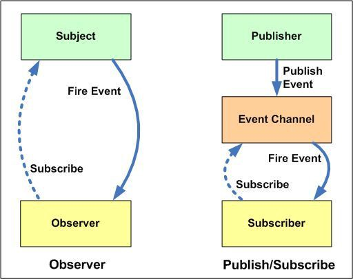

***Pub-Sub패턴*** (또는 게시자/구독자 패턴)은 Reactive Programming을 공부하면서 많이 보게 되는 패턴입니다  
`Head First Design Patterns`에서는 [옵저버 패턴](../observer-pattern/)과 이 패턴을 같은 패턴으로 설명하지만 엄연한 차이점을 가지고 있습니다  
그러면 왜 `Reactive Programming`에서는 **옵저버패턴** 대신 **Pub-Sub패턴**를 사용하는지 알아보겠습니다  

## Pub-Sub패턴을 사용하는 이유?
일반적으로 두 패턴 모두 구독자의 대해서 작업을 수행하는 일을 하는 것은 같습니다  
하지만 Pub-Sub패턴 중간에 ***이벤트관리자***(또는 MessageBroker)를 두고 보다 느슨한 관계를 같습니다  

 

source : [developers-club](http://ww1.developers-club.com/)

이렇게 하므로써 Subject와 Observer 사이의 서로를 알아야 했던 결합이 풀어지고 Subject의 역할이었던 `Observer 이벤트 전파` 및 `작업 수행`도 나누어서 각각의 핵심 기능에 집중할 수 있게 됩니다  

source : [microsoft-architecture](https://docs.microsoft.com/ko-kr/azure/architecture/patterns/publisher-subscriber)

그래서 Pub-Sub패턴은 위의 이미지와 같은 구조를 갖게 되고 다음과 같은 장점을 얻게 됩니다  
> 1. 게시자와 구독자는 서로 느슨한 결합을 갖게 되어 안정성이 향상됩니다    
> 2. Message Broker가 queue 역할을 하여 Subscriber는 Publisher의 상태를 확인하지 않아도 됩니다  
> 3. Publisher 역시 Input channel을 통해 메시지를 보내고 응답과 상관없이 `비동기적`으로 작업을 수행할 수 있습니다  
> 4. 비동기적 처리가 가능하게 되므로 시스템의 자원 낭비를 줄일 수 있습니다    
> 5. cross-application(교차 플랫폼)에 사용하기 적합해 집니다  

 

위와 같이 그저 가운데 `Message Broker` 하나만 추가했는데 많은 이점을 갖게 되었습니다  
다음의 장점들을 통해 `Pub-Sub패턴`은 `Reactive Programming`에 사용하기 적합한 패턴이 됩니다  

 

---

## 참고 사이트  
[microsoft-architecture](https://docs.microsoft.com/ko-kr/azure/architecture/patterns/publisher-subscriber)  
[hackernoon](https://hackernoon.com/observer-vs-pub-sub-pattern-50d3b27f838c)  