# Docker 시작하기  
이 포스팅을 **Windows에서 Git Bash로 Docker를 활용해 Ubuntu에서 `Hello World`를 출력**하는 것을 목표로 합니다  
만약 설치와 Docker의 구조를 모르신다면 아래 포스팅 두개를 보고 오시면 됩니다  

[Windows10 Docker 설치](https://renuevo.github.io/other/docker/docker-setup/)  
[Docker의 구조와 Windows10의 Docker](https://renuevo.github.io/other/docker/docker-hello-world/)  

<br/>

해당 포스팅의 설명은 `Windows10`에서 `Git Bash`를 사용하여 설명합니다  
`Git Bash`는 이미 깔려 있다고 생각하고 진행하지만 없다면 `CMD`로 하셔도 무관합니다  
요즘은 Docker도 편리한 관리를 위해서 아래사진과 같은 `Kitematic`이라는 GUI 툴도 제공합니다  

---

## Docker의 기본 방식  
Docker는 기본적으로 App실행에 필요한 것들을 Build하여 `Image`를 만드는 것으로 시작합니다  
그리고 이러한 Image를 여러 환경에서 설치한 환경을 `Container`라고 합니다  

```text
간단하게 환경과 App을 저장하고 필요할때 설치한다
```

**그림으로 보면 아래와 같습니다**  
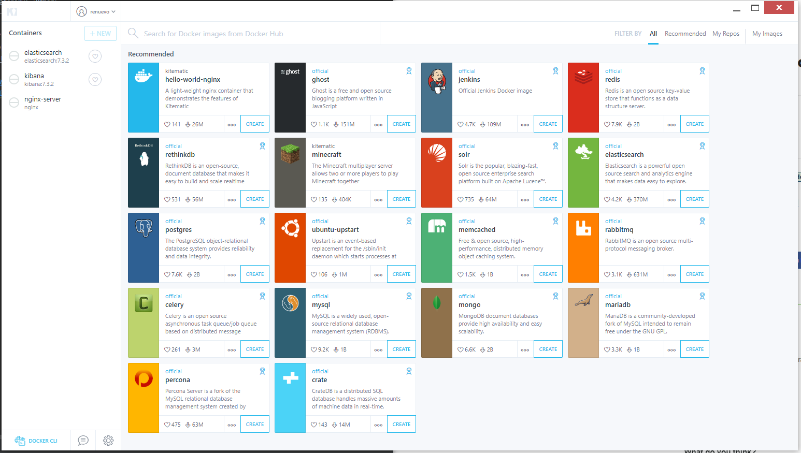  
[Docker Doc Kitematic Guide](https://docs.docker.com/kitematic/userguide/)를 통해 정식으로 지원하고 있습니다  
하지만 이번 포스팅에서는 다루지 않고 `Command`로 진행합니다  
Kitematic을 통한 설정은 추후 Elastic과 Kibana설치를 하는 예제로 포스팅하겠습니다  

<br/>

돌아와서 설명드리면 Docker는 Image를 풀어 Container환경 구성이 가능합니다  
그림처럼 A, B, C 의 전혀 다른 서버에 **Docker Image를 활용해 같은 환경**을 만들수 있습니다  

<br/>

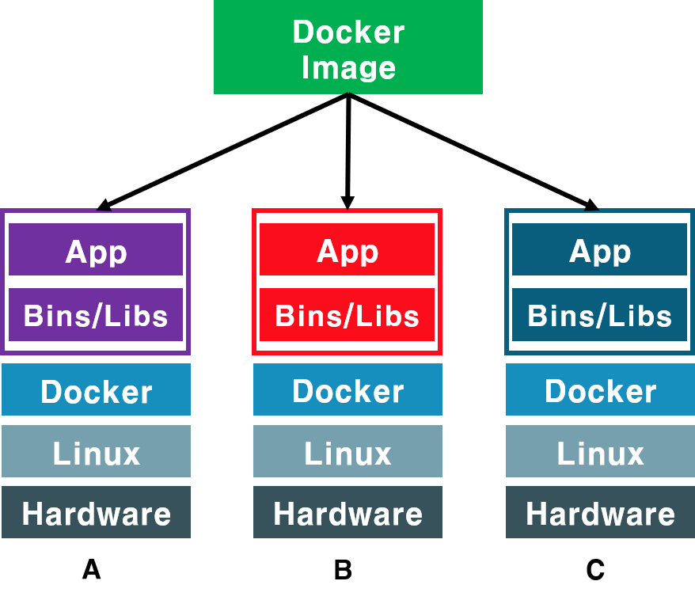  
 
이렇게 환경을 맞춤으로 많은 이점을 가질 수 있습니다  

**1. 마이크로 서비스에 특화**  
**2. 호환성 문제를 극복**  

제 생각에는 크게 이렇게 2가지를 얻을 수 있다고 생각합니다  
때문에 요즘 Container환경이 각광받으며 `Docker`와 `Kubernetes`를 많이 사용하는 걸 볼 수 있습니다  

<br/>

---

## Docker의 Repository  
앞서 `Docker`는 `Image`를 받아와서 `Container` 환경을 구성한다는걸 알았습니다  
이러한 `Image`는 직접 만들 수 도 있지만 왠만한 것들이 이미 공유되고 있습니다  
Docker에서 제공하고 있고 가장 많은 Image를 가지고 있는 곳이 [Docker Hub](https://hub.docker.com/)입니다 

<br/> 

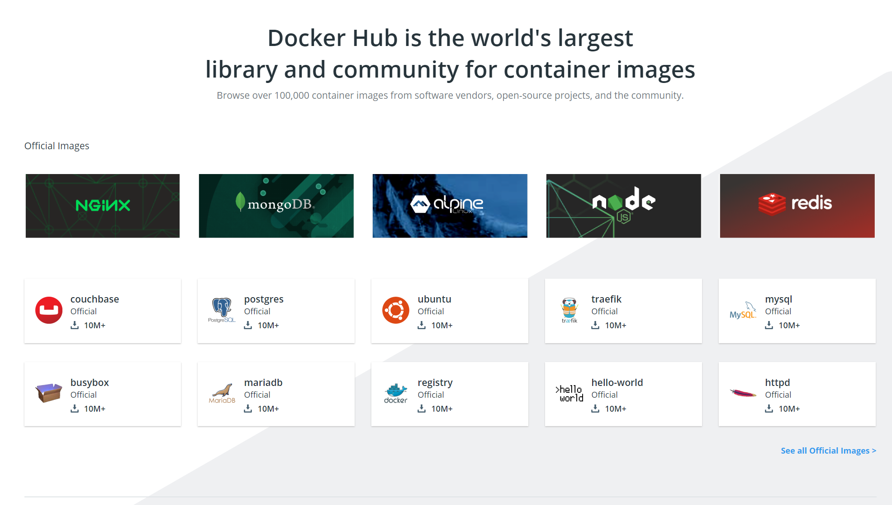
<span class='img_caption'>[Docker Hub](https://hub.docker.com/)</span>

보시는 것과 같이 `Docker Hub`에서는 간단하게 이미 구성된 **Image들을 다운**받아 사용할 수 있습니다  
그럼 이제 Docker Hub에서 Image를 다운받아 `Ubuntu Container 환경`을 구성하고 `Hello World`를 출력해 보도록 하겠습니다  

<br/>

---

### Docker Hub에 로그인 하기  
Image를 다운받기에 앞서 Docker Client를 로그인 해줍니다  

**1. 명령어를 이용한 방식**  

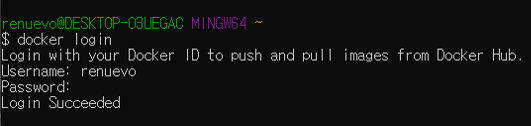   

```text
docker login [OPTIONS] [SERVER]
[OPTIONS] : -u --username / -p --password
```

login은 사진처럼 단계별로 입력하는 방법과 options으로 한꺼번에 입력할 수도 있습니다  

<br/>

**2. GUI를 이용한 방식**

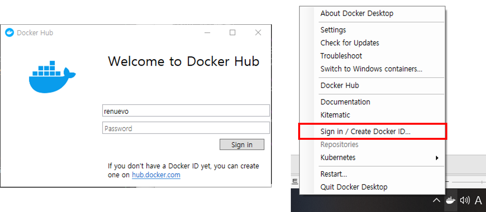  

<br/>

### Error 발생할 경우
<span class='red_font'>Error : Cannot perform an interactive login from a non TTY device</span>  

**라거나**

<span class='red_font'>the input device is not a TTY. If you are using mintty, try prefixing the command with 'winpty'
</span> 

Git Bash로 진행하다 보면 다음과 같은 Error가 뜰 수도 있습니다  
원인은 Git Bash 설치시 Terminal 사용을 `Use MinTTY`를 선택해서 그렇습니다  
설치시 해당 설정이 default이고 한국의 각종 블로그에서 설치시 해당 옵션을 선호합니다

이럴경우 재설치를 하시거나 명령어 앞에 `winpty`를 붙여 주시면 됩니다  

```text
winpty docker login
```

만약 그래도 안될경우 재설치를 해주시면 됩니다  
저 같은 경우 Git 버젼도 올릴겸 재설치를 하였습니다  

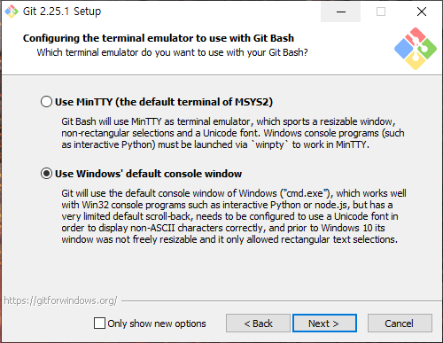

Windows 10 이전에는 cmd의 각종 문제가 많았지만 이후론 문제들이 수정되면서 윈도우에서 사용시  
`Use Windows default console window`를 선택하는게 더 좋다고 생각합니다  

<br/>

물론 다 필요없이 CMD에서 실행할 경우 정상적으로 실행 됩니다 ~~(그래도 CMD는 불편)~~  

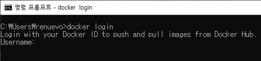  

<br/>

---

### Image를 가져와서 Hello World 출력  

Image를 가져올때는 Pull을 통해 가져올 수 있습니다  
[Docker Hub](https://hub.docker.com/)에 접속하시면 Image의 `Description`과 `Tag`들을 확인 하실 수 있습니다  

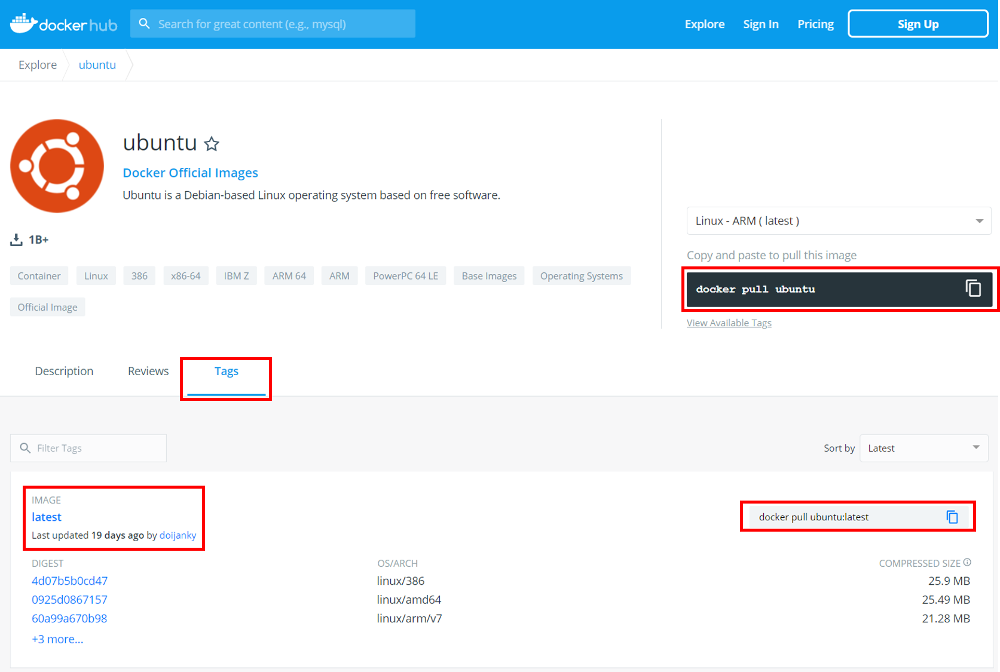  

<br/>

Docker의  Pull 기본 명령 형식은 다음과 같습니다  
```text
docker pull [IMAGENAME]:[TAG]
``` 
`Image`명으로 원하는 Image를 선택하고 `Tag`를 통해 버젼을 지정해서 가져오는게 일반적입니다  
<span class='code_header'>따라서 Ubuntu Image를 가져오는 Docker 명령어는 다음과 같습니다</span>  

```text
docker pull ubuntu:lastest
``` 
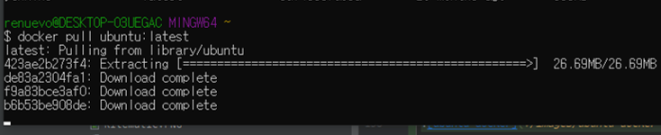

<br/>

위와 같이 차례로 필요한 요소를 다운로드 합니다  
그리고 완료 후 `docker image ls`를 통해 local Image를 확인할 수 있습니다    
```text
docker image ls
``` 
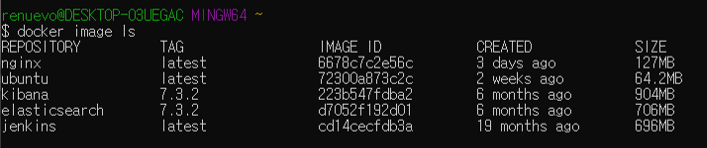

<br/>

자 그럼 이제 Ubuntu Image를 가져왔습니다   
**이제 Docker를 통해 Image를 적용해서 Ubuntu Container를 구성하고 echo를 통해 Hello world를 출력해 봅시다**  
Container 구성 명령어는 `docker container run [IMAGENAME]`입니다  

```text
docker container run ubuntu:latest /bin/echo 'Hello world'
```

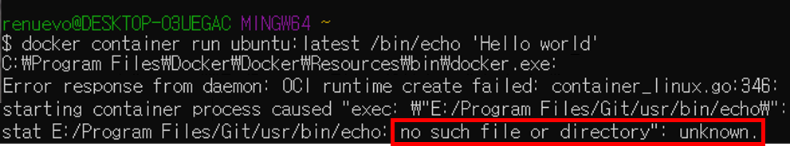

짜잔! 그럼 다음과 같은 <span class='red_font'>Error</span>를 만나게 됩니다  
이유인 즉 /bin/echo Path가 `Convert` 되면서 Git에서 `/bin/echo`를 찾게 됩니다  
`Hello world`가 쉽지가 않습니다 :sweat_smile:    

<br/>

**하지만 역시 해결법은 존재합니다**  
1. `MSYS_NO_PATHCONV=1`을 맨앞에 줘서 Convert를 막는 방법
2. `//bin/echo`로 설정하면 Convert가 되지 않습니다  

<br/>

**명령어를 수정합니다**  

```text
docker container run ubuntu:latest //bin/echo 'Hello world'
```

**OR**

```text
MSYS_NO_PATHCONV=1 docker container run ubuntu:latest /bin/echo 'Hello world'
```

<br/>

**드디어 `Hello world`를 만났습니다** :v:   

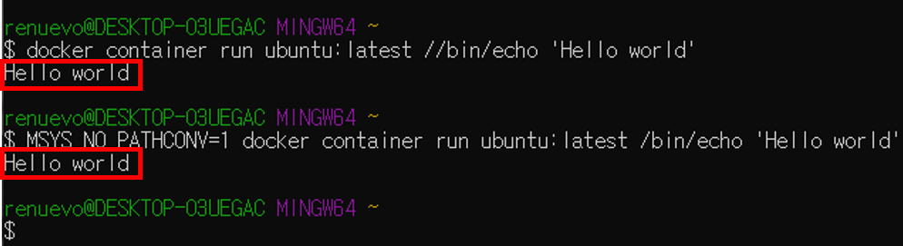  


<br/>

---
마지막으로 Container run을 하는경우 Image가 없다면 자동으로 Pull을 하여 받아옵니다  
local에서 Image를 찾아보고 없으면 [Docker Hub](https://hub.docker.com/)에서 Pull해서 진행합니다  

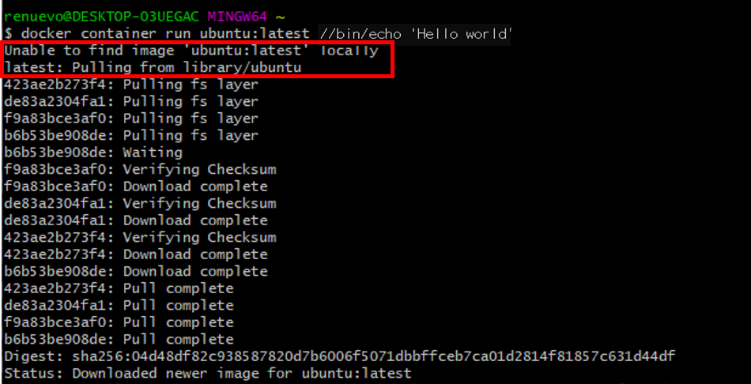  

<br/>

**결론은 아래 명령어만 하면 `Hello world`를 만날 수 있다!** :clap:  
```text
docker container run ubuntu:latest //bin/echo 'Hello world'
```