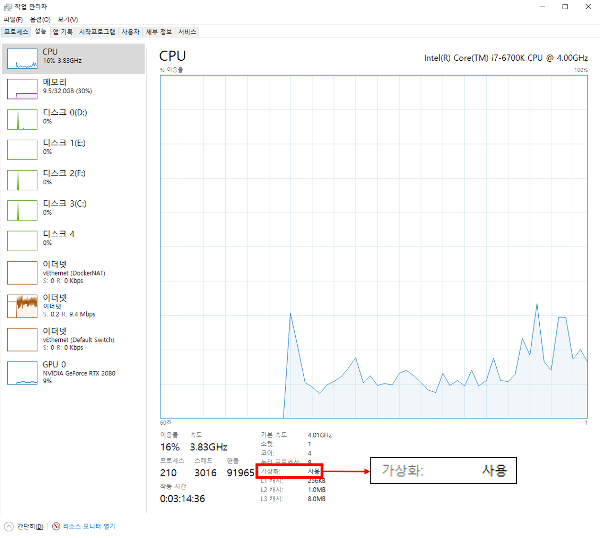

## Windows 10에서 Docker 설치 하기  

### 1. CPU 가상화 기능 설정하기  

Windows10에서는 Hyper-V를 통한 Hypervisor를 활용하여 간단하게 Docker를 설치 할 수 있습니다  
하지만 Windows7의 경우 Hyper-V를 지원하지 않아서 VirtualBox를 통해 Docker를 사용할 수 있게 `Docker Toolbox`를 지원하고 있습니다  
관련해서는 정식 도큐먼트를 확인해 주세요 [Install Docker Toolbox on Windows](https://docs.docker.com/toolbox/toolbox_install_windows/)  

 

먼저 CPU의 `가상화`기능을 설정해야 합니다  

  

만약 이미지처럼 사용으로 되어 있으면 상관 없지만 아니라면 설정을 해주셔야합니다  
BIOS에서 CPU설정을 확인하셔서 가상화 관련 기능을 Enabled 시켜주시면 됩니다  
메인보드별로 설정방법을 확인하셔서 설정해 주시기 바랍니다  :point_right: [메인보드별 BIOS 가상화](https://www.isunshare.com/blog/how-to-enable-virtualizationvt-in-bios-for-hyper-v-windows-10/)

 

### 2. Windows10 Hyper-V 설정하기  
다음으로 윈도우의 Hyper-V기능을 활성화 해야합니다 :point-right:[왜 Hyper-V가 필요한가?](http://renuevo.github.io/other/docker/docker-hello-world/#windows10-hyper-v%EC%99%80-docker)   
**프로그램 추가 제거로 들어가서 Windows 기능 켜기/끄기를 클릭합니다**  

해당 칸들을 이미지처럼 체크하시고 재부팅을 해주면 됩니다  

 

### 3. Docker 설치하기  
이제 Docker를 설치하기 위한 모든 환경설정이 끝났습니다  
이제 Docker 사이트에서 설치파일을 다운로드 합니다  
  
[Docker Download Page](https://hub.docker.com/editions/community/docker-ce-desktop-windows/)로 이동해서 설치 파일을 받습니다  
사이트에서 원할한 Docker 이용을 위해서 사이트에도 가입해 주세요  
설치파일을 실행하면 Docker 설치에 필요한 package를 다운로드합니다  

이후 ok만 클릭하면 자동으로 도커가 설치되는 것을 확인 할 수 있습니다  

오른쪽 밑에 다음과 같이 Docker 아이콘이 뜨면 설치가 완료된 것을 확인할 수 있습니다  

