*Elastic을 활용하여 다음 3가지 방법의 자동완성 서비스를 구현하는 기술을 다룹니다*   
*Elastic 7.x 버젼을 기준으로 진행합니다*   

1. Prefix Queries를 활용한 자동완성  
2. Index 색인을 통한 Search  
3. Completion Suggester를 활용한 자동완성  

해당 포스팅에서는 `Prefix Queries`를 활용한 가장 단순한 자동완성을 만드는 방법 소개합니다  

<br/>

---

## Example Data Setting  
먼저 테스트 데이터를 준비해 줍니다  
간단한 Index Mapping 정보를 작성합니다  

<span class="code_header">**Autocomplete Example Mapping**</span>  
```json

PUT autocomplete_test_1
{
  "settings": {
    "index": {
      "number_of_shards": 1,
      "number_of_replicas": 1
    }
  },
   "mappings": {
      "properties": {
        "word": {
          "type": "text",
          "fields": {
            "keyword": {
              "type": "keyword"
            }
          }
        }
    }
  }
}

```
word에 2가지 속성으로 색인을 하였습니다  

1. `text` type은 형태소 분석를 통해서 색인 키를 가지게 됩니다  
    따로 설정이 없으면 Standard Analyzer로 색인되는데 기본적으로 `불용어, lowercase, whitespace`로 색인 됩니다  
      **스팀게임 추천 :** `스팀게임` `추천`  두개의 단어로 키가 잡힙니다
    호출로 색인 키를 확인 할 수 있습니다  
    ```json
       GET autocomplete_test_1/_analyze
       {
         "text" : "스팀게임 추천"
       }
    ```
   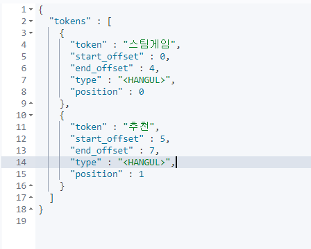
   <span class='img_caption'>Standard Analyzer</span>  
     
     <br/>
    
2. `keyword` type은 텍스트 자체를 키로 색인을 합니다  
    **스팀게임 추천 :** `스팀게임 추천`이라는 문장으로 키가 잡힙니다
    
<br/>
---

이제 기본 개념을 알아봤으니 예제의 사용할 데이터를 생성하겠습니다  
<span class="code_header">**Autocomplete Example Data**</span>  
```json

POST _bulk
{"index":{"_index":"autocomplete_test_1","_id":"1"}}
{"word":"스팀게임"}
{"index":{"_index":"autocomplete_test_1","_id":"2"}}
{"word":"스팀게임 추천"}
{"index":{"_index":"autocomplete_test_1","_id":"3"}}
{"word":"스팀게임 추천 2019"}
{"index":{"_index":"autocomplete_test_1","_id":"4"}}
{"word":"스팀게임 환불"}
{"index":{"_index":"autocomplete_test_1","_id":"5"}}
{"word":"스팀게임 싸게"}
{"index":{"_index":"autocomplete_test_1","_id":"6"}}
{"word":"스팀게임 순위"}
{"index":{"_index":"autocomplete_test_1","_id":"7"}}
{"word":"스팀게임 추천 2020"}
{"index":{"_index":"autocomplete_test_1","_id":"8"}}
{"word":"스팀게임 환불하는법"}


```
자동완성 데이터는 Google에 스팀게임을 검색해서 나오는 자동완성을 가져왔습니다  

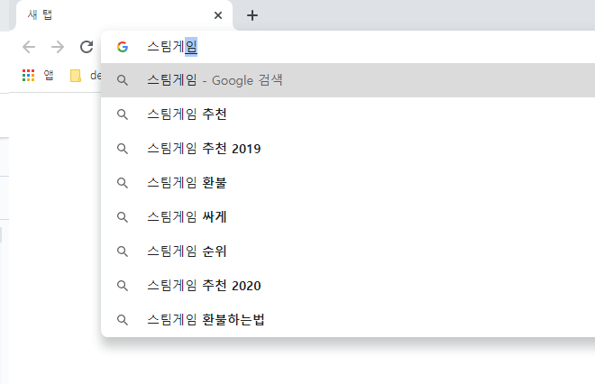
<span class='img_caption'>Google Search</span>  

<br/>
<br/>

만약 7.X보다 밑의 버젼을 쓰신다면 type을 추가해주셔야합니다  
```json

POST _bulk
{"index":{"_index":"autocomplete_test_1","_type" : "_doc", "_id":"1"}}
{"word":"스팀게임"}

```

<br/>
<br/>

## Prefix Query  
먼저 Prefix Query를 살펴보겠습니다  
`Prefix Query`는 Elastic에서 제공하는 앞글자 일치 검색기능 입니다  
간단한 쿼리를 통해서 `text`와`keyword` type들에 대해 어떻게 검색이 다르게 되는지 살펴 보겠습니다  

<br/>

***여기서 부터 차례로 text와 keyword을 번갈아 가면서 어떻게 다르게 검색되는지 살펴보겠습니다***  

형태소 분석이된 `Text Type`에 대한 검색입니다  
띄어쓰기 기준으로 키워드가 색인된 것을 앞서 확인했습니다  
예를 들어 `스팀게임 추천`이라는 문장은 `스팀게임`과 `추천` 이라는 2개의 키워드를 통해 검색됩니다  

<br/>

Prefix쿼리로 먼저 앞글자 단어 일치를 확인해보겠습니다  
```json 

GET autocomplete_test_1/_search
{
  "query": {
    "prefix": {
      "word": {
        "value": "스팀게"
      }
    }
  }
}

```

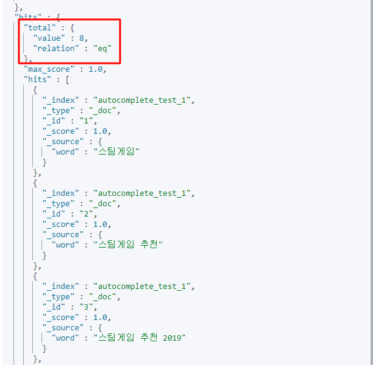
<span class='img_caption'>Prefix Text Search</span>  
정상적으로 모든 `스팀게임`의 키워드를 기준 앞글자가 일치하는 모든 결과가 검색된걸 확인할 수 있습니다  

<br/>
<br/>

다음은 `Keyword Type`에대해 Prefix쿼리로 검색합니다  
```json 

GET autocomplete_test_1/_search
{
  "query": {
    "prefix": {
      "word.keyword": {
        "value": "스팀게"
      }
    }
  }
}

```


<span class='img_caption'>Prefix Keyword Search</span>    
Text Type과 같이 모든 단어가 검색된걸 확인할 수 있습니다  

둘의 검색을 비교해 보면 다음과 같습니다  

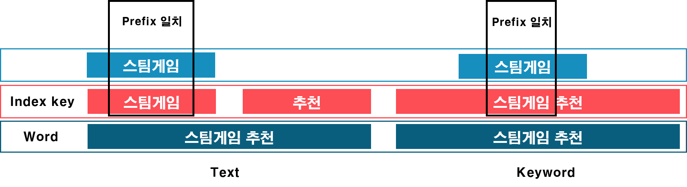
<span class='img_caption'>Elastic Index Search</span>  

그래서 둘 모두 같은 결과를 내놓았습니다  
만약 Text Type에 형태소에서 `스팀게임`이라는 단어를 `Index Key`로 잡지 않았다면 전혀 다른 결과가 나오게 됩니다  

<br/>
<br/>

다음으로 `Text Type`에 `추천`으로 검색해 보겠습니다  

```json

GET autocomplete_test_1/_search
{
  "query": {
    "prefix": {
      "word": {
        "value": "추천"
      }
    }
  }
}

```

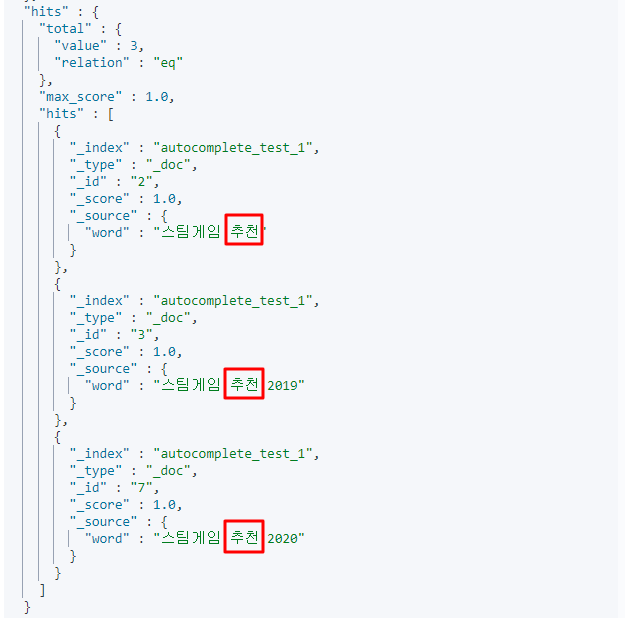
<span class='img_caption'>Prefix Text2 Search</span>  
예상한것과 같이 추천이 뒤에 포함된 결과들이 검색된걸 확인할 수 있습니다  

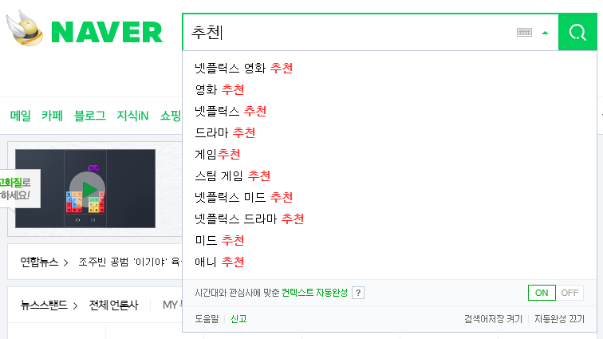
<span class='img_caption'>Naver Autocomplete</span>  
다음과 같이 뒤에 단어까지 확장된 검색이 필요하다면 Text Type의 색인된 검색결과를 입력하는게 효율적입니다  


<br/>
<br/>

다음으로 `Keyword Type`에 `추천` 키워드로 검색해 보겠습니다  
```json

GET autocomplete_test_1/_search
{
  "query": {
    "prefix": {
      "word.keyword": {
        "value": "추천"
      }
    }
  }
}

```

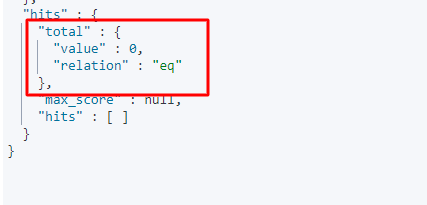
<span class='img_caption'>Prefix Keyword2 Search</span>    
추천과 관련된 word가 3개가 있는데 검색 결과는 <span class='red_font'>0건</span>이 나왔습니다  

<br/>

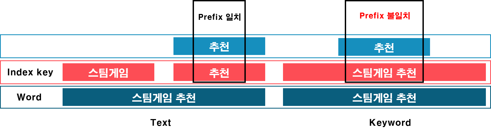
<span class='img_caption'>Elastic Index Search2</span>    
Type Type과 달리 들어오는 키워드 자체로 색인되기 때문에 추천이라는 글자가 포함되더라도 검색되지 않습니다  


<br/>
<br/>

**그럼 무조건 Text Type의 검색일 사용하면 되는 걸까요?**  
Text Type으로 설정시 <span class='red_font'>치명적인 단점</span>을 가지고 있습니다  
다음과 같이 각각의 키워드는 있으나 결합된 키워드로 검색시 결과가 나오지 않을 수 있습니다   

```json

GET autocomplete_test_1/_search
{
  "query": {
    "prefix": {
      "word": {
        "value": "스팀게임 추"
      }
    }
  }
}

```
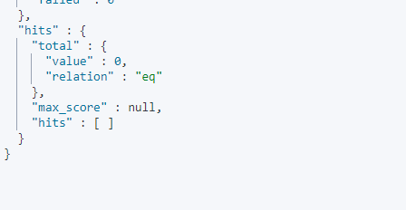
<span class='img_caption'>Prefix Text3 Search</span>    

자동완성처럼 한글자씩 치면서 아래 계속해서 list를 펼쳐줘야 하는데  
이는 치명적인 단점으로 다가오게 됩니다  

<br/>
<br/>

반면 Keyword Type의 경우 색인된 결과와 앞글자를 일치 시켜주면 검색이 됩니다  
```json

GET autocomplete_test_1/_search
{
  "query": {
    "prefix": {
      "word.keyword": {
        "value": "스팀게임 추"
      }
    }
  }
}

```
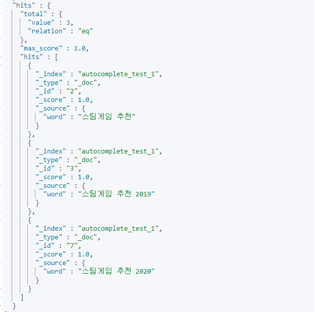
<span class='img_caption'>Prefix Keyword3 Search</span>    

이 때문에 높은 `recall(재현율)`을 위해서 두가지 타입을 `OR`로 사용해서 서비스 할 수도 있습니다  

<br/>

하지만 아직 위의 구현으로는 쓸만한 자동완성을 만들 수 있지만 잘 만든 자동완성은 아닙니다  
다음으로 `오타교정 자동완성`과 `형태소 분석`을 통한 자동완성을 살펴 보겠습니다   

<br/>

---
<br/>

## Fuzzy Query  

다음으로 알아볼것은 Elastic에서 제공하는 **Fuzzy Query**를 통한 자동완성입니다  
Fuzzy Query를 사용하게 되면 `편집거리 알고리즘`을 사용하여 오타를 교정하는 검색이 가능해 집니다  
간단히 설명드리면 **fuzziness**설정 값 이하로 **글자를 바꾸거나, 넣거나, 빼는 횟수**를 측정하여 검색합니다     
**편집거리 알고리즘(Levenshtein distance)**에 대한 자세한 설명은 제 다른 포스팅을 확인해 주세요 :point_right: [편집거리 알고리즘](https://github.com/renuevo/data-modeling-algorithm/tree/master/levenshtein-distance)   

<br/>

Fuzzy Query에 경우에도 아까 설명드린 `Text`와 `Keyword`에 대한 검색방식은 같습니다  

**Text Type Fuzzy Query**  
먼저 Text Type에 대해 검색을 하는 쿼리를 실행해 보겠습니다   

<span class='code_header'>Fuzzy Query Text Type Search</span>  
```json

## 바꾸거나
GET autocomplete_test_1/_search
{
  "query": {
    "fuzzy": {
      "word": {
        "value": "스게팀임", /* highlight-line */  
        "fuzziness": 1
      }
    }
  }
}
GET autocomplete_test_1/_search
{
  "query": {
    "fuzzy": {
      "word": {
        "value": "스팀께임", /* highlight-line */  
        "fuzziness": 1
      }
    }
  }
}


## 넣거나
GET autocomplete_test_1/_search
{
  "query": {
    "fuzzy": {
      "word": {
        "value": "스게임", /* highlight-line */  
        "fuzziness": 1
      }
    }
  }
}

## 빼거나
GET autocomplete_test_1/_search
{
  "query": {
    "fuzzy": {
      "word": {
        "value": "스!팀게임", /* highlight-line */  
        "fuzziness": 1
      }
    }
  }
}

```
`fuzziness`를 **1**로 설정해서 1글자의 대해서 교정을 해주었습니다  
그래서 **한글자를 바꾸거나, 넣거나, 빼는** 경우에 대해서 아래와 같이 모두 같은 결과가 나옵니다  

<br/>

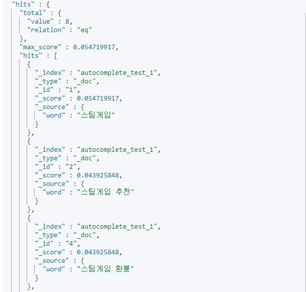
<span class='img_caption'>Fuzzy Text Search</span>  

<br/>

이처럼 간단한 `Fuzzy Query`만으로 오타에 대한 자동완성을 대처할 수 있습니다  

<br/>

**Keyword Type Fuzzy Query**  
Keyword Type은 Key가 전체의 문자으로 잡히기 때문에 Fuzzy Query로 긴 자동완성을 풀기엔 무리가 있습니다  

<span class='code_header'>Fuzzy Query Keyword Type Search</span>  
```json

GET autocomplete_test_1/_search
{
  "query": {
    "fuzzy": {
      "word.keyword": {
        "value": "스팀게임", /* highlight-line */  
        "fuzziness": 1
      }
    }
  }
}

```

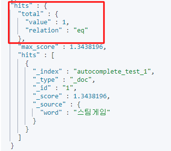
<span class='img_caption'>Fuzzy Keyword Search</span>  

그래서 검색하면 다음과 같이 `스팀게임`만 결과로 나옵니다  
`스팀게임 추천`과 `스팀게임`을 비교하면 빈공간과 추천이란 단어로 3개의 차이점이 보입니다  
때문에 `fuzziness`의 1의 값과 맞지 않아 검색결과가 오로지 1건만 노출됩니다   

<br/>

---

<br/>

## Match Phrase Prefix  
마지막으로 알아볼 것은 `Match Phrase Prefix`입니다  
Match Phrase Prefix는 많은 자동완성에서 실제로 많이 사용되고 있습니다  
기본적으로 Text Type에 검색을 하며 앞색인어와 뒷색인어 둘 모두 만족해야만 검색이 되는 형식입니다  
말로 하면 어려우니 실제 예제를 통해 살펴 보겠습니다  

```json

GET autocomplete_test_1/_search
{
  "query": {
    "match_phrase_prefix": {
      "word": "스팀게임 추"
    }
  }
}

```

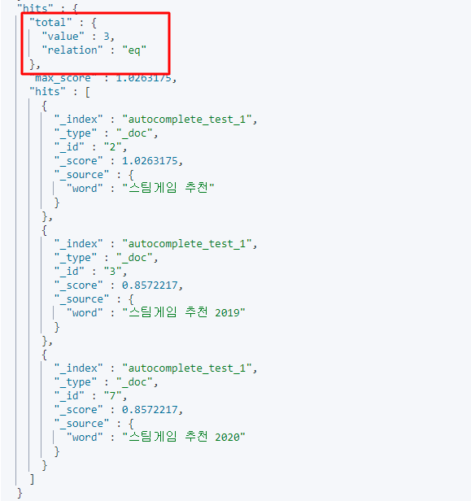  

보시는 것과 같이 이전 Prefix를 Keyword에 검색하는 것과 같은 결과가 나옵니다  

<br/>

**그럼 어떠한 경우에 다르게 나올까요?**    

```json

GET autocomplete_test_1/_search
{
  "query": {
    "match_phrase_prefix": {
      "word": "추천 20"
    }
  }
}

```

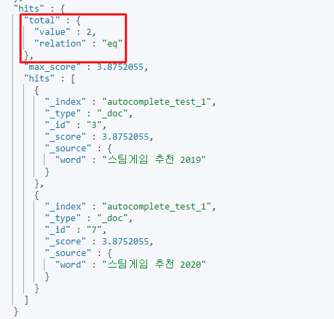
<span class='img_caption'>Match Phrase Prefix</span>  

이전과 다르게 2가지의 결과만 나왔습니다  
**추천과 20**이라는 키워드를 차례대로 포함하고 있어서 입니다  
일반적인 <span class='red_font'>like</span>검색과는 차이가 있습니다  

<br/>

색인키 **스팀게임, 추천, 2019**를 각각 가지고 있고 해당 색인키가 `차례대로 나올때에만` 검색이 됩니다  

```json

GET autocomplete_test_1/_search
{
  "query": {
    "fuzzy": {
      "word": {
        "value": "20 추천",
        "fuzziness": 1
      }
    }
  }
}

```

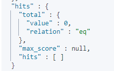
<span class='img_caption'>Match Phrase No Match</span>  
따라서 다음과 같이 색인키의 순서가 다를 때에는 검색에서는 결과가 나오지 않습니다  

<br/>

---

<br/>

## Combine Query  
마지막은 위에서 언급한 것들을 적절하게 섞어서 쓰는 방식입니다  
Elastic에 bool 쿼리를 사용하여 쉽게 작성 가능합니다  
예를 들어 아래 예제는 Fuzzy와 Prefix를 혼합하여 쓰는 방식입니다  

```json

GET autocomplete_test_1/_search
{
  "query": {
    "bool": {
      "should": [
        {
          "fuzzy": {
            "word.keyword": {
              "value": "스팀게임 불",
              "fuzziness": 1
            }
          }
        },
        {
          "prefix": {
            "word.keyword": {
              "value": "스팀게임 "
            }
          }
        }
      ]
    }
  }
}

```
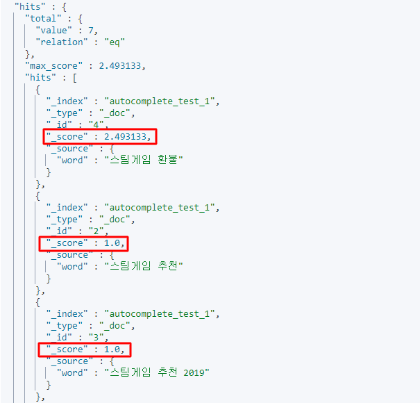
<span class='img_caption'>Fuzzy와 Prefix의 혼합</span>  

<br/>

결과를 보시면 Should를 사용하여 Fuzzy와 Prefix 중 한가지라도 조건이 맞으면 결과로 노출됩니다  
여기서 확인해야 할것은 `score`에 의한 `정렬`입니다  
맨처음 **스팀게임 환불**만 Fuzzy와 Prefix를 모두 만족시켜서 높은 스코어로 맨 위에 노출되었습니다  

<br/>
 
실제로 Fuzzy쿼리만 검색해보시면 다음과 같은 score 확인이 가능합니다  

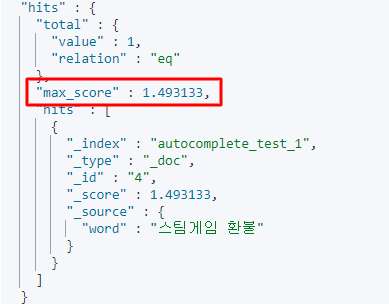  
이걸로 이전 결과가 `prefix 1 + fuzzy 1.4로 2.4`로 스코어 집계가 된걸 확인할 수 있습니다  
이처럼 여러 조건을 혼합한 설계로 좋은 품질의 자동완성을 만드는 것이 가능합니다  