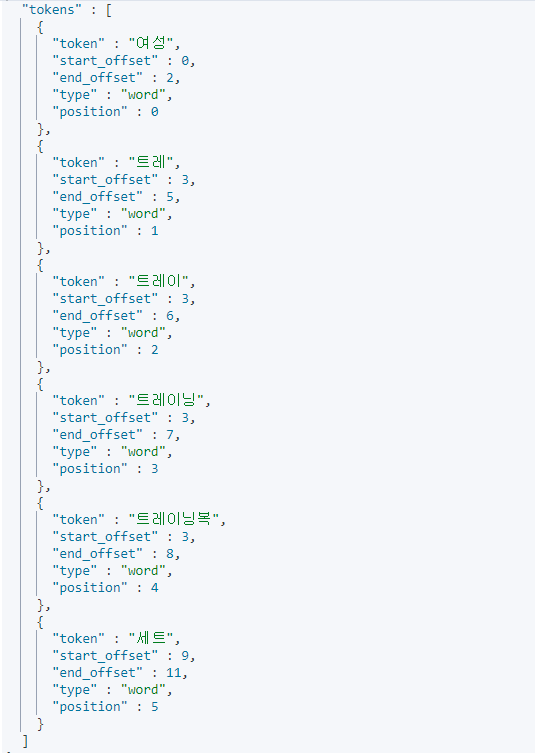
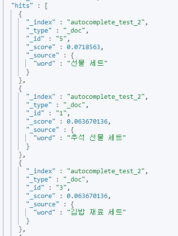
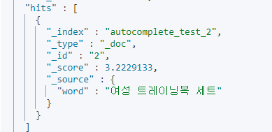
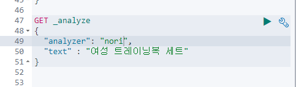
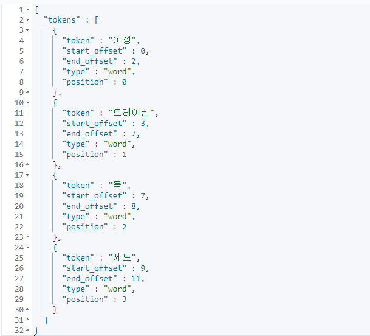
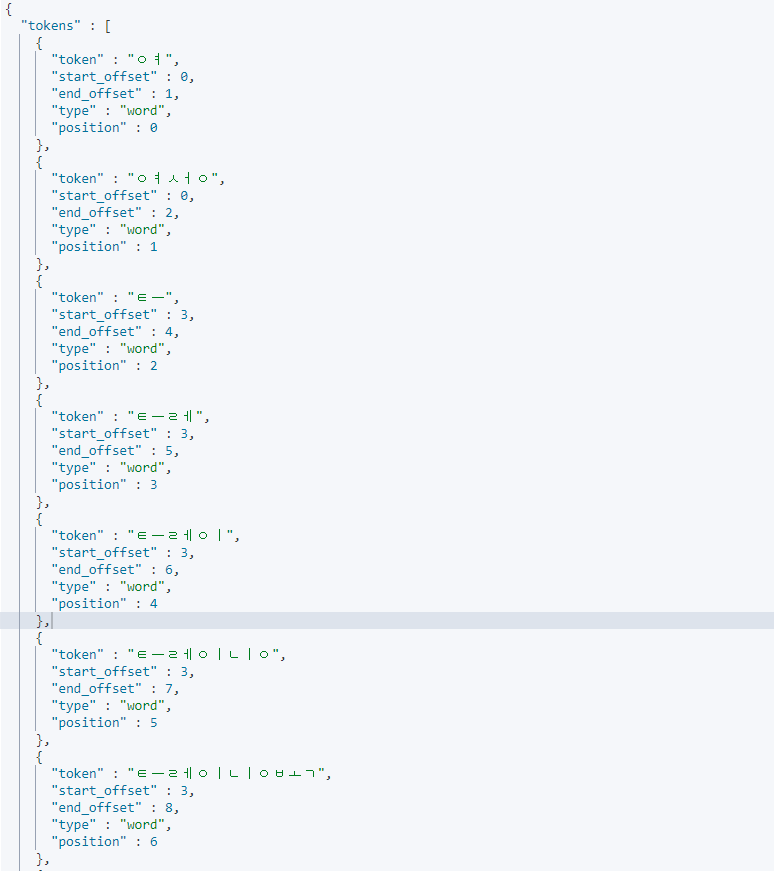
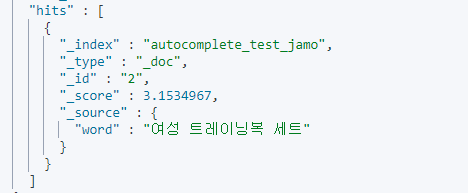

### Elastic Autocomplete Guide 시리즈

1. [Autocomplete Prefix Queries](https://renuevo.github.io/elastic/autocomplete/elastic-autocomplete-1/)
2. [Autocomplete Index Search](https://renuevo.github.io/elastic/autocomplete/elastic-autocomplete-2/)

<br/>

---

<br/>

*Elastic을 활용하여 다음 3가지 방법의 자동완성 서비스를 구현하는 기술을 다룹니다*   
*Elastic 7.x 버젼을 기준으로 진행합니다*   

1. Prefix Queries를 활용한 자동완성  
2. Index 색인을 통한 Search  
3. Completion Suggester를 활용한 자동완성  

해당 포스팅에서는 앞서 소개한 [Prefix Queries](https://renuevo.github.io/elastic/autocomplete/elastic-autocomplete-1/)에서는 다룰수 없었던  
초성검색과 같은 보다 복잡한 자동완성을 해결할 수 있는 `Index Search`를 활용한 자동완성을 만드는 방법 소개합니다  

<br/>

---

## Example Data Setting  
먼저 테스트 데이터를 준비해 줍니다  
간단한 Index Mapping 정보를 작성합니다  

<span class="code_header">**Autocomplete Example Mapping**</span>  
```json

PUT autocomplete_test_2
{
  "settings": {
    "analysis": {
      "analyzer": {
        "autocomplete": {
          "tokenizer": "autocomplete",
          "filter": [
            "lowercase"
          ]
        },
        "autocomplete_search": {
          "tokenizer": "lowercase"
        }
      },
      "tokenizer": {
        "autocomplete": {
    /* highlight-range{1-7} */
          "type": "edge_ngram",
          "min_gram": 2,
          "max_gram": 20,
          "token_chars": [
            "letter",
            "digit"
          ]
        }
      }
    }
  },
  "mappings": {
    "properties": {
      "word": {
        "type": "text",
        "analyzer": "autocomplete",
        "search_analyzer": "autocomplete_search"
      }
    }
  }
}

```
색인을 활용한 자동완성을 위해 커스텀한 형태소 분석을 추가해 줍니다  

<br/>

[Elastic에서 기본적으로 제공하는 Tokenizer reference](https://www.elastic.co/guide/en/elasticsearch/reference/current/analysis-tokenizers.html)  
토큰을 끊는 기준을 Elastic에서 제공하는 edge\_ngram으로 작성했습니다  
`edge_ngram`은 자동완성과 아주 잘 맞는 Tokenizer 입니다  

<br/>

<span class="code_header">**Edge_ngram Tokenizer**</span>  
```json

  "tokenizer": {
    "autocomplete": {
      "type": "edge_ngram",
      "min_gram": 2,
      "max_gram": 20,
      "token_chars": [
        "letter",
        "digit"
      ]
    }
  }

```
edge\_ngram는 기본적으로 min\_gram과 max\_gram을 지정하게 되어있습니다  
글자수를 지정하는 단위로 위와 같이 설정할 경우 "2 Quick Foxes"를 `[ Qu, Qui, Quic, Quick, Fo, Fox, Foxe, Foxes ]` 다음과 같이 끊어 줍니다  
그래서 실제 검색하는 글자 타이핑에 맞게 알맞은 색인어들이 생성됩니다  

<br/>

token\_chars는 글자수에 포함될 형태의 단위로 위에는 문자와 숫자를 추가 하였습니다  
문자와 숫자를 제외한 다른 것들(공백, 줄바꿈등)은 새롭게 토큰을 시작하는 기준이 됩니다  

<br/>

자세한 설명은 [Elastic 공식 가이드](https://www.elastic.co/guide/en/elasticsearch/reference/current/analysis-edgengram-tokenizer.html)에서 확인할 수 있습니다!!  

<br/>


---

<br/>

이제 기본 index 설정 개념을 알아봤으니 예제의 사용할 데이터를 생성하겠습니다  

<br/>


<span class='img_caption'>Coupang Search</span>  

자동완성 샘플 데이터는 쿠팡에 **세트**를 검색해서 나오는 자동완성을 가져왔습니다  

<br/>

<span class="code_header">**Autocomplete Example Data**</span>  
```json

POST _bulk
{"index":{"_index":"autocomplete_test_2","_id":"1"}}
{"word":"추석 선물 세트"}
{"index":{"_index":"autocomplete_test_2","_id":"2"}}
{"word":"여성 트레이닝복 세트"}
{"index":{"_index":"autocomplete_test_2","_id":"3"}}
{"word":"김밥 재료 세트"}
{"index":{"_index":"autocomplete_test_2","_id":"4"}}
{"word":"여성 속옷 세트"}
{"index":{"_index":"autocomplete_test_2","_id":"5"}}
{"word":"선물 세트"}
{"index":{"_index":"autocomplete_test_2","_id":"6"}}
{"word":"설화수 세트"}
{"index":{"_index":"autocomplete_test_2","_id":"7"}}
{"word":"달고나 만들기 세트"}
{"index":{"_index":"autocomplete_test_2","_id":"8"}}
{"word":"무선 키보드마우스 세트"}

```
이걸로 기본 데이터 설정은 끝났습니다  
다음은 검색을 통해 어떠한 결과를 가지고 오는지 살펴 보겠습니다  

<br/> 
<br/>

## Search를 통한 검색  
이게 샘플 데이터를 가지고 검색을 해보겠습니다  
먼저 이해를 돕기 위해 Index에 설정된 analyze로 샘플 데이터가 어떻게 색인되는지 살펴보겠습니다  
다음 쿼리로 샘플데이터의 색인 토큰을 확인 하실 수 있습니다  

```json

GET autocomplete_test_2/_analyze
{
  "analyzer": "autocomplete",
  "text" : "여성 트레이닝복 세트"
}

```

<span class='img_caption'>Edge_Ngram 색인 토큰</span>   

<br/>

색인어를 보면 2글자 이상을 기준으로 공백으로 끊어서 색인어가 생성된 것을 확인 하실 수 있습니다  
이것을 토대로 생성된 자동완성을 일반 검색과 같이 `match`를 써서 자동완성을 서비스 합니다  

```json

GET autocomplete_test_2/_search
{
  "query": {
    "match": {
      "word": "세트"
    }
  }
}

```

<span class='img_caption'>Match 검색 결과</span>   

<br/> 
<br/>

오타에 대한 검색을 위해 `fuzziness`를 설정하여 검색도 가능합니다  
```json

GET autocomplete_test_2/_search
{
  "query": {
    "match": {
      "word": {
        "query": "트레이복",
        "fuzziness": 2
      }
    }
  }
}

```


<span class='img_caption'>Fuzziness 설정 검색 결과</span>   

<br/>

이것으로 이전에 [Autocomplete Prefix Queries](https://renuevo.github.io/elastic/autocomplete/elastic-autocomplete-1/)에서 첫글자를 기준으로 입력해야 했던 `Prefix`와 `Whitespace`의 단점을 보완하였습니다  
이러한 방식으로 **세트**와 같이 중간이나 끝에 나오는 문자도 자동완성으로 제공하는 서비스가 가능합니다   

<br/>

하지만 이러한 자동완성도 어디까지나 영어와 같은 a, b, c 같이 문자가 하나하나일 경우만 효과적일 수 있습니다 :exclamation:  
다시 말해 한글과 같이 자음과 모음의 합성으로 만들어지는 문자의 경우는 해당 방법만으로 서비스를 하기엔 부족한 부분이 있습니다  
다음은 한글 자동완성의 다른점과 어떻게 서비스를 만들어야 하는지를 설명합니다  

<br/>
<br/>

## 한글의 자동완성  
한글은 `자음과 모음`의 합성으로 글자가 이루어 집니다  
이러한 경우 사람이 이해하기 쉽지만 시스템에서는 이를 서비스하기 위해 약간의 추가적 개발이 필요합니다  

<br/>

먼저 한글로 인해 고려해야할 항목들을 생각해 보겠습니다  
> 1. `ㄱ`과 `ㅏ`가 만나 `가`가 되는 합성문자 이다  
> 2. `받침`을 가지고 있어 `자음이 이전문자`의 `받침`이 될 수 있다  
>> :potato:`감자튀김`을 입력할 경우 `감잩`같이 중간에 전혀 다른 글자가 된다   
> 3. 서비스적으로 :potato:`감자튀김`을 `ㄱㅈㅌㄱ`과 같이 검색 할 수 도 있다  

<br/>

한글 자동완성을 설계할 때는 다음과 같은 상황을 고려해서 설계할 필요가 있습니다  
이러한 기능들을 구현하기 위해서는 색인어를 다양한 형태로 저장해야만 합니다  
하지만 현재의 Elastic Search가 제공하는 기본 기능만으로는 한계가 있습니다   
그래서 추가적으로 Plugin을 설치하여 Elastic의 기능을 확장할 필요성이 있습니다  

<br/>
세키로


<br/>

## 한글 자동완성을 위한 플러그인  
자동완성의 경우에는 일반적인 검색에 대한 인덱싱과는 색인어의 차이를 가지고 있습니다  
일반적인 검색에서는 `nori형태소`와 같이 검색을 위해 단어에 대해서 색인을 하게 됩니다  

<br/>


<span class='img_caption'>Fuzziness 설정 검색 결과</span>   

<br/>


<span class='img_caption'>Fuzziness 설정 검색 결과</span>   

<br/>

이 처럼 일반적인 형태소를 통해서 색인을 하게 되면 검색에 알맞은 색인어가 추출됩니다  
<span class='red_font'>하지만 이러한 색인어들로는 자동완성을 하기 부적절 합니다</span>  

<br/>

그래서 한글과 자동완성에 맞는 기능을 위해 Plugin을 설치해야 합니다  
일반적으로 해당기능을 위해 많이 알려진 Plugin은 [한글 jamo 플러그인](https://github.com/punxism/elasticsearch-hangul-jamo-plugin)입니다  
하지만 개인적으로 아쉽게도 해당 플러그인은 현재 4년전 5.2.2까지만 테스트가 진행 되었고 Maven으로 빌드되어 있습니다  
(현재 공식 [Elastic github](https://github.com/elastic/elasticsearch)에서는 Gradle을 기본으로 사용합니다)

<br/>

그래서 이전에 사용하던 6.5.4와 7.3.2버젼의 호환성과 Gradle기반의 Elastic Plugin을 직접 제작하였습니다 :point_right: [한글 jamo 7.3.2 Custom 버젼](https://github.com/renuevo/elastic-plugin-test)  
해당 github project는 Plugin 개발을 위한 Test용도이며 개발에는 Lucene과 Elastic의 Plugin 개발 지식이 필요합니다  
Plugin 개발에 대해서는 이후 따로 포스팅할 예정이며 Elastic에서 제공하는 [Elastic Plugin](https://github.com/elastic/elasticsearch/tree/master/plugins)의 example을 보고 개발 가능합니다  

<br/>

이제 자소분해 검색을 진행해보겠습니다  
먼저 Plugin을 사용해서 신규 형태소 분석을 갖는 인덱스를 생성해 줍니다    
```json

PUT autocomplete_test_jamo
{
  "settings": {
    "analysis": {
      "analyzer": {
        "jamo_analyzer": {
          "tokenizer": "ngram_token",
          "filter": [
            "lowercase",
            "jamo-filter"
          ]
        }
      },
    /* highlight-range{1-5} */
      "filter": {
        "jamo-filter": {
          "type": "jamo_filter",
          "name": "jamo_filter"
        }
      },
      "tokenizer": {
        "ngram_token": {
          "type": "edge_ngram",
          "min_gram": 1,
          "max_gram": 30,
          "token_chars": [
            "letter",
            "digit"
          ]
        }
      }
    }
  },
  "mappings": {
    "properties": {
      "word": {
        "type": "text",
        "analyzer": "jamo_analyzer",
        "search_analyzer": "jamo_analyzer"
      }
    }
  }
}

```
Tokenizer는 이전과 똑같이 Ngram을 사용하였습니다  
이후 필터부분에 플러그인으로 제작한 `jamo_filter`를 등록해 줍니다  

<br/>

여기서 Plugin의 코드를 잠시 살펴 보겠습니다  
```java

public class JamoTokenFilter extends TokenFilter {

    CharTermAttribute charTermAttribute = addAttribute(CharTermAttribute.class);
    Parser parser;

    protected JamoTokenFilter(TokenStream input, Parser parser) {
        super(input);
        this.parser = parser;
    }

    @Override
    public boolean incrementToken() throws IOException {

    /* highlight-range{1-5} */
        if(input.incrementToken()){
            String result = parser.parser(charTermAttribute.toString());
            charTermAttribute.setEmpty().append(result);
            return true;
        }

        return false;
    }
}

```
코드를 보시면 Ngram으로 파싱해서 가져온 글자를 `charTermAttribute.toString()`으로 받아옵니다  
이후 parser로 자음과 모음을 분해해서 `charTermAttribute.setEmpty()`로 기존 색인어를 초기화하고 분해한 색인어 값을 추가해 줍니다  

<br/>

이렇게 등록하면 다음과 같이 자음과모음이 분해된 색인어를 갖게 됩니다  
```json

GET autocomplete_test_jamo/_analyze
{
  "analyzer": "jamo_analyzer",
  "text" : "여성 트레이닝복 세트"
}

```


<span class='img_caption'>Jamo 형태소 분석 결과</span>   

<br/>
<br/>

이후 다음과 같은 쿼리로 자모분해 검색이 가능합니다  
```json

GET autocomplete_test_jamo/_search
{
  "query": {
    "match": {
      "word": "트레인"
    } 
  }
}

```

<span class='img_caption'>Jamo 검색에 대한 결과</span>   

<br/>
<br/>

이전 Index 생성시 등록한 `"search_analyzer": "jamo_analyzer"`를 통해 검색에 형태소가 적용되어 검색을 하게 됩니다   


<span class='img_caption'>실제 내부 검색 형태</span>   
덕분에 트레인이라고 검색하지만 `ㅌㅡㄹㅔㅇㅣㄴ`으로 검색하여 이후 자음이 받침으로와도 검색되도록 문제를 해결 할 수 있습니다  

---

<br/>

이전에 말씀드린 고려사항 같은 방법을 응용하여 해결할 수 있습니다  
> 3. 서비스적으로 :potato:`감자튀김`을 `ㄱㅈㅌㄱ`과 같이 검색 할 수 도 있다  

이 경우는 따로 설명 드리지 않겠습니다  
좋은 서비스를 만들기 위해 직접 실험하고 해보시길 권유 드립니다 🙋‍♂  