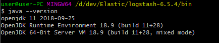
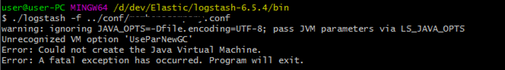
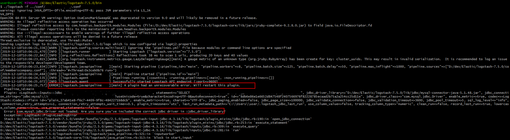

얼마전 `open-jdk11`로 시스템을 업그레이드 하였습니다  


`local`에서 사용하는 ELK는 `6.5.4`를 쓰고 있었습니다  

Elastic이랑 Kibana는 문제없이 작동 됐지만 Logstash에서 다음과 같은 에러를 마주 했습니다  


해당 <span class='red_font'>에러</span>는 JVM버젼이 안 맞아서 나는 에러 입니다  
조금 검색해보면 Elastic에서 제공하는 JVM Support Matrix 페이지를 찾을 수 있습니다  
:point_right: [Elastic Support Matrix](https://www.elastic.co/kr/support/matrix#matrix_jvm) 

**Elastic**은 **6.5.X** 버젼부터 jdk11을 지원하고 **Logstash**의 경우 **6.7.X**부터 지원하는게 쫌 이상하지만..  
Logstash 버젼을 올리니 잘 작동하였습니다  

추가적으로 다음과 같이 Plugin Error를 밷었습니다  

  

해당 에러는 mysql connection 라이브러리가 없을때 발생 합니다  
예전에는  

```ruby
jdbc_driver_library => "./mysql-connector-java-8.0.12.jar"
```
처럼 설정해 줬었는데 **6.2.X**부터는 `/logstash-core/lib/jars/`에 포함해 줘야 정상 작동합니다  


