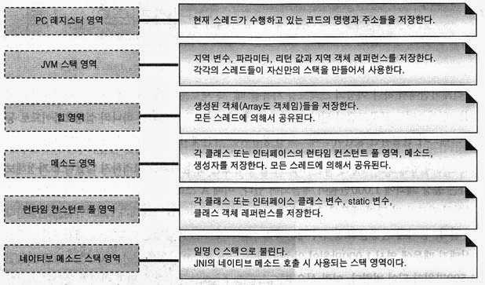
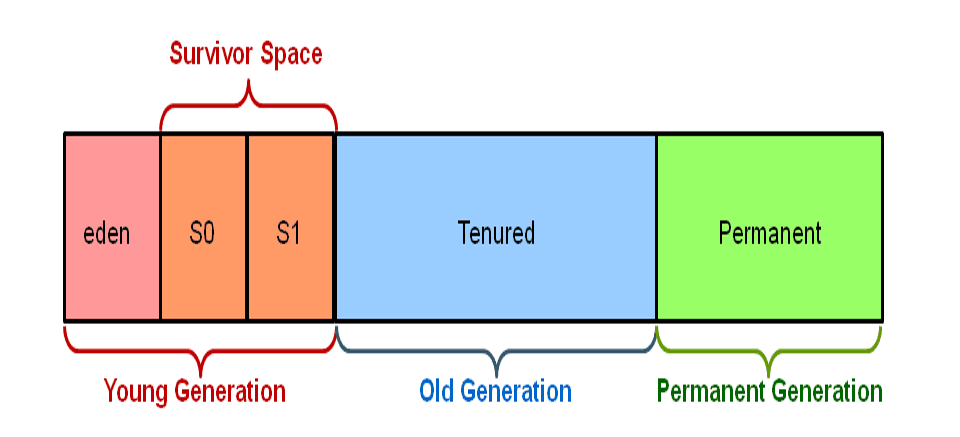
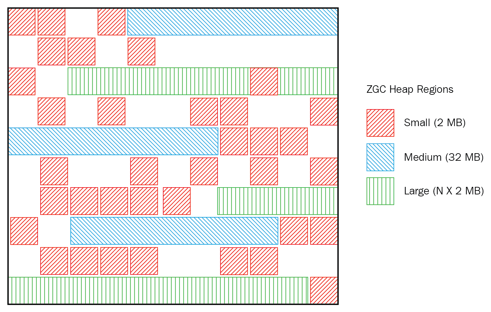
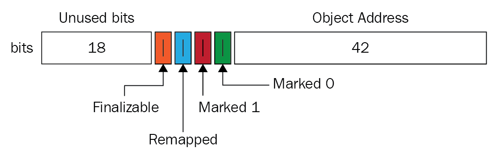
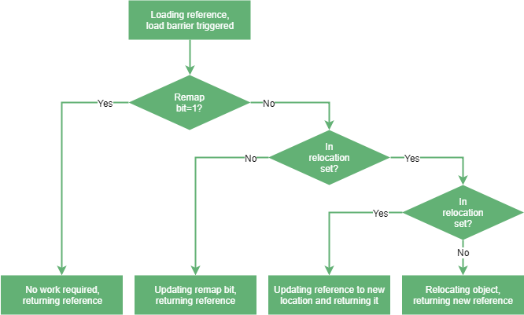

얼마전 JDK 버젼이야기를 하다가 GC의 대해서 이야기 하는 자리가 생겼습니다  
C++같은 언어들에 비해 JVM기반 언어들은 GC가 알아서 메모리 관리를 해주기 때문에 자세히 알아보지 않은 부분들이라 적지않게 당황했습니다  
그래서 JVM기반 언어들을 사용한다면 내부 구현의 대해서 어느정도 알아야겠다고 생각했고 GC에 대해 정리 하게되었습니다  

### JVM 메모리 영역
  
source [jvm_memory](https://yckwon2nd.blogspot.com/2014/04/garbage-collection.html)

### GC의 역할
**GC의 역할은** Heap 메모리에 대한  
> 1. 참조가 없는 객체들을 메모리에서 탐색하고 제거 하여 메모리를 확보하는 작업  
> 2. 단편화된 메모리 공간을 조각 모음하여 압축하는 작업   

을 담당하게 됩니다

***GC를 수행하면 일반적으로 Stop The World(STW)가 되며 application이 멈추게 되는데 위의 작업을 얼마나 빠르게 할 것인가***  

 

### GC의 종류
>1. 마이너 GC : Young 영역에서 발생하는 GC
>2. 메이저 GC : Old 영역이나 Perm 영역에서 발생하는 GC / (FULL GC)

### Heap 메모리 구조 (JDK8까지)

**JDK8까지의 java heap**   source [Java Heap](https://javarevisited.blogspot.com/2011/05/java-heap-space-memory-size-jvm.html)

 

**Heap 메모리 영역**
> 1. Young
>>   1. Edem : 메모리에 올라가는 객체가 생성됨
>>   2. Survivor 1
>>   3. Survivor 2 
> 2. Old
> 3. Perm : 클래스 정보와 메소드 정보 java 언어 레벨에서 사용되지 않음

**JDK8 까지의 GC 방식**
> 1. Edem에 새로운 객체가 생성됨  
> 2. Edem에서 GC(마이너)가 발생하면 Survivor1쪽으로 객체가 이동하거나 참조가 없는 개체들은 해제된다  
> 3. Survivor1도 객체가 차게 되면 GC가 실행되면서 Edem과 Survivor1에 객체가 Survivor2영역으로 이동하고 Survivor1은 빈영역이 된다   
> 4. 이런식으로 계속해서 마이너 GC를 반복하여 메모리를 확보한다  
> 4. 더 이상 Young영역에서 공간이 남지 않으면 객체들은 Old 영역으로 이동하게 된다     
> 5. 이때 Old영역는 512byte의 Chunk에 Card Table이라는 구역에 Old영역에서 Young 영역의 참조를 표시하는 데이터를 표시한다   
> 6. Old 영역도 객체가 차게되면 FULL GC가 일어나게 된다  

 

**FULL GC 방식**
1. Serial Collector
2. Parallel Collector :point_right: `JDK7, JDK8`
3. Concurrent Collector
4. Concurrent Mark Waeep(CMS) Collector

위의 방식들은 일반적으로 여러 블로그에 남아 있습니다   
자세히 알고 싶으신분들은 여기를 참고해 주세요 :point_right:  [Naver D2 블로그](https://d2.naver.com/helloworld/1329)   

---

### Heap 메모리 구조 (JDK9부터 JDK13까지)

**JDK9부터의 java heap**   source [Java Heap](https://docs.oracle.com/javase/9/gctuning/garbage-collector-implementation.htm) 

 

JDK9부터는 기본적으로 Garbage First Garbage Collector(G1GC)가 기본 GC방식으로 변경되었습니다   
`G1GC`의 경우 Heap memory의 Young이나 Old가 논리적으로 분할되어 있으며 동적으로 영역 사이즈를 변경하게 됩니다  

아래의 이미지 처럼 어느 구역을 나눠서 메모리를 관리하지 않고 Region이라는 작은 크기로 Heap을 분할하여 메모리를 관리 합니다  
또한 이전 참조 표시를 담당하던 `Card Table`이 Reginon의 객체참조에 대한 관리 형태인 `Remembered Set`로 변경됩니다  

 source [G1GC Image](https://imp51.tistory.com/entry/G1-GC-Garbage-First-Garbage-Collector-Tuning) 

**Minor GC**
> 1. Heap Structure : 대략 2000개의 Region으로 분할
> 2. Heap Allocation : Region을 논리적으로 Young과 Old로 나누고 Parallel 하게 collection 할 수 있도록 설계된다
>>    1. Young Generatio : Region을 대략 2000개로 나누며 크기는 1~32MB 크기로 할당된다
> 3. Young GC : Minor GC(Evacuation Pauses)가 일어나면 `STW`(Stop The World)되며 Multi-thread로 동작한다

 

**Full GC**
> 1. Initial Mark(`STW`) : Old Generation내의 객체에서 참조를 가지는 Survivor Regions(Root Region)을 Mark
> 2. Root Region Scanning : Old Generation이 참조하는 Survivor Regions을 탐색한다. YoungGC전에 완료되어야 하며 Multi Thread로 동작한다
> 3. Concurrent Marking : Heap내의 모든 reachable/ live 개체를 마킹하며, Multi Thread이고 Young GC와 동시에 실행 가능하다
> 4. Remark(`STW`) : live 객체의 마킹 완료 단계로 G1은 Snapshot-At-The-Beginning(SATB) 알고리즘으로 CMS collector보다 빠르다 :point_right: Remembered Set의 마킹된(GC시작점) Live 객체만 빠르게 탐색하는 방식 
> 5. Cleanup(`부분 STW`) : live 객체에 대해서 병렬처리를 하고 free regions(STW)에 대해서 Empty Region을 추가하고 Remembered Set을 정리(STW)
> 6. Copying(`STW`) : live객체가 새로운 unused region으로 복사

 

***보다 자세함 G1GC의 동작방식은*** :point_right: [imp51 블로그](https://imp51.tistory.com/entry/G1-GC-Garbage-First-Garbage-Collector-Tuning)

---
### Z Garbage Collectors (ZGC)
이 방식은 Oracle에서 개발했으며 JDK11에 early access로 포함되었습니다  
일반적으로 ***Pause시간은 <10ms로 application performance는 <15%의 성능을 이끌어 냈다고 발표 했습니다***  
ZGC는 처럼 Region 구조를 가져가지만 G1GC와는 다른 메모리 구조를 가져 가게됩니다  

source [ZGC_Heap](https://hub.packtpub.com/getting-started-with-z-garbage-collectorzgc-in-java-11-tutorial/)

### ZGC의 주요 개념
ZGC에는 속도와 안정성을 위해 `Colored pointers`와 `Load barriers`라는 주요한 알고리즘 2가지가 들어가 있습니다   

**1. Colored pointers**  
Colored pointers는 객체를 가리키는 변수의 포인터에서 64bit라는 메모리를 활용하여 Mark를 진행하여 객체의 상태값을 저장하여 사용하는 방식입니다  

 sources [colored pointers](https://hub.packtpub.com/getting-started-with-z-garbage-collectorzgc-in-java-11-tutorial/)

 

위에 이미지 처럼 42bit는 객체를 가르키는 주소값으로 사용하였고, 나머지 22bit중 4bit를 4가지 `Finalizable`, `Remapped`, `Marked 1`, `Marked 0`로 나눠서 표시하였습니다  
이 때문에 ZGC는 64bit 운영체제에서만 작동하며 JDK11 ~ JDK12까지는 4TB의 메모리만 지원하였고 현재 JDK13에서 16TB까지 메모리 확대가 이루어 졌습니다

4bit에 대해서 하나하나 살펴 보면  
1. Finalizable : finalizer을 통해서만 참조되는 Object로 garbage로 보시면 됩니다  
2. Remapped : 재배치 여부를 판단하는 Mark
3. Marked 1 : Live Object   
4. Marked 0 : Live Object  

 

**2. Load barriers**  
Load barriers은 Thread에서 참조 객체를 Load할때 실행되는 코드입니다  
ZGC는 재배치에 대해서 STW없이 동시적으로 재배치를 실행하기 때문에 참조를 수정해야 하는 일이 일어나게 됩니다  
이때 Load barriers가 RemapMark와 RelocationSet을 확인하며 참조와 Mark를 업데이트하고 올바른 참조값으로 인도해줍니다  

sources [zgc-remap-flow](https://www.baeldung.com/jvm-zgc-garbage-collector)

 

### ZGC의 동작 방식  
ZGC는 총 3번의 Pause만이 일어납니다  

1. `Pause` Mark Start : ZGC의 Root에서 가리키는 객체 Mark 표시 (Live Object)  
2. Concurrent Mark/Remap : 객체의 참조를 탐색하며 모든 객체에 Mark를 표시 한다  
3. `Pause` Mark End : 새롭게 들어온 객체들의 대해서 Mark를 표시한다  
4. Concurrent Pereare for Reloc : 재배치 하려는 영역을 찾아 RelocationSet에 배치한다  
5. `Pause` Relocate Start : 모든 루트참조의 재배치를 진행하고 업데이트한다  
6. Concurrent Relocate : 이후 Load barriers를 사용하여 모든 객체를 재배치 및 참조를 수정한다  

***보다 자세한 설명을 원하시면*** :point_right: [A FIRST LOOK INTO ZGC](https://dinfuehr.github.io/blog/a-first-look-into-zgc/)

---

### Shenandoah GC
***Shenandoah GC는 JDK 12에서 정식으로 추가되었으며  JDK8/JDK11에서도 추가되어 있어 사용이 가능합니다***

source [shenandoah-gc-cycle](https://wiki.openjdk.java.net/display/shenandoah/Main)

1. Init Mark initiates the concurrent marking. It prepares the heap and application threads for concurrent mark, and then scans the root set. This is the first pause in the cycle, and the most dominant consumer is the root set scan. Therefore, its duration is dependent on the root set size.
2. Concurrent Marking walks over the heap, and traces reachable objects. This phase runs alongside the application, and its duration is dependent on the number of live objects and the structure of object graph in the heap. Since the application is free to allocate new data during this phase, the heap occupancy goes up during concurrent marking.
3. Final Mark finishes the concurrent marking by draining all pending marking/update queues and re-scanning the root set. It also initializes evacuation by figuring out the regions to be evacuated (collection set), pre-evacuating some roots, and generally prepares runtime for the next phase. Part of this work can be done concurrently during Concurrent precleaning phase. This is the second pause in the cycle, and the most dominant time consumers here are draining the queues and scanning the root set. 
4. Concurrent Cleanup reclaims immediate garbage regions – that is, the regions where no live objects are present, as detected after the concurrent mark.
5. Concurrent Evacuation copies the objects out of collection set to other regions. This is the major difference against other OpenJDK GCs. This phase is again running along with application, and so application is free to allocate. Its duration is dependent on the size of chosen collection set for the cycle.
6. Init Update Refs initializes the update references phase. It does almost nothing except making sure all GC and applications threads have finished evacuation, and then preparing GC for next phase. This is the third pause in the cycle, the shortest of them all.
7. Concurrent Update References walks over the heap, and updates the references to objects that were moved during concurrent evacuation. This is the major difference against other OpenJDK GCs. Its duration is dependent on number of objects in heap, but not the object graph structure, because it scans the heap linearly. This phase runs concurrently with the application.
8. Final Update Refs finishes the update references phase by re-updating the existing root set. It also recycles the regions from the collection set, because now heap does not have references to (stale) objects to them. This is the last pause in the cycle, and its duration is dependent on the size of root set.
9. Concurrent Cleanup reclaims the collection set regions, which now have no references to.
   
   
---

## 참고 사이트
[Java Garbage Collection](https://d2.naver.com/helloworld/1329)  
[JVM 튜닝](https://imp51.tistory.com/entry/G1-GC-Garbage-First-Garbage-Collector-Tuning)  
[G1: Garbage first garbage collector](https://b.luavis.kr/server/g1-gc)  
[Java GC 튜닝](https://johngrib.github.io/wiki/java-gc-tuning/)  
[JVM 메모리 구조와 GC](https://johngrib.github.io/wiki/jvm-memory/)  
[오랜만에 Garbage Collection 정리](https://yckwon2nd.blogspot.com/2014/04/garbage-collection.html)  
[An Introduction to ZGC](https://www.baeldung.com/jvm-zgc-garbage-collector)  
[Java's new Z Garbage Collector (ZGC) is very exciting](https://www.opsian.com/blog/javas-new-zgc-is-very-exciting/)  
[Java Garbage Collection](https://dzone.com/articles/java-garbage-collection-3)  
[Getting started with Z Garbage Collector (ZGC) in Java 11](https://hub.packtpub.com/getting-started-with-z-garbage-collectorzgc-in-java-11-tutorial/)  
[A FIRST LOOK INTO ZGC](https://dinfuehr.github.io/blog/a-first-look-into-zgc/)  
[OpenJDKWiki / shenandoah](https://wiki.openjdk.java.net/display/shenandoah/Main)  
[OpenJDKWiki / JDK13](https://wiki.openjdk.java.net/display/zgc/Main#Main-SettingHeapSize)
