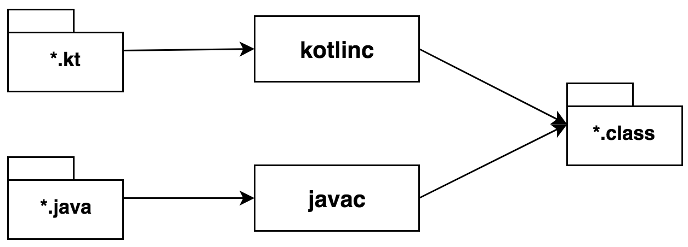
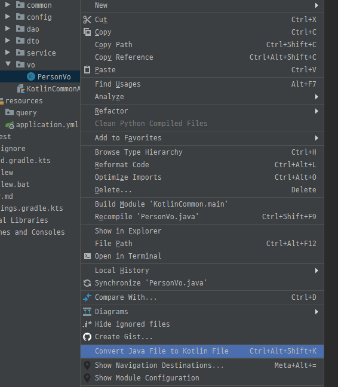
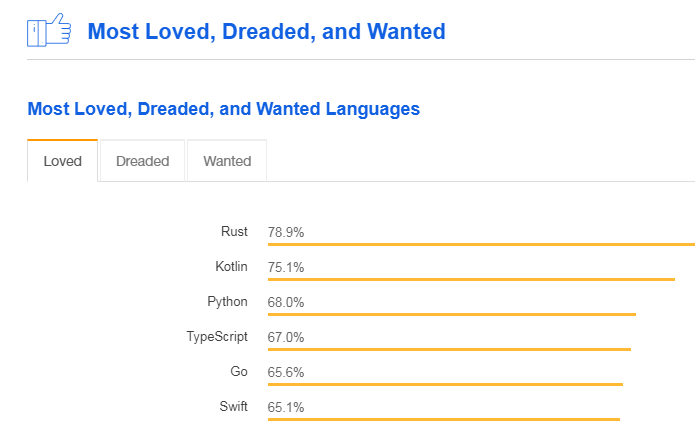
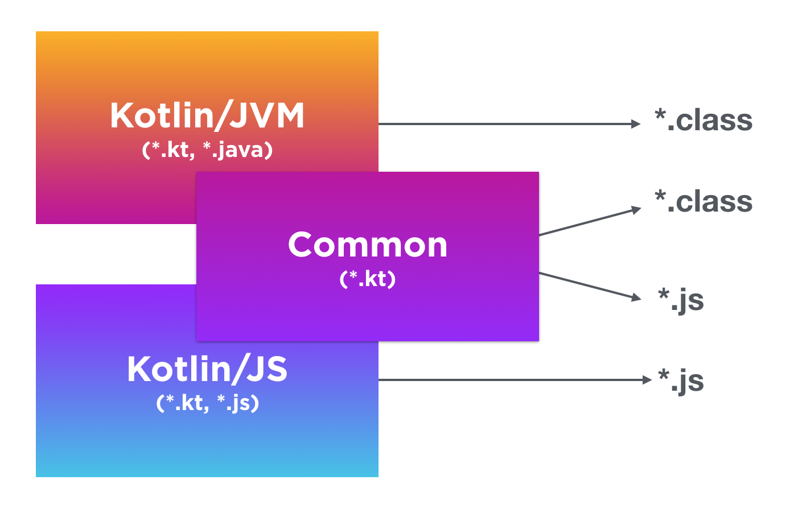
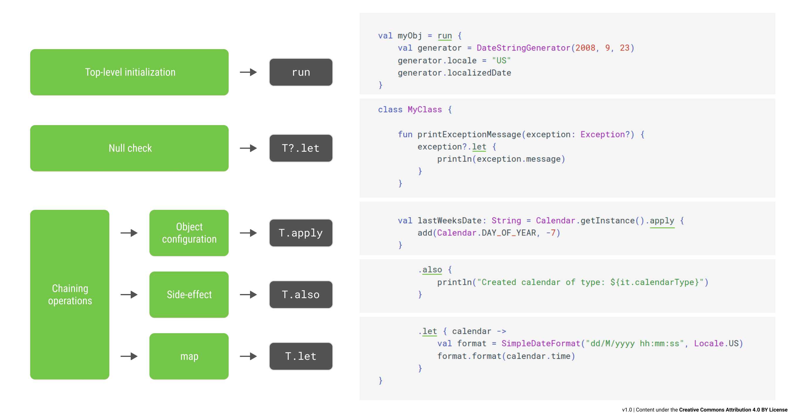

# Why Kotlin?
Kotlin을 처음 공부하고 사용하면서는 많은 불편함을 느꼈습니다  
하지만 계속 쓰면 쓸수록 Kotlin이 Java보다 편하다는 명확한 이점을 파악하였고 왜 Kotlin을 사용하는 지에 대해 포스팅하게 되었습니다


## 1. 간결한 코드  
제가 생각하는 첫번째 장점은 간결한 코드가 가능하다는 것입니다  
어느 lang이나 간결한 코드는 가능하겠지만, 뒤 따라오는 문제는 간결성 - 가독성은 서로 친하지 않다는 것입니다  
하지만 koltin을 사용해보면 JetBrrains사에서 언어를 만들때 간결설과 가독성을 얼마나 고심하며 설계 했는지가 명확히 들어 납니다  
간단한 샘플을 보면 명확히 이해되실 겁니다


**Java Code <span class='sub_header'>(Variables Null Check)</span>**
```java

Person person = new Person("deokhwa", "kim");

public String getFirstName(){     
  
    if(person != null && person.getFirstName() != null){ //Null Check  /* highlight-line */  
            return person.getFirstName();
    }
        
    return "";
}

```

<br/>
<br/>

**Kotlin Code <span class='sub_header'>(Variables Null Check)</span>**
```kotlin

var person = Person("deokhwa", "kim");

fun getFirstName() : String{
    return person?.firstName ?: "" //Null Check   /* highlight-line */  
}

```
다음과 같이 간단하게 `?`만로 `Null Check`가 가능해서 보시는 것과 같이 단 한줄로 기능이 구현됩니다  
그리고 `간결성`과 더불어서 java코드는 줄을 쭉 따라 내려가며 이해해야 하지만 kotlin코드는 한줄을 보고 단번에 이해할 수 있어서 `가독성`도 더 좋습니다


---
***다음은 이름의 성을 대문자로 반환하는 함수를 만들어 보겠습니다***


**Java Code <span class='sub_header'>(Function)</span>**  
```java

Person person = new Person("deokhwa", "kim");

public String getLastNameUpper(){       
    return person.getLastName().toUpperCase();  /* highlight-line */   
}

```

<br/>
<br/>

**Kotlin Code <span class='sub_header'>(Function)</span>**  
```kotlin
Person person = new Person("deokhwa", "kim");

fun getLastNameUpper() = person.name.toUpperCase() /* highlight-line */    

```

**보이시나요?**  
java코드도 간단히 구현 가능하지만 kotlin으로 구현했을 때의 더 간결함!  
여기서 `Null Check`를 한번 추가해 보겠습니다  

---
***성을 대문자로 반환하지만 Null 값이면 빈 String값을 반환하는 코드***

**Java Code <span class='sub_header'>(Function & Null Check)</span>**  
```java

Person person = new Person("deokhwa", "kim");

public String getLastNameUpper(){       
    /* highlight-range{1-2} */   
    if(person != null && person.getLastName != null){   //Null Check
         return person.getLastName().toUpperCase();     //Upper
    }
    return "";  
}

```

<br/>
<br/>

**Kotlin Code <span class='sub_header'>(Function & Null Check)</span>**  
```kotlin
Person person = new Person("deokhwa", "kim");

fun getLastNameUpper() = person?.name?.toUpperCase() ?: "" //Null Check & Upper /* highlight-line */    

```  
이 처럼 간결함이 합쳐져서 더욱 간결해진 kotlin 코드를 만나 볼 수 있었습니다  

<br/>

---

## 2. 안전성과 호환성

> **1. 안전성**  
 시스템에서 가장 중요한것은 안전성입니다  
 이런 측면에서 java는 전세계인들의 사랑을 받아왔고 수년간의 노하우로 안전성에서 인정받아 지금도 가장 널리 사용되는 언어 중 하나입니다    
 kotlin은 이런 안전성을 확보하기 위해 기존 jvm 위에서 java와 같이 실행되도록 구현되었습니다   


<span class="img_caption">source [Introduction to Kotlin](https://subscription.packtpub.com/book/application_development/9781789349252/2/ch02lvl1sec17/introduction-to-kotlin) </span>

 보시는 것 같이 java던 kotlin이던 각각의 컴파일러를 거쳐 class로 생성되어 jvm에서 똑같이 동작되어 `안전성`을 그대로 가져왔습니다

<br/>

> **2. 호환성**  
 kotlin은 java를 100% 호환되도록 설계되었습니다  
 그래서 사용자는 java와 kotlin을 구분없이 사용가능하고 Intellij에서는 java코드를 kotlin코드롤 자동변환해 주는 기능도 제공합니다



 이는 사용자와 시스템 모두에게 매우 긍정적인 측면으로 작용합니다  
 호환과 관련된 보다 자세한 사항은 [Jay Tilu Blog](https://medium.com/jay-tillu/how-kotlin-provides-100-interoperability-with-java-5ee132869038)를 참조하시면 좋을꺼 같습니다  

***java의 서드파티(lombok, kryo등등)까지 완벽히 지원되지는 않습니다***


---

## 3. 커뮤니티의 활성화  
 예전에 XNA 프레임워크에 대해 공부한적이 있었습니다  
 남들이 많이 사용하지 않았지만, 나름대로 pc/xbox/windowMoblie을 하나로 모아 게임을 개발할 수 있다는 것에 흥미를 느끼고 공부했었습니다  
 하지만 2013년 개발 중단으로 더이상 아무도 사용하지 않는 프레임워크가 되었습니다  
 여러요인이 있겠지만 커뮤니티 활성화가 되지 않아 쓰는 사람이 없다가 제가 본 가장 큰요인 이었습니다  
 kotlin은 이런 측면에서 방대한 커뮤니티를 가지고 있습니다  
 google은 안드로이드 진형 메인 언어로 Kotlin을 채택하였고 2019년 [google I/O](https://developers-kr.googleblog.com/2019/05/google-io-2019-empowering-developers-to-build-experiences-on-Android-Play.html)에서 다시 한번 언급하였스빈다
 또한 jetbrains에서의 지속적인 관리와 피드백이 이루어 졌고 빠르게 전파되어 [Stack OverFlow 2018](https://insights.stackoverflow.com/survey/2018)에서 많은 Love를 획득하였습니다

  
<span class="img_caption">source [Stack Overflow](https://insights.stackoverflow.com/survey/2018)</span>

방대한 커뮤니티를 가지고 있다는 것은 많은 발전의 피드백이 이루어진다는 말이고 이는 분명한 장점으로 작용합니다  
gradle에서 사용하는 groovy언어는 편리하지만 커뮤니티가 형성이 안되었고 개발툴등의 발전 부재로 gradle은 멀티언어로 kotlin을 채택해서 지원하기 시작했습니다

---

## 4. 멀티 플랫폼 지원  
 kotlin만 사용하여 java만 대체해서 개발할 수 있는게 아닙니다   
 위에서 언급했듯이 gradle도 kotlin으로 언어를 확장해서 지원하기 시작했습니다   
 또한 kotlin만으로 javascript, ios등등의 다양한 플랫폼을 구성하고 개발이 가능합니다

  
<span class="img_caption">source [Kotlin Blog](https://blog.jetbrains.com/kotlin/2017/11/kotlin-1-2-released/)</span>


 자세한 멀티 플래폼관련 사항은 [Multiplatform Programming](https://kotlinlang.org/docs/reference/multiplatform.html)에서 확인 하실수 있습니다
 
---

## 5. Lambda&Closure와 Scope Functions
 위에 여러 이유들이 있지만 제가 생각하는 kotlin을 사용하는 가장 큰 이유입니다   
 먼저 `Lambda`부터 살펴 보겠습니다  


**1. Lambda & Closure**  
 lambda는 굉장히 편리합니다  
 java8 부터 사용할 수 있고 처음에는 느리다는 평이 많았지만 컴파일러가 발전하면서 현재는 기존코드보다도 빠른 성능을 보일때도 있습니다  
 하지만 java lambda에는 Closure를 사용할때 명확한 제한사항이 있고 저는 이 때문에 java에서 생각보다 lambda식을 많이 사용하지 않았습니다  
 그 제한사항은 외부변수 참조에 `final`이 있어야지만 참조가 된다는 것입니다  
 이는 java 메모리 구조상 `heap/stack`으로 나뉘는 부분과 익명함수의 특성을 그대로 가져와 외부변수를 lambda내에서 capture해서 사용하게 되고 memory leak과 무결성유지를 위해 final을 유지시켜야 한다는 것인데 이는 현재 포스팅하는 글에서 내용이 벗어나니 이만 줄이겠습니다  
 관련해서 궁금하시면 다음 글들을 참고하시기 바랍니다 (추후 포스팅 하겠습니다)


[Understanding Java 8 Lambda final finally variable](https://www.javahabit.com/2016/06/16/understanding-java-8-lambda-final-finally-variable/)   
[Why Do Local Variables Used in Lambdas Have to Be Final or Effectively Final?](https://www.baeldung.com/java-lambda-effectively-final-local-variables)

<br/>

 다시 돌아와서 kotlin은 이러한 제약없이 자유로운 lambda 사용이 가능합니다  
 간단한 예제와 함께 보도록 하겠습니다  

**Java Code <span class='sub_header'>(Lambda)</span>**
```java

public static void main(String[] args) {  
  
        List<String> personList = new ArrayList<>(Arrays.asList("deokhwa Kim", "junghoon Im", "jikin Kim"));

        /* highlight-range{1-3} */
        personList.forEach(name ->{
            System.out.println("person name : "+name);
        });
}

```

<br/>

**실행 결과**
```
person name : deokhwa Kim
person name : junghoon Im
person name : jikin Kim
```

위에 보시는 코드는 일반적으로 설명하는 java의 lambda 예제입니다  
다음과 같이 기본적으로 personList만 가지고 println 할 상황이 얼마나 될까요.. 이런 기능이 필요나 할까요?  
만약 이름을 한줄로 표현하고 싶어서 외부 변수를 두고 합치는 로직을 구현하면 어떻게 될까요?  

**Java Code <span class='sub_header'>(variable used in lambda expression should be final or effectively final)</span>**  
```java
    public static void main(String[] args) {

        List<String> personList = new ArrayList<>(Arrays.asList("deokhwa Kim", "junghoon Im", "jikin Kim"));

        String allName = null;  //Not Final         /* highlight-line */  

        /* highlight-start */
        personList.forEach(name ->{
            if(allName == null)         //외부 참조 Error
                allName += ","+name;    //variable used in lambda expression should be final or effectively final
            else
                allName = name;
        });
        /* highlight-end */
        System.out.println("person name : "+allName);
    }
```
***다음과 외부 참조는 Error를 불러 일으킵니다***  

<br/>

원하는 결과를 보려면 이런식으로 구현해야 합니다  

**Java Code <span class='sub_header'>(lambda used final variable)</span>**  
```java
    public static void main(String[] args) {

        List<String> personList = new ArrayList<>(Arrays.asList("deokhwa Kim", "junghoon Im", "jikin Kim"));

        final String[] allName = {null};    /* highlight-line */

        personList.forEach(name ->{
            if(allName[0] != null)
                allName[0] += ", "+name;
            else
                allName[0] = name;
        });
        System.out.println("person name : "+ allName[0]);
    }

```
보시는 것 같이 `forEach`문으로 이름을 합치기 위해 불필요한 배열을 생성하고 외부변수를 썼는지 안 쓴건지 하나하나 전부 고려하며 사용해야 합니다  
이럴꺼면 그냥 `for(String name : personList)`를 사용하겠습니다
  

<br/>

> **실행 결과**
```
person name : deokhwa Kim, junghoon Im, jikin Kim
```

<br/>

다음으로 kotlin 코드를 보겠습니다  
코틀린은 그냥 외부참조가 가능하므로 직관적으로 사용해도 됩니다  

**Kotlin Code <span class='sub_header'>(lambda & closure)</span>**  
```kotlin
    public static void main(String[] args) {

        val personList = listOf("deokhwa Kim", "junghoon Im", "jikin Kim")
    
        var allName: String? = null
        /* highlight-range{1-4} */
        personList.forEach {
            allName = if (allName.isNullOrEmpty()) it   //외부 참조
                      else "$allName, $it"
        }
        println("person name : $allName")
    }
```
`kotlin lambda`는 아무생각없이 `forEach`으로 간단하게 위의 기능을 구현할수 있습니다  
 여기서 또하나의 장점은 java에서 썼던 name -> 같은 불필요한 인자 없이 `it`으로 내부에서 그냥 사용하면 된다는 것입니다  
 물론 `name ->`을 써서 내부 인자변수명을 변경할 수도 있습니다
 
<br/>

> **실행 결과**  
```
person name : deokhwa Kim, junghoon Im, jikin Kim
```

<br/>

> **2. Scope Function**  
 Scope Function은 Kotlin에서 제공하는 아주 유용한 6개의 함수들입니다
>1. T.let  
>2. T.run  
>3. run  
>4. with  
>5. T.apply  
>6. T.also  

 Scope Function은 말그대로 Kotlin에서 범위를 묶어서 처리할때 사용하는 함수들로


<span class="img_caption">source [Fatih Coşkun Blog](https://medium.com/@fatihcoskun/kotlin-scoping-functions-apply-vs-with-let-also-run-816e4efb75f5) </span>

 scope들은 비슷한 개념들을 가지고 있는 애들도 존재하고 각각의   
 scope에서 context object가 `this vs it`이냐  
 scope에서 return value가 `object vs lambda_result`이냐  
 다르게 사용되어 집니다  


<span class="img_caption">source [Jose Alcérreca Blog](https://medium.com/androiddevelopers/kotlin-standard-functions-cheat-sheet-27f032dd4326) </span>
해당 이미지는 한눈에 Scope를 확인할 수 있는 간단한 예제들 입니다  

***지금 부터 Scope Function에 대해 하나하나 설명해 드리겠습니다***

---

**1. T.let**  
T.let의 **context object**는 `it` 이고 **return value**는 `lambda result` 입니다  

**Kotlin Code <span class='sub_header'>(let sample)</span>**
```kotlin
val numbers = mutableListOf("one", "two", "three", "four", "five")
numbers.map { it.length }.filter { it > 3 }.let(::println)  //[5, 4, 4]  /* highlight-line */
```
보시는 것같이 앞의 lambda에 대한 마지막 기능부를 구현할 때 사용할 수 있습니다

```kotlin
val str: String? = "Hello"   
val length = str?.let { /* highlight-line */
    println("let() called on $it")  //let() called on Hello      
    it.length
}
println(length) //5  /* highlight-line */
```
`?.`으로 null check를 한뒤 null이 아닐때 기능을 구현하는 코드로도 사용 가능합니다  
반환되는 값은 lambda로 length에는 `"Hello".length`의 값이 들어가게 됩니다   

---

**2. T.run**  
T.run의 **context object**는 `this` 이고 **return value**는 `lambda result` 입니다  

**Kotlin Code <span class='sub_header'>(T.run sample)</span>**
```kotlin
val name = "deokhwa kim"
/* highlight-range{1-3} */
name.run{
    println(length) //11
    println(name.length) //11
}
```
run은 계속해서 객체내부의 요소를 사용할때 다음과 같이 사용하실 수 있습니다  
만약 java로 구현한다면 계속해서 `name.`을 써주어야 하지만 kotlin에서는 run이라는 범위로 묶어서 java의 `class내부`의 `this`처럼 간단히 사용하실 수 있습니다  

---

**3. run**  
run의 **context object**는 `this` 이고 **return value**는 `lambda result` 입니다  
해당 run은 위에 T.run과 달리 결과를 묶어서 처리하고 반환값을 받을 때 유용합니다  

**Kotlin Code <span class='sub_header'>(run sample)</span>**
```kotlin
val name = run{ 
    val firstName = "deokhwa"
    val lastName = "kim"
    "$firstName $lastName"  //return /* highlight-line */  
}
println(name) //deokhwa kim
```
이 예제는 run으로 묶어서 작업을 처리하고 value를 return 받는 예제입니다

<br/>

```kotlin 
var name : String? = null
    name?.let{
        //Null이 아닐때 기능구현
    /* highlight-range{1-3} */  
    } ?: run{  
        //name이 Null일때 기능 구현
    }   
```
let와 run을 같이 사용하여 다음과 같은 flow도 구현 가능합니다

<br/>

```kotlin
val personList = listOf("deokhwa Kim", "junghoon Im", "jikin Kim")
run loop@{ /* highlight-line */
    personList.forEach{
        println(it) //deokhwa Kim
        if(it == "deokhwa Kim")
            return@loop  //break run /* highlight-line */  
    }
}
```
다음과 같이 forEach에서는 break문을 쓸수 없는데 `run`으로 묶어서 `return@loop`해서 `break`와 같은 기능을 지원하기도 합니다  
만약 그냥 return을 하게되면 메서드가 return되고 `continue`랑 같은 기능을 하려면 `return@forEach`을 사용해야 합니다  

---

**4. with**  
with의 **context object**는 `this` 이고 **return value**는 `lambda result` 입니다   
with은 T.run과 똑같지만 content object를 파라미터로 받습니다  

**Kotlin Code <span class='sub_header'>(with sample)</span>**
```kotlin
val name = "deokhwa kim"
/* highlight-range{1-3} */
with(name){
    println(length) //11
    println(name.length) //11
}

```

---

**5. apply**  
apply의 **context object**는 `this` 이고 **return value**는 `object` 입니다   

**Kotlin Code <span class='sub_header'>(apply sample)</span>**
```kotlin
data class Person(var name: String, var age: Int = 0, var city: String = "") //dto class
fun main() {
    /* highlight-range{1-3} */
    val adam = Person("Adam").apply {
        age = 32    //java is adma.setAge(32)
        city = "London" //java is adma.setCity("London")        
    }
    println(adam) //Person(name=Adam, age=32, city=London)
}
```
apply이는 변수 내부의 값을 주입할때 `object.variable`으로 계속해서 같은 코드를 반복해야 할때 `apply`로 묶어서 `variable`만으로 값을 넣을 수 있습니다 


---

**6. also**  
also의 **context object**는 `it` 이고 **return value**는 `object` 입니다   

**Kotlin Code <span class='sub_header'>(apply sample)</span>**
```kotlin
data class Person(var name: String, var age: Int = 0, var city: String = "") //dto class
fun main() {
    /* highlight-range{1-3} */
    val adam = Person("Adam").also {
        it.age = 32    //java is adma.setAge(32)
        it.city = "London" //java is adma.setCity("London")        
    }
    println(adam) //Person(name=Adam, age=32, city=London)
}
```
also는 일반적으로 객체에 사용하면 apply와 같으며 content object만 this에서 it으로 바뀐형태와 같습니다

<br/>

```kotlin
val numbers = mutableListOf("one", "two", "three")
numbers
    /* highlight-range{1-2} */  
    .also { println("The list elements before adding new one: $it") }
    .add("four")
println(numbers) //[one, two, three, four]
```
다음과 같이 lambda로 사용하였을때, 이후 다음 과정을 추가할 수 있다는게 apply와 다른 개념입니다

---

## 마무리  
이외에도 kotlin의 장점은 설명하자면  
>1. [Null Safe Programing](https://kotlinlang.org/docs/reference/null-safety.html)  
>2. [Switch기능을 확장한 When](https://kotlinlang.org/docs/reference/control-flow.html#when-expression)  
>3. [편리한 함수 참조의 Kclass](https://kotlinlang.org/api/latest/jvm/stdlib/kotlin.reflect/-k-class/index.html)  
>4. [Function Default Parameter](https://kotlinlang.org/docs/reference/coding-conventions.html#default-parameter-values)  
>5. [Data Class](https://kotlinlang.org/docs/reference/data-classes.html#data-classes)  

등등한도 끝도 없이 많아서 이만 마무리를 하려고 합니다  

<br/>

처음에는 kotlin의 문법을 배우면서 하나하나 coding 하면서 많은 어려움을 느꼈습니다  
java랑 완벽히 호환된다지만 `서드파티`들간의 호환문제도 있었고 `Assignment not allow in while expression?`라면서 error가 나는 부분 그리고 `Null Safe`조건으로 하나의 변수타입의 속성이 2가지가 존재한다는 개념으로 코딩할때 마다 red_line이 떴습니다  
그럼에도 꾸역꾸역 kotlin으로 프로젝트를 진행하고 보니 이제는 Null Safe으로 코딩하면서 자동으로 얻게 되는 `안정성`과 kotlin의 `생산성`과 `간편함`에 빠져들었습니다  
현재는 java보다 kotlin을 사용한 기간이 압도적으로 짧음에도 불구하고 kotlin이 더욱 편합니다  
이 처럼 많은 분들이 kotlin의 장점을 저처럼 경험하실 수 있었으면 좋겠습니다

---

## 부록

**1. Lombok을 대체할 Kotlin의 사용**
[Migrating from Lombok to Kotlin](https://www.jworks.io/migrating-from-lombok-to-kotlin/)  

<br/>

**Java Code <span class='sub_header'>(@Cleanup sample)</span>**
```java
    @Cleanup /* highlight-line */  
    BufferedReader br = new BufferedReader(new FileReader(new File("...")));
```

<br/>

**Kotlin Code <span class='sub_header'>(use sample)</span>**
```kotlin
    File("...").bufferedReader().use { /* highlight-line */  
    }
```
서드파티중 가장 많은 부분에서 사용됐던 lombok을 kotlin에서 어떻게 대체하고 있는지를 보여줍니다

<br/>
<br/>

**2. While안에 식으로 error가 났던 Kotlin**
[Assignment not allow in while expression?](https://discuss.kotlinlang.org/t/assignment-not-allow-in-while-expression/339)  

<br/>

**Java Code <span class='sub_header'>(@Cleanup sample)</span>**
```java
    @Cleanup
    BufferedReader br = new BufferedReader(new FileReader(new File("...")));
    
    String str;
    while((str = br.readLine())!=null){ //kotlin error  /* highlight-line */  
    }
```

**Kotlin Code <span class='sub_header'>(use sample)</span>**
```kotlin
    File("...").bufferedReader().use { 
        while(true){
            val str = it.readLine() ?: break  /* highlight-line */  
        }
    }
```
while문안에 식을 썼을때 `가독성`이 떨어진다는 이유로 해당문법을 앞으로도 허용하지 않을꺼라고 합니다  