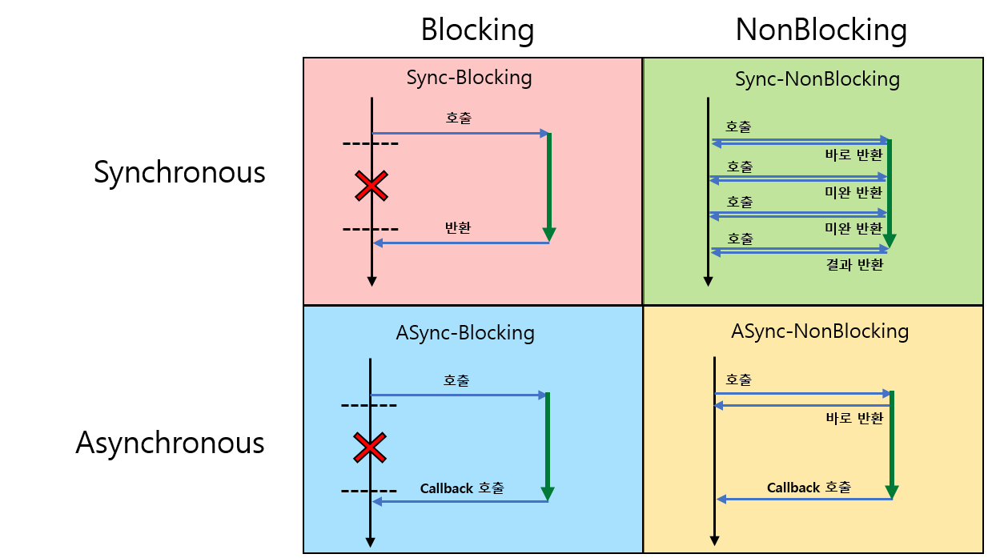
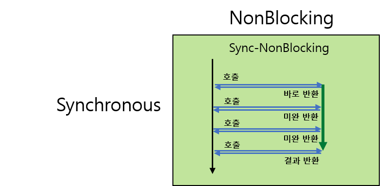
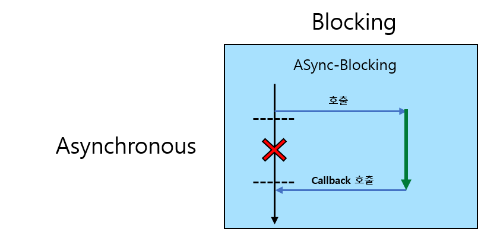

얼마전 Reactive Programing을 공부하면서 [백기선님의 유튜브](https://www.youtube.com/channel/UCwjaZf1WggZdbczi36bWlBA)를 보다 문득 의문이 생기는 부분이 있었습니다

```textbox
By being built around the core pillars of being fully asynchronous and non-blocking,  
Reactive Programming is an alternative to the more limited ways of doing asynchronous code in the JDK: namely Callback based APIs and Future.
```
***"asynchronous하면 당연히 non-blocking 되는 게 아닌가?"*** &nbsp;지금까지 저는 비동기면 당연히 논블록킹하다고 생각하고 있었습니다   
그래서 알아보게 되었습니다  

---

## 동기(Synchronous)와 비동기(Asynchronous)  
***호출된 메서드를 호출하는 쪽에서 관심을 가지고 있는지 봅니다***

> **1. 동기(Synchronous)**
>> 호출되는 기능의 완료를 호출한 쪽에서 확인하고 처리한다  
>> 단순히 기능의 완료를 호출하는 쪽에서 관심을 보이면 동기로 보면 됩니다  
>> `일반적인 함수 호출`이 여기에 해당됩니다  
>
> **2. 비동기(Asynchronous)**
>> 호출되는 기능의 완료를 호출 한 쪽에서 알아서 처리하는 것  
>> 호출하는 쪽에서 비동기로 호출한다는건 해당 기능의 완료가 어떻게 되든 신경쓰지 않는다는 겁니다  
>> 호출된쪽에서는 `callback`을 통해 완료를 전달하게 됩니다  


---

## 블로킹(Blocking)과 논블로킹(NonBlocking)  
***메인 프로세스 플로우의 제어권에 초점을 맞추고 있습니다***

> **1. 블로킹(Blocking)**
>> 메인 플로우의 제어권이 호출된 쪽으로 넘어가서 해당 제어권을 다시 돌아오기를 기다립니다    
>> 기다리는 동안 메인 플로우는 제어권을 상실하여 아무것도 하지 않습니다  
>
> **2. 논블로킹(NonBlocking)**
>> 메인 플로우가 제어권을 바로 반환 받습니다  
>> 메인 플로우는 제어권을 가지고 있으므로 얼마든지 본인의 플로우대로 작업을 실행합니다  


---

## 같이 생각하기  

***이제 동기와 비동기 & 블로킹과 논블로킹을 같이 생각해 보겠습니다***  




<span class="img_caption"> 출처 : [Homo Efficio님 블로그](http://homoefficio.github.io/2017/02/19/Blocking-NonBlocking-Synchronous-Asynchronous/) </span>

<br/>

그림으로 보면 다음과 같습니다  
2 x 2로 해당 개념들을 믹스해보면 다음과 같습니다

- Sync-Blocking
- Sync-NonBlocking
- Async-Blocking
- Async-NonBlocking

그럼 하나하나 차근차근 살펴 보겠습니다

---

## 동기 블로킹 (Sync_Blocking)
***메인 프로세스에서 제어권이 넘어가서 작업이 끝나고 제어권을 다시 받는다***

일반적인 순서대로 호출되는 함수 호출이 Sync_Blocking 입니다

#### Sample Source
```java

@SpringBootApplication
public class SimpleCode{

    private int sum(int a, int b) {
        return a + b;
    }

    //Run
    public void syncBlockTest() {
        System.out.println("1 + 1 = " + sum(1, 1));     //제어권이 Sum 메서드로 넘어갑니다
        System.out.println("1 + 1 = 귀요미지..");
    }

}

```

</br>

#### 실행결과
```
1 + 1 = 2
1 + 1 = 귀요미지..

```

<br/>

제어권이 sum 메서드로 넘어가며 블로킹 되었고 syncBlockTest는 제어권을 잃어서  
`1 + 1 = 귀요미지..`를 호출하지 않고 기다렸다가 **순차적**으로 실행 되었습니다

---

## 동기 논블로킹 (Sync_NonBlocking)
***메인 프로세스에서 제어권이 넘겼다가 바로 받지만 호출된 기능의 완료에 관심을 보입니다***

**그림을 다시한번 보시겠습니다**



<span class="img_caption"> <b> Sync_NonBlocking </b> </span>


여기서 부터 애매해서 많이들 어려워하는 부분입니다  
~~하지만 걱정하지 마세요 Sync_NonBlocking은 일반적이지 않습니다~~  

#### Sample Source
```java

@Async
@Service
public class AsyncCodeTest {
    @Async  //Async로 비동기 논블로킹이 자동으로 구현되기 때문에 헷갈리기 쉽습니다
    public Future<Integer> asyncSum(int a, int b) throws Exception{
        Thread.sleep(1000);
        return new AsyncResult<>(a+b);
    }
}


@EnableAsync
@SpringBootApplication
public class SimpleCode {

    //Run
    public void syncNonBlockTest() throws Exception {
        Future<Integer> sumResult = asyncCodeTest.asyncSum(1,1); //제어권을 바로 반환 받습니다(NonBlocking)
        while(!sumResult.isDone()){  //메인 프로세스는 주기적으로 asyncSum의 완료를 확인 합니다(핵심)
            System.out.println("1 + 1 = 귀요미지..");  //asyncSum과 상관없이 메인 프로세스가 자리 일을 합니다           
        }
        System.out.println("1 + 1 = " + sumResult.get());  //asyncSum의 호출을 이미 isDone()으로 알고 있습니다
    }

}

```

</br>

#### 실행결과
```
.....
1 + 1 = 귀요미지..
1 + 1 = 귀요미지..
1 + 1 = 귀요미지..
1 + 1 = 귀요미지..
1 + 1 = 귀요미지..
1 + 1 = 귀요미지..
1 + 1 = 2
```

<br/>

이부분을 이해하는데 있어서 많이 어려웠던거 같습니다  
@Async면 async지 왜.. sync야 라고 생각하게 되었고 보면 볼수록 더 헷갈리게 되는 개념이었습니다  

####하지만 판별의 핵심은
> **1. 제어권의 판별**
>> 제어권이 메인 프로세스로 부터 (거의)이관되어 지지 않음 = NonBlocking  
> 
> **2. 관심의 판별**  
>> 메인 프로세스가 asyncSum의 isDone()을 확인하며 완료를 직접 확인함 = sync 

---

## 비동기 논블로킹 (Async_NonBlocking)
***메인 프로세스에서 제어권이 넘겼다가 바로 받고 호출된 기능의 완료에 관심을 갖지 않습니다***

원활한 설명을 위해서 비동기 논블로킹부터 설명하겠습니다
호출된 기능의 완료에 관심을 갖지 않는다는 말은 기능이 알아서 완료여부를 반환해서 Pull 해주는 것도 포함됩니다 <span class="sub_header">(callback)</span>

#### Sample Source
```java

@Async
@Service
public class AsyncCodeTest {
    @Async
    public void asyncSum(int a, int b) throws Exception{
        System.out.println("1 + 1 = "+(a+b));
    }
}


@EnableAsync
@SpringBootApplication
public class SimpleCode {

    //Run
    public void asyncNonBlockTest() throws Exception {
        asyncCodeTest.asyncSum(1,1);    //asyncNonBlockTest은 제어권을 바로 반환 받습니다
        System.out.println("1 + 1 = 귀요미지..");
        Thread.sleep(1000); //메인 프로세스의 다른 작업들 대신 사용하였습니다 
    }

}

```

</br>

#### 실행결과
```
.....
1 + 1 = 귀요미지..
1 + 1 = 2
```

<br/>

메인 프로세스는 asyncSum 호출했지만 바로 제어권을 받아서 `1 + 1 = 귀요미지...`를 출력했습니다  
그리고 여기서는 Thread.sleep(1000)을 사용하였지만 메인 프로세스의 작업들이라고 생각해 주시기 바랍니다  

```textbox
Thread.sleep(1000)을 한 이유는 메인프로세스는 asyncSum을 호출 했지만 완료에  
관심을 갖지 않기 때문에 메인 프로세스가 asyncSum() 완료와 상관없이 먼저 종료 될 수 있습니다

```
<br/>

#### 한마디더
다른 건 이해하지 못하더라도 async_nonBlocking은 꼭 알아두셔야 합니다  
위에서 언급했지만 async_nonBlocking은 가장 효율적인이며 이상적인 구조입니다  
***Reactive Programing is built around the core pillars of being fully asynchronous and non-blocking***

---

## 비동기 블로킹 (Async_Blocking)
***메인 프로세스에서 제어권이 넘어갔지만 호출된 기능의 완료에 관심을 갖지 않습니다***

**그림을 다시한번 보시겠습니다**



<span class="img_caption"> <b> Async_Blocking </b> </span>

저에게는 가장 어려운 개념이었습니다  
제어권이 상대에게 있는데 완료에 관심을 갖지 않는다는게 생각되지 않았기 때문입니다  
그래서 결론 내리길 핵심은 콜백을 받는 입장으로 대기한다라고 생각합니다


#### Sample Source
```java

@Async
@Service
public class AsyncCodeTest {
    @Async
    public Future<Integer> asyncSum(int a, int b) throws Exception{
        Thread.sleep(1000);
        return new AsyncResult<>(a+b);
    }
}


@EnableAsync
@SpringBootApplication
public class SimpleCode {

    //Run
    public void asyncBlockTest() throws Exception {
        Future<Integer> sumResult = asyncCodeTest.asyncSum(1, 1); //asyncBlockTest은 제어권을 바로 반환 받습니다 -> 여기서는 nonBlocking으로 해석이 가능합니다
        System.out.println("1 + 1 = " + sumResult.get());   //isDone()의 상태를 모르고 get()하여 대기(blocking)합니다 -> async
        System.out.println("1 + 1 = 귀요미지..");
    }

}

```

</br>

#### 실행결과
```
1 + 1 = 2
1 + 1 = 귀요미지..
```

<br/>

아까와 같은 Future의 get()을 써서 헷갈리실 수 있지만 엄연히 다른 개념으로 보셔야 합니다  
아까는 메인 프로세스가 isDone()으로 asyncSum의 상태를 계속 해서 확인한 반면 지금은 단순히 get()을 호출하고 asyncSum에서 값을 return 할때 까지 단순히 대기 하고 있습니다  
다시말해 get()을 호출하면 메인 프로세스는 blocking되며 asyncSum에서 값이 Pull 되기를 기다리게 됩니다  
조금 쉽게 이야기하면 ***Async_NonBlocking에서 Blocking되는 상황이 생기면 Async_Blocking이 됩니다***  


대표적인 예가 JDBC입니다  
JDBC는 blocking 방식으로 DB에 접근하게 되는데 비동기 환경에서 JDBC로 DB에 접근하게 되는 순간 이 프로세스는 **async_blocking**이 되는 것입니다 

####하지만 판별의 핵심은
> **1. 제어권의 판별**
>> 제어권이 메인 프로세스로 부터 Future의 get()을 호출 하므로 이관되어짐 = Blocking  
>
> **2. 관심의 판별**  
>> 메인 프로세스는 asyncSum가 완료되어 Callable로 Futrue의 get()에 값을 주길 기다림 = sync 

---

## 마무리
저는 동기(Synchronous)와 비동기(Asynchronous) & 블로킹(Blocking)과 논블로킹(NonBlocking)을 이해하면서 많은 어려움이 있었습니다  
이해 했다가도 다시 볼수록 더 헷갈리고 이해가 안되는 부분이 많았습니다  
공부를 하면서 이런저런 자료를 뒤지던중 많은 자료들을 볼 수 있었고 관련 내용에 대한 많은 토론도 볼 수 있었습니다  
그리고 포스팅을 하면서 지금 제가 내린 **결론은 정답은 없다** 입니다  

위의 예시도 부분부분적으로 코드를 나눠보면 다른 개념들로 충분히 해석되어 질 수 있습니다  
그러므로 해당 개념들을 간단히 보시고 Synchronous의 개념과 Blocking의 개념이 다르구나를 생각해 주시고  
궁긍적으로 ***Asynchronous_NonBlocking***으로 프로그래밍 패러다임이 이동한다는 것에 집중하시는게 더 좋을 꺼 같습니다