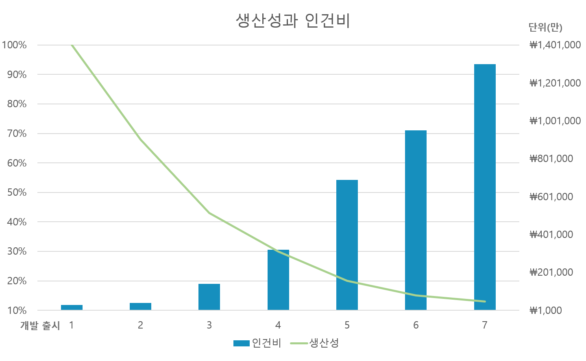
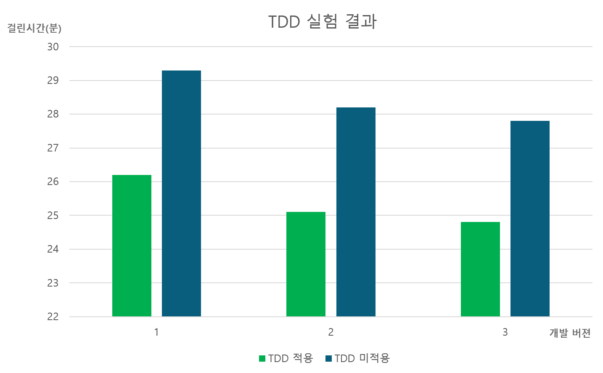
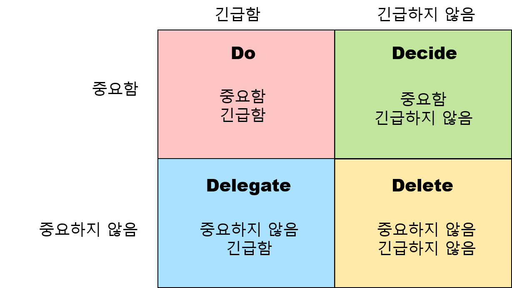

## 설계와 아키텍처
설계(design)와 아키텍처(architecture)의 의미부터 알고 이야기를 시작하고자 한다

1. 설계(design)
> 저수준의 구조와 결정사항을 의미하는 용어로 사용되어 진다   

2. 아키텍처란(architecture)
>  고수준의 구조와 결정사항을 의미하는 용어로 사용되어 진다

<br/>


저수준의 구조와 결정사항들을 한곳에 모아 고수준으로 형태를 이루지만 저수준과 고수준을 마땅히 구분할 만한 경계는 가지고 있지 않다  
따라서 **실제로 설계와 아키텍처 둘사이엔 아무런 차이가 없다**  

하지만 나는 일반적으로 `기능적 구조를 설계` / `적체적인 프로젝트의 시스템적 구조는 아키텍처`라고 부르는것 같다  

---

## 아키텍처의 목표

소프트웨어 아키텍처의 목표는 필요한 시스템을 만들고 유지보수하는 데 투입되는 인력을 최소화하는 데 있다  
좋은 아키텍처는 경영자와 개발자의 둘 모두의 시각에서 긍정적인 효과를 가지고 온다  

### 다음은 실제 사례이다  
안 좋은 구조로 개발하여 출시한 앱이 있다  
해당 앱은 출시와 동시에 기능적으로 성공하여 많은 개발자를 채용하고 여러 기능을 추가하고자 한다  
이때 다음과 같은 문제가 발생하기 시작한다  

  

1. 처음에는 생산성이 좋지만 안 좋은 구조로 점점 많은 코드와 작업이 필요해진다  
2. 기능적 추가를 위해 개발자를 점점 더 고용하여 인건비는 늘어난다  

결국 앱의 생산성은 점점 줄어들어 개발자는 작업이 많아지고 지불되는 인건비로 경영자도 불행해진다   
때문에 항상 좋은 구조를 중요시 생각하여 개발하여야 한다  

---

<br/>

### 개발자들의 흔한 착각

개발자들이 흔히 착각하는 사실이 있다  
"지저분한 코드를 작성하면 단기간에는 빠르게 개발이 가능하고, 장기적으로 볼 때만 생산성이 낮아진다" 라는 것이다  
하지만 진실은 `엉망으로 만들면 깔끔하게 유지할 때보다 항상 더 느리다` 라는 것이다  

   
다음은 실제 해외 개발자 제이슨 고먼이 수행한 실험이다  
같은 프로그램을 TDD적용과 TDD미적용을 비교하면서 개발하였다  
결과 그래프처럼 항상 TDD를 적용했을때 더 빠르게 개발을 완료 하였다  

<br/>

이러한 결과로 볼때 빠른 개발을 위해서 개발자는 처음에 러닝커브가 발생하더라도 장기적 미래를 생각하여 테스팅에 필요한 프레임워크 스킬을 가지고 있어야 한다  
(Spring의 경우에는`Junit` / `Spock`과 같은 것들)

---

## 개발의 두 가지 가치  

소프트웨어는 다음과 같은 두 가지의 가치를 지닌다  
> 1. 목적에 맞게 수행하는 기능  
> 2. 변경이 가능한 유연한 구조  

두 가지 모두 중요한 가치를 지니지만 기능보다 구조가 보다 높은 가치를 가진다  

<br/>

* 완벽하게 동작하지만 수정/추가를 할 수 없는 프로그램 <span class='red_font'>(구조 결여)</span>
> 처음에는 잘 작동하지만 시간이 가면 결국 해당 프로그램은 더 이상 쓸 수 없을 것이다  
* 기능적으로 동작하지 않지만 구조적으로 수정이 가능한 프로그램 <span class='red_font'>(기능 결여)</span>
> 이 프로그램은 당장에는 사용할 수 없지만 수정개발을 하면 계속해서 사용 가능해 진다  

<br/>

다소 억지로 보이겠지만 실제 회사에서의 업무관계자들은 항상 추가/수정이 가능한 프로그램을 원한다  
때문에 구조의 가치를 기능보다 높게 이야기 할 수 있다  

<br/>

물론 나의 생각을 첨언하면 해당 기능의 요소가 비즈니스에 미치는 영향도에 따라 다르게 분류가 가능 할 것이다  
그것을 알아 보기 위해 다음 `아이젠하워 매트릭스`를 살펴 보자  

<br/>
<br/>

### 아이젠하워 매트릭스  
다음은 미국의 43대 대통령 아이젠 하워가 매일의 일정을 계획하며 사용한 표이다  

<br/>

  

<span class="img_caption">**아이젠 하워 매트릭스**</span>  

<br/>

이것을 토대로 다음과 같은 일의 우선순위를 매길 수 있다  
1. 긴급하고 중요한   
2. 긴급하지는 않지만 중요한  
3. 긴급하지만 중요하지 않은  
4. 긴급하지도 중요하지도 않은  

<br/>

다음 우선순위로 개발의 2가지 가치를 같이 생각해 볼때 중요한 사실을 깨달을 수 있다  
> * 기능은 긴급함을 요구하지만 매번 높은 중요도를 가지지 않는다   
> * 구조는 중요하지만 긴급성을 필요로 하는 경우는 절대로 없다  

<br/> 

```textbox
즉 정말 긴급하고 중요한 기능을 제외하고는 구조적 중요성이 2단계로 긴급한 일보다 중요하다   
하지만 간혹 3단계인 긴급하지만 중요하지 않은 것을 1단계인 긴급하고 중요한 것으로 착각하는 경우가 많다  
때문에 모든 기능이 구조보다 항상 우선시 되는 경우를 자주 보게 된다  
```
**개발자는 업무를 분간하고 이를 토대로 구조적 중요성을 업무관계자에게 설명할 능력을 길러야 한다**   

<br/>