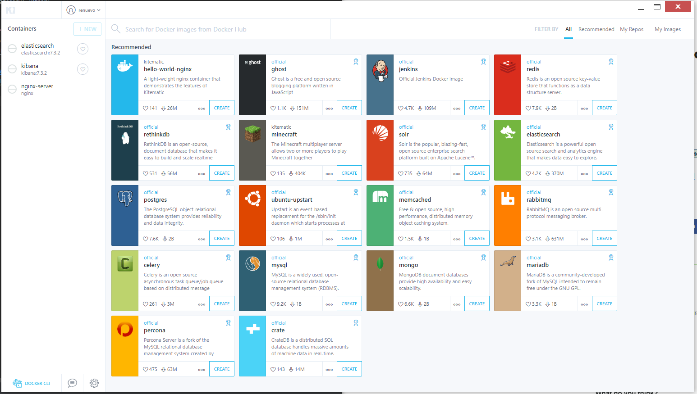
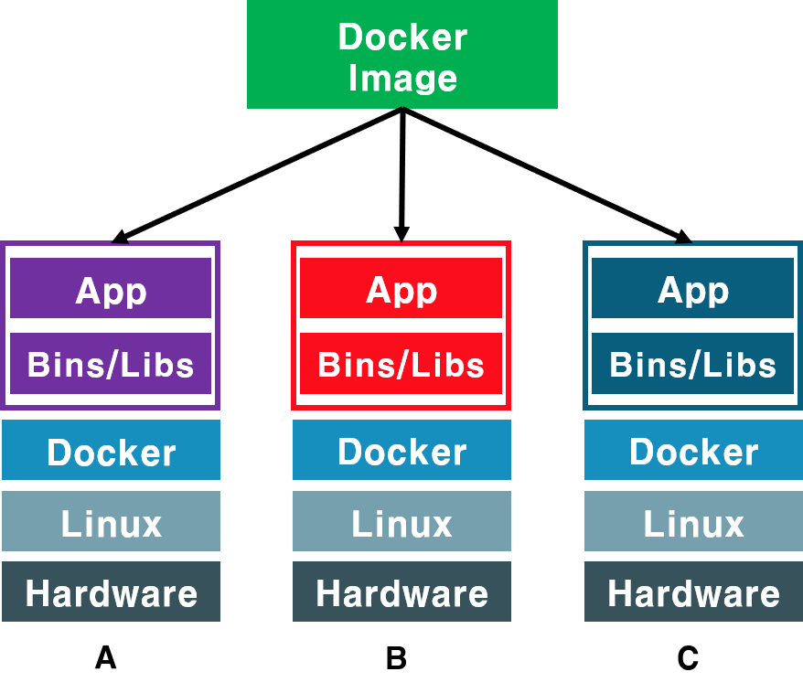

# Docker 시작하기  
이 포스팅을 **Windows에서 Git Bash로 Docker를 활용해 Ubuntu에서 `Hello World`를 출력**하고 `Nginx`까지 설치하는 것을 목표로 합니다  
만약 설치와 Docker의 구조를 모르신다면 아래 포스팅 두개를 보고 오시면 됩니다  

[Windows10 Docker 설치](https://renuevo.github.io/other/docker/docker-setup/)  
[Docker의 구조와 Windows10의 Docker](https://renuevo.github.io/other/docker/docker-hello-world/)  

<br/>

해당 포스팅의 설명은 `Windows10`에서 `Git Bash`를 사용하여 설명합니다  
요즘은 Docker도 편리한 관리를 위해서 아래사진과 같은 `Kitematic`이라는 GUI 툴도 제공합니다  

  
[Docker Doc Kitematic Guide](https://docs.docker.com/kitematic/userguide/)를 통해 정식으로 지원하고 있습니다  
하지만 이번 포스팅에서는 다루지 않고 Command로 진행합니다  
Kitematic을 통한 설정은 추후 Elastic과 Kibana설치를 하는 예제로 포스팅하겠습니다  

---

## Docker의 기본 방식  
Docker는 기본적으로 App실행에 필요한 것들을 Build하여 `Image`를 만드는 것으로 시작합니다  
그리고 이러한 Image를 여러 환경에서 설치한 환경을 `Container`라고 합니다  

```text
간단하게 환경과 App을 저장하고 필요할때 설치한다
```

**그림으로 보면 아래와 같습니다**  

<br/>

  

위의 그림은 처럼 A, B, C 의 전혀 다른 서버에 **Docker Image를 활용해 같은 환경**을 만들수 있습니다  
이렇게 환경을 맞춤으로 많은 이점을 가질 수 있습니다  

**1. 마이크로 서비스에 특화**  
**2. 호환성 문제를 극복**  

제 생각에는 크게 이렇게 2가지를 얻을 수 있다고 생각합니다  
