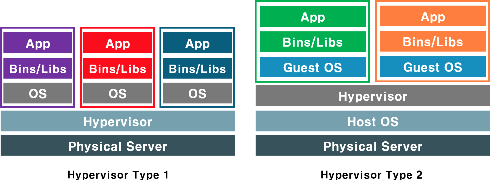
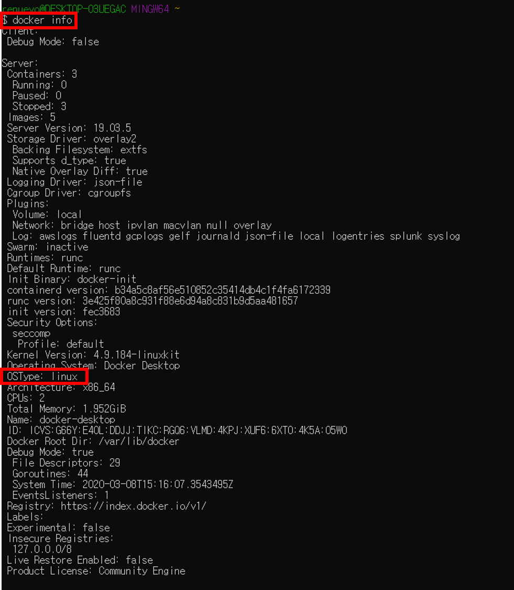
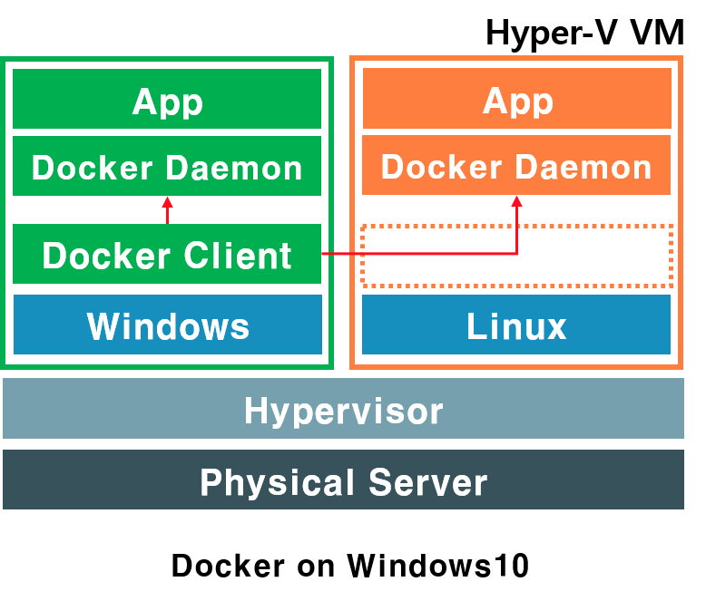
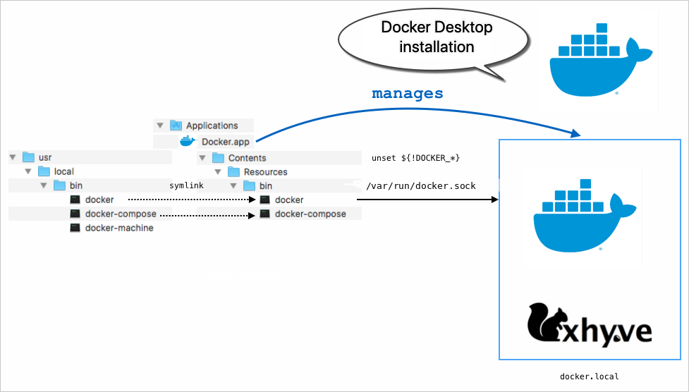

# Docker의 기본 구조  
이번 포스트에서는 `가상화 기술의 3가지`와 `Windows10에서 Hyper-V`가 있어야만 Docker 설치가 가능한 이유를 알아 보도록 하겠습니다  

## 서버 가상화 (Virtual Machine)  
먼저 서버 가상화 기술 2가지에 대해 알아 보겠습니다  

  

 

1. 하이퍼바이저 Type1 가상화  
하이퍼바이저 Type1은 Windows에서 지원하는 `Hyper-V`가 있습니다  
하드웨어를 이용한 가상화 기술로 효율적인 가상화가 가능합니다  

 

2. 하이퍼바이저 Type2(호스트형) 가상화  
호스트형 서버 가상화에는 `VMware Server`가 있습니다  
Host OS위에 가상환경을 만들어 Guest OS를 설치하는 가상화 기술입니다  
하드웨어 및 가상환경이 호스트 OS에 의지하고 있기 때문에 속도가 느립니다   

 

### 전가상화와 반가상화
일반적으로 이 두가지 Type과 같이 나오는 개념이 `전가상화`와 `반가상화`라는 개념이 있습니다    
**반가상화가 전가상화에 비해 상대적으로 성능이 좋습니다**  
Type1을 전가상화 Type2를 반가상화라고 설명하는 글들을 볼 수 있는데 이는 전부 옛말입니다  
요즘은 `전/반가상화`를 혼재해서 사용하는 경우가 많습니다  

보다 자세한 개념은 [하이퍼바이저, 전가상화, 반가상화](https://itholic.github.io/hypervisor/) 포스팅을 참고하시기 바랍니다    

 

## 컨테이너화 (Containers)  
**컨테이너화는 Docker에서 사용하는 가상화 기술입니다**  
VM과 헷갈리기 쉬워 [Containers are not VMs](https://www.docker.com/blog/containers-are-not-vms/)라는 글이 정식으로 등록되기도 했습니다  
그림으로 서로 어떻게 다른지 살펴보겠습니다  

  
Source : [Docker Blog](https://www.docker.com/blog/containers-and-vms-together/)  

`Containers`는 Host OS위에서 동작합니다  
Docker는 추상화를 통해 Host OS 커널을 공유 하면서 각 App Container들이 필요로 하는 요소만을 패킹징하여 제공합니다  
이러한 요소때문에 각각의 OS를 가져야하는 일반적인 가상화 보다 효율적이게 작동할 수 있습니다  

 

**하지만 Host OS 커널에 의존하기 때문에 OS가 다른 경우 오른쪽 그림처럼 VM과 Docker를 같이 사용하는 경우도 존재 합니다**  

 

## Windows10 Hyper-V와 Docker  
**Windows10에서 Hyper-V를 통해 Docker에 Linux 가상화 환경을 제공합니다**  

  
이를 통해 Docker는 OS-TYPE Linux로 동작하는 것을 확인 할 수 있습니다  

 

그러면 Hyper-V를 통해 Windows는 어떻게 Linux 환경을 제공할까요?  
Windows10에서 Linux를 제공하는 방법은 2가지 입니다 :point_right: [Windows 10의 Linux 컨테이너](https://docs.microsoft.com/ko-kr/virtualization/windowscontainers/deploy-containers/linux-containers)    

1. Linux VM를 통한 Linux 컨테이너 실행
2. Hyper-V 격리 통한 Linux 컨테이너 실행

일반적으로 1번 방식을 통해 Docker는 Windows에서도 Linux Container를 동작합니다  
Client는 Windows에 둔 상태에서 Daemon만을 이중으로 두고 운영환경에 맞게 동작됩니다   

 

---

 

**참고로 Mac OS도 같은 이유로 Linux 환경을 제공할 가상환경이 필요합니다**  
Mac OS의 경우는 `Xhyve`라는 `Hypervisor`기반의 `HyperKit`를 통한 경량화 가상 기술을 사용합니다    
[Xhyve](https://github.com/machyve/xhyve)은 Mac OS의 [bhyve](https://en.wikipedia.org/wiki/Bhyve) 버젼으로 `Type2형식`의 Hypervisor를 지원합니다  

 

Source : [Docker Desktop on Mac vs. Docker Toolbox](https://docs.docker.com/docker-for-mac/docker-toolbox/)

 

---  

## 관련 참고  
[Docker Bolg](https://www.docker.com/blog/)  
[도커에 대한 이야기](https://medium.com/@jwyeom63/%EC%8B%9C%EC%9E%91%ED%95%98%EB%8A%94-%EC%9D%B4%EB%93%A4%EC%9D%84-%EC%9C%84%ED%95%9C-%EC%BB%A8%ED%85%8C%EC%9D%B4%EB%84%88-vm-%EA%B7%B8%EB%A6%AC%EA%B3%A0-%EB%8F%84%EC%BB%A4%EC%97%90-%EB%8C%80%ED%95%9C-%EC%9D%B4%EC%95%BC%EA%B8%B0-3a04c000cb5c)  
[Hyper-V 격리](https://docs.microsoft.com/ko-kr/virtualization/windowscontainers/manage-containers/hyperv-container)  
[LinuxKit on Mac OS X with xhyve](https://www.nebulaworks.com/blog/2017/04/23/getting-started-linuxkit-mac-os-x-xhyve/)