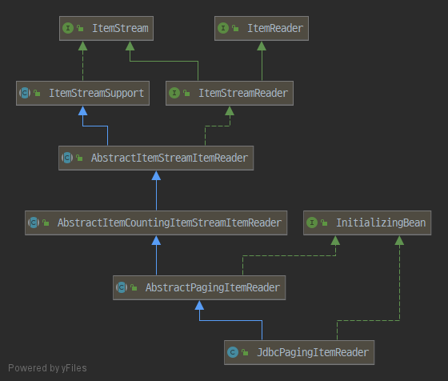
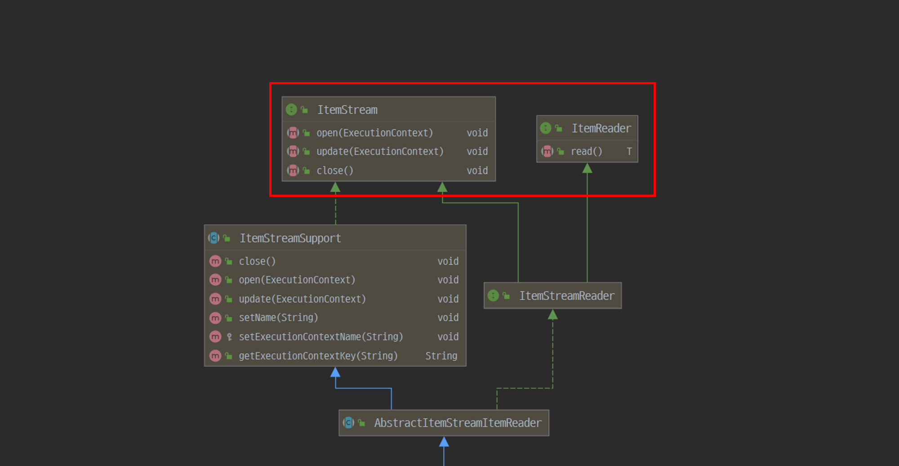
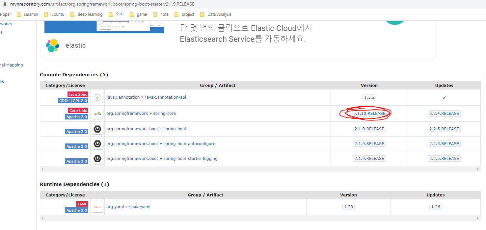
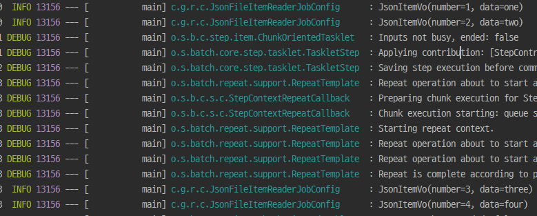
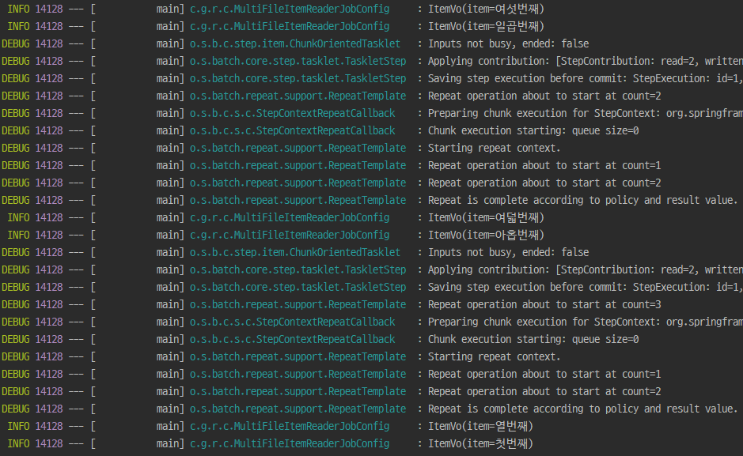

### Spring Batch Guide 시리즈

1. [Spring Batch의 기본 개념](https://renuevo.github.io/spring/batch/spring-batch-chapter-1/)
2. [Spring Batch의 ItemReader - File Item Reader](https://renuevo.github.io/spring/batch/spring-batch-chapter-2/)
3. [Spring Batch의 ItemReader - DB Item Reader](https://renuevo.github.io/spring/batch/spring-batch-chapter-3/)

<br/>

---

<br/>

*Chapter 2에서는 Spring Batch의 File ItemReader에 대한 이야기를 다룹니다*  

<br/>

앞서 본것과 같이 Chunk 지향처리 `3가지`의 구성요소로 이루어져 있습니다  

1. ItemReader  
2. ItemProcessor  
3. ItemWriter  

지금부터 이 3가지 요소의 대해 알아보도록 하겠습니다  

## ItemReader  

기본적으로 Spring Batch는 다음과 같은 흐름으로 많이 사용합니다  

<br/>

**Data -> ItemReader -> ItemProcessor -> ItemWriter -> Data**

<br/>

여기서 `ItemReader`는 데이터를 읽어 들이는 역할을 합니다  
Spring Batch에서는 다양한 데이터를 읽어 올 수 있도록 기본적인 구현체를 제공하고 있습니다  
또한  사용자 개인이 커스텀하여 다양한 형태의 데이터도 읽어 올 수 있도록 확장성도 열어 두었습니다  

<br/>

### ItemReader의 기본 구성

먼저 가장 기본적인 SpringBatch의 ItemReader인 `JdbcPagingItemReader` 살펴 보며 ItemReader의 구조를 알아 보겠습니다  
<br/>

  

보시는 것과 같이 `JdbcPagingItemReader`는 여러 Class와 Interface를 상속받아 구현되어 있습니다  
여기서 눈여겨 볼것은 상위에 위치되어 있는 `ItemStream`와 `ItemReader` 인터페이스입니다  

<br/>

   


먼저 2개의 인터페이스중 ItemReader를 먼저 살펴 보겠습니다  

<br/>

**1. ItemReader는 Step에서 요구하는 필수적인 인터페이스입니다**  
```java

public interface ItemReader<T> {
    T read() throws Exception, UnexpectedInputException, ParseException, NonTransientResourceException;
} 

```
내부도 간단하게 Step에서 사용할 데이터를 가져오는 Read에 대한 역할에 충실하고 있습니다  
Step은 이런 ItemReader를 받아와서 데이터 Reader 업무를 수행합니다  

```java

public SimpleStepBuilder<I, O> reader(ItemReader<? extends I> reader) {
    this.reader = reader;
    return this;
}   

```
사용자 지정 Reader를  ItemReader를 구현할때 상속받아 read() 부분을 구현하시면 됩니다  

<br/>

**2. 다음은 ItemStream 입니다**  
구성은 다음과 같이 3가지의 메소드를 가지고 있습니다  

```java

public interface ItemStream {

	void open(ExecutionContext executionContext) throws ItemStreamException;

	void update(ExecutionContext executionContext) throws ItemStreamException;

	void close() throws ItemStreamException;
}

```

**ItemStream은 주기적으로 상태를 업데이트하고 오류가 발생하면 복원상태를 확인 가능하게 합니다**  
open과 close는 Stream에 열고 닫음을 설정합니다  
update는 상태를 주기적으로 업데이트 하는 역할을 담당합니다  

<br/>

기본 구성은 다음과 같고 다음으로 Spring Batch에서 제공하는 기본적인 ItemReader들과 커스텀 구현을 알아 보도록 하겠습니다  

<br/>

---

## Spring Batch의 ItemReader  

Spring Batch에서 제공하는 ItemReader는 2가지의 유형으로 나눠서 설명드리겠습니다  

**1. File 형식의 데이터 Reader (txt, csv, xml, json)**  
**2. DB접근을 통한 데이터 Reader**  

DB접근을 통한 데이터 Reader는 Chapter 3에서 설명드릴 예정입니다  
Chapter 2에서는 File Reader에 대해서 살펴보도록 하겠습니다  

---

### File Reader  

**1. Txt 파일 ItemReader** :point_right: [Code](https://github.com/renuevo/spring-boot-in-action/blob/master/spring-boot-batch-in-action/src/main/java/com/github/renuevo/config/TxtFileItemReaderJobConfig.java)  
txt 파일의 아이템 Reader는 **FlatFileItemReader**를 통해 Read 할 수 있습니다  

```java

@Bean
public FlatFileItemReader<ItemVo> txtFileItemReader() {
    FlatFileItemReader<ItemVo> flatFileItemReader = new FlatFileItemReader<>();
    flatFileItemReader.setResource(new ClassPathResource("/sample.txt")); /* highlight-line */  
    flatFileItemReader.setLineMapper((line, lineNumber) -> new ItemVo(line)); /* highlight-line */  
    return flatFileItemReader;
}

```

setResource로 Read할 파일의 Resource를 지정해줍니다  
그러면 Step에서 Read할때 Line으로 데이터를 Read하게 됩니다  
**Read하는 데이터를 내부적으로 LineMapper를 통해 Mapping을 진행하게 되며 setLineMapper를 통해 LineMapper를 지정해 주면됩니다**   

<br/>

<span class='code_header'>LineMapper</span>
```java

public interface LineMapper<T> {
	T mapLine(String line, int lineNumber) throws Exception;
}

```
LineMapper는 2가지의 파라미터를 받게 되는데 line은 한줄의 데이터를 lineNumber는 해당데이터의 라인번호를 의미합니다  
이를 토대로 Mapper를 프로세스에 맞게 만들어서 설정 가능합니다  

<br/>

---

**2. Csv 파일 ItemReader**  :point_right: [Code](https://github.com/renuevo/spring-boot-in-action/blob/master/spring-boot-batch-in-action/src/main/java/com/github/renuevo/config/CsvFileItemReaderJobConfig.java)  

Csv파일도 txt파일을 읽어오는것과 별반 다르지 않습니다  
FlatFileItemReader를 통해서 LineMapper만 수정해서 받아오면 됩니다  

```java

@Bean
public FlatFileItemReader<CsvItemVo> csvFileItemReader() {
    FlatFileItemReader<CsvItemVo> flatFileItemReader = new FlatFileItemReader<>();
    flatFileItemReader.setResource(new ClassPathResource("/sample_data.csv"));
    flatFileItemReader.setLinesToSkip(1);  /* highlight-line */    

    DefaultLineMapper<CsvItemVo> defaultLineMapper = new DefaultLineMapper<>();  /* highlight-line */  

    DelimitedLineTokenizer delimitedLineTokenizer = new DelimitedLineTokenizer();
    delimitedLineTokenizer.setNames("number","item");

    BeanWrapperFieldSetMapper<CsvItemVo> beanWrapperFieldSetMapper = new BeanWrapperFieldSetMapper<>();
    beanWrapperFieldSetMapper.setTargetType(CsvItemVo.class);

    defaultLineMapper.setLineTokenizer(delimitedLineTokenizer);
    defaultLineMapper.setFieldSetMapper(beanWrapperFieldSetMapper);

    flatFileItemReader.setLineMapper(defaultLineMapper);  /* highlight-line */  
    return flatFileItemReader;
}

```

예제에서는 flatFileItemReader에 setLinesToSkip을 설정해서 Header라인인 첫라인을 무시했습니다  
그리고 `DefaultLineMapper`를 통해서 Csv파일을 VO Class로 바인딩 해줍니다  
내부적으로 `DefaultLineMapper`는 mapLine을 통해서 데이터를 Mapping 합니다  
```java

    @Override
	public T mapLine(String line, int lineNumber) throws Exception {
		return fieldSetMapper.mapFieldSet(tokenizer.tokenize(line));   /* highlight-line */    
	}

```

위에 소스를 보시면 Tokenizer를 통해 Line을 분류하고 MapfieldSet을 통해 데이터를 바인딩하는것을 알 수 있습니다  
그래서 **DelimitedLineTokenizer에 Tokenizer와 FieldSetMapper를 설정해 주어야 합니다**  

<br/>

**Tokenizer부터 살펴보겠습니다**  

```java

DelimitedLineTokenizer delimitedLineTokenizer = new DelimitedLineTokenizer();
delimitedLineTokenizer.setNames("number","item");

```  
Tokenizer는 `DelimitedLineTokenizer`를 사용했습니다   
setNames를 통해 각각의 데이터의 이름만을 설정해주고 사용하였습니다  
`DelimitedLineTokenizer`는 내부적으로 `,`를 구분자로 가지고 있어서 Csv를 Read할 경우 바로 사용 가능합니다  
만약 다른 구분자가 다른 데이터를 가지고 올 경우에는 setDelimiter로 변경 가능합니다  

```java

public class DelimitedLineTokenizer extends AbstractLineTokenizer implements InitializingBean {
    
    ...

	public static final String DELIMITER_COMMA = ",";  /* highlight-line */    

	public DelimitedLineTokenizer() {
		this(DELIMITER_COMMA);
	}

	public void setDelimiter(String delimiter) {  /* highlight-line */    
		this.delimiter = delimiter;
	}

    ...
}

```

<br/>

**다음으로 FieldSetMapper입니다**
```java

BeanWrapperFieldSetMapper<CsvItemVo> beanWrapperFieldSetMapper = new BeanWrapperFieldSetMapper<>();
beanWrapperFieldSetMapper.setTargetType(CsvItemVo.class);

```  
FieldSetMapper는 Tokenizer에서 가지고온 데이터들을 VO로 바인드하는 역할을 합니다  
기본적인 `BeanWrapperFieldSetMapper`을 사용하였고 `setTargetType`을 통해 class를 넘겨주면 내부에서 newInstance를 통해 객체를 생성해서 데이터를 바인드하고 return 합니다   

<br/>

**이 두개의 기능을 DefaultLineMapper을 통해서 FlatFileItemReader에 전달하면 간편하게 Csv를 읽을 수 있습니다**  
```java

defaultLineMapper.setLineTokenizer(delimitedLineTokenizer);
defaultLineMapper.setFieldSetMapper(beanWrapperFieldSetMapper);

```

~~이들을 활용하면 왠만한 File들은 전부 쉽게 읽을 수 있습니다~~

마지막으로 위의 소스들은 익명클래스를 활용해서 간단하게 구현도 가능합니다  

```java

@Bean
public FlatFileItemReader<CsvItemVo> csvFileItemReader() {
    FlatFileItemReader<CsvItemVo> flatFileItemReader = new FlatFileItemReader<>();
    flatFileItemReader.setResource(new ClassPathResource("/sample_data.csv"));
    flatFileItemReader.setLinesToSkip(1);
    flatFileItemReader.setLineMapper(new DefaultLineMapper<>() {
        {
            setLineTokenizer(new DelimitedLineTokenizer() {
                {
                    setNames("number", "item");
                }
            });

            setFieldSetMapper(new BeanWrapperFieldSetMapper<>(){
                {
                    setTargetType(CsvItemVo.class);
                }
            });
        }
    });
    return flatFileItemReader;
}

```

<br/>

---

**3. XML 파일 ItemReader** :point_right: [Code](https://github.com/renuevo/spring-boot-in-action/blob/master/spring-boot-batch-in-action/src/main/java/com/github/renuevo/config/XmlFileItemReaderJobConfig.java)

XML은 앞서 설명드린 FlatFileItemReader와 달리 다른 Class를 사용합니다  
여기서는 [Spring OXM](https://docs.spring.io/spring/docs/current/spring-framework-reference/data-access.html#oxm)을 통해 XML을 읽는 방법을 소개 합니다  

<br/>

Reader에서 사용할 Sample XML 파일을 준비합니다  

```xml

<?xml version="1.0" encoding="UTF-8" ?>
<items>
    <item id="1">
        <number>1</number>
        <data>one</data>
    </item>
    <item id="2">
        <number>2</number>
        <data>two</data>
    </item>
    <item id="3">
        <number>3</number>
        <data>three</data>
    </item>
    <item id="4">
        <number>4</number>
        <data>four</data>
    </item>
</items>

```

그리고 자신의 버젼에 맞는 의존관계 설정이 필요합니다  
아래 그림과 간이 `xstream`과 `spring-oxm`을 gradle에 추가해 줍니다  
```groovy
dependencies {
 ...
 implementation group: 'com.thoughtworks.xstream', name: 'xstream', version: '1.4.11.1'
 implementation group: 'org.springframework', name: 'spring-oxm', version: '5.1.10.RELEASE'
 ...
}

```
Spring Boot의 따로 oxm은 없고 Spring 버젼에 맞는 oxm을 가져와서 추가해야 깔끔할겁니다  
저는 Spring Boot 2.1.9를 사용하고 있고 해당 버젼의 spring-core는 5.1.10으로 oxm도 5.1.10으로 추가해 줬습니다  
Spring Boot의 Spring 버젼 확인 방법은 아래와 같은 Compile Dependencies를 확인하시면 됩니다  



<br/>

자 그럼 이제 필요한 요건은 모두 갖춰졌습니다  
이제 XML을 VO로 읽어 보겠습니다  
Spring Batch에서는 XML을 읽기 위해서 `StaxEventItemReader` Class를 제공합니다  

<br/>

**먼저 VO객체 Class를 정의합니다**  

```java

@Data
public class XmlItemVo {
    int number;
    String data;
}

``` 
주의 하실점은 다른곳에서도 사용하는 VO로 생성자를 재정의 할 경우 Default 생성자는 꼭 생성을 해주셔야 합니다  

<br/>

**다음으로 ItemReader Bean을 정의합니다**  

```java

@Bean
public StaxEventItemReader<XmlItemVo> xmlFileItemReader() {
    return new StaxEventItemReaderBuilder<XmlItemVo>()
            .name("xmlFileItemReader")
            .resource(new ClassPathResource("/sample_xml_data.xml"))
            .addFragmentRootElements("item")
            .unmarshaller(itemMarshaller())  /* highlight-line */
            .build();
}

```

위의 소스를 한눈의 알아 볼 수 있을 정도로 간결합니다  
그중에서 기존에 spring-oxm을 안접해 보신 분들에게는 `unmarshaller`만 새로운 개념으로 보이실 겁니다  
unmarshaller는 간단히 말해서 스트림을 객체로 역직렬화하는 것입니다  
관련 정보의 대해 자세히 알고 싶으신 분들은 [Outsider's Dev Story](https://blog.outsider.ne.kr/891)해당 포스터를 참고해 주시기 바랍니다  

<br/>

**itemMarshaller는 역질렬화는 XStreamMarshaller를 통해 간단하게 정의 가능합니다**  
```java

@Bean
public XStreamMarshaller itemMarshaller() {
    Map<String, Class<?>> aliases = Maps.newHashMap();
    aliases.put("item", XmlItemVo.class);
    aliases.put("number", Integer.class);
    aliases.put("data", String.class);
    XStreamMarshaller xStreamMarshaller = new XStreamMarshaller();
    xStreamMarshaller.setAliases(aliases);
    return xStreamMarshaller;
}

```
각 필드별 자료형을 정의해 주고 setAliases로 넘겨주기만 하면 간단하게 마샬링이 구현가능합니다  
다음과 같은 구현으로 XML Reader는 구현이 끝났습니다  

하지만 그냥 실행하게 된다면 다음과 같은 경고를 만나실 수 있습니다  

<br/>

<span class='red_font'>Security framework of XStream not initialized, XStream is probably vulnerable</span>

<br/>

해당경고는 XStream이 보안허점이 될수 있으므로 언마샬링 대상을 지정하여 설정하기를 권장하기 때문입니다  
다음과 같이 보안 설정 파일을 만들어서 해결 가능합니다  

```java

@Configuration
public class JobSecurityConfig {

    public JobSecurityConfig(XStreamMarshaller marshaller) {
        XStream xstream = marshaller.getXStream();
        XStream.setupDefaultSecurity(xstream);    /* highlight-line */
        xstream.allowTypes(new Class[]{XmlItemVo.class});
    }

}

```
<br/>

---

**4. JSON 파일 ItemReader** :point_right: [Code](https://github.com/renuevo/spring-boot-in-action/blob/master/spring-boot-batch-in-action/src/main/java/com/github/renuevo/config/JsonFileItemReaderJobConfig.java)  
이번엔 XML 형식보다 요즘 많이 사용되는 JSON형식을 읽는 ItemReader에 대해 알아 보겠습니다  
Json형식은 XML처럼 복잡하지 않고 간단하게 Spring Batch에 있는 `JsonItemReaderBuilder`로 ItemReader를 생성 가능합니다  

<br/>

**먼저 Sample Json 파일을 준비합니다**  
```json

[
  {
    "number" : 1,
    "data" : "one"
  },
  {
    "number" : 2,
    "data" : "two"
  },
  {
    "number" : 3,
    "data" : "three"
  },
  {
    "number" : 4,
    "data" : "four"
  }
]

```

<br/>

**그리고 그것에 맞는 VO Class를 하나 생성해 줍니다  
```java

@Data
@NoArgsConstructor
@AllArgsConstructor
public class JsonItemVo {
    int number;
    String data;
}

```
만약 VO객체의 변수명과 Json객체의 명이 다를 경우는 `@JsonProperty`를 사용해 이름을 지정해 주시면 됩니다  
`JacksonJsonObjectReader`를 사용해서 내부적으로 ObjectMapper로 구현되기 때문입니다  
Jackson과 관련하여 자세한 사용법을 알고 싶으시면 :point_right: [Jackson JSON Tutorial](https://www.baeldung.com/jackson)  

<br/>

<span class='code_header'>JsonItemReader</span>
```java

@Bean
public JsonItemReader<JsonItemVo> jsonItemReader(){
    return new JsonItemReaderBuilder<JsonItemVo>()
            .jsonObjectReader(new JacksonJsonObjectReader<>(JsonItemVo.class))  /* highlight-line */
            .resource(new ClassPathResource("/sample_json_data.json"))
            .name("jsonItemReader")
            .build();
}

```
ItemReader 설정은 다음과 같이 간단한 설정으로 JsonItem은 Read 가능합니다  
**JsonItemReaderBuilder로 build하면서 jsonObjectReader로 JacksonJsonObjectReader로 설정하고 VO객체를 적용해 주면 됩니다**  
그리고 실행하시면 아래 처럼 잘 Read 되는걸 확인 할 수 있습니다  



<br/>

---

**5. Multi 파일 ItemReader** :point_right: [Code](https://github.com/renuevo/spring-boot-in-action/blob/master/spring-boot-batch-in-action/src/main/java/com/github/renuevo/config/MultiFileItemReaderJobConfig.java)  
File Item Reader의 마지막으로 여러 File을 읽는 방법을 소개 하겠습니다  
여러 파일을 읽을 때는 Spring Batch에서 제공하는 `MultiResourceItemReader`를 사용하시면 됩니다  
일단 sample txt 파일 2개를 준비합니다  

<span class='code_header'>sample.txt</span>
```text
첫번째
두번째
세번째
네번째
다섯번째

```
<span class='code_header'>sample2.txt</span>
```text

여섯번째
일곱번째
여덟번째
아홉번째
열번째

```

Sample txt를 한 폴더에 두는 것으로 데이터는 준비되었습니다  

<br/>

<span class='code_header'>Multi File ItemReader</span>
```java

@Bean
@SneakyThrows
public MultiResourceItemReader<ItemVo> multiResourceItemReader(){
    MultiResourceItemReader<ItemVo> resourceItemReader = new MultiResourceItemReader<ItemVo>();
    resourceItemReader.setResources(ResourcePatternUtils.getResourcePatternResolver(this.resourceLoader).getResources("read_sample/*.txt"));  /* highlight-line */  
    resourceItemReader.setDelegate(multiFileItemReader());  /* highlight-line */  
    return resourceItemReader;
}


@Bean
public FlatFileItemReader<ItemVo> multiFileItemReader() {
    FlatFileItemReader<ItemVo> flatFileItemReader = new FlatFileItemReader<>();
    flatFileItemReader.setLineMapper((line, lineNumber) -> new ItemVo(line));
    return flatFileItemReader;
}

```

다음은 `MultiResourceItemReader` 코드를 보겠습니다  
이전에는 `FlatFileItemReader`에서 Resource를 설정해 줬지만 이번에는 Multi Reader에서는 `MultiResourceItemReader`에 Resource를 Array를 설정해 주는것 만으로 
여러 파일들을 읽게 설정이 가능합니다  

  

<br/>

참고로 Resource를 Array를 읽는 방법은 여러가지가 있습니다  
저는 위에 처럼 getResourcePatternResolver를 사용해 Pattern으로 가져와서 MultiResourceItemReader에 설정 해 줬습니다  
다음과 같이도 설정이 가능합니다  

```java

@Value("input/sample*.csv")
private Resource[] inputResources;

```

<br/>

---

이것으로 File ItemReader에 대해서 알아 봤습니다  
위와 같이 Spring Batch는 여러 종류의 File들을 간편하게 Read 하는 방법을 제공 하고 있습니다  
다음으로는 보다 안정적으로 데이터 관리하고 사용하는 DB와 Spring Batch를 연동하여 Read하는 방법에 대해서 알아보도록 하겠습니다  

---
## 관련 참고

[Spring Batch Doc](https://docs.spring.io/spring-batch/docs/current/reference/html/index.html)   
[기억보단 기록을](https://jojoldu.tistory.com/)   