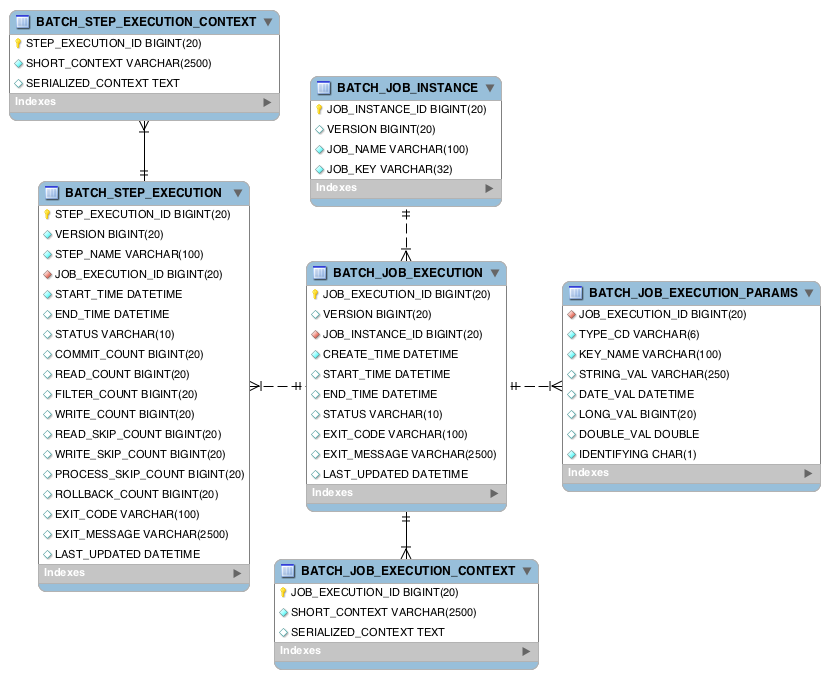
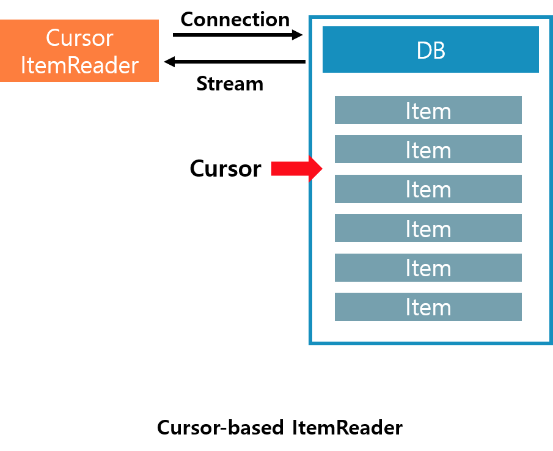

*Chapter 3에서는 Spring Batch의 DB ItemReader에 대한 이야기를 다룹니다*  

<br/>

## Spring의 JDBC ItemReader  

Spring은 사용자 편의를 위하여 `JDBC의 기능을 확장`해서 `추상화 서비스`로 제공합니다  
사용자는 이렇게 제공된 JDBC ItemReader 구현체로 간편하게 Item을 읽어올 수 있어 보다 서비스에 집중 할 수 있습니다  

그럼 Item의 읽어오는 방식을 먼저 생각해 보겠습니다  
앞서 [Chapter 1](https://renuevo.github.io/spring/batch/spring-batch-chapter-1/)에서 마지막에서 설명했듯 프로세스를 Spring Batch는 `Chuck 지향 처리`를 합니다  

```textbox
Spring Batch의 가장 큰 장점 중 하나는 `Chunk` 지향 처리입니다  
`Chunk`지향처리란 한 번에 하나씩의 데이터를 읽어 Chunk라는 덩어리를 만든 뒤, Chunk 단위로 트랜잭션을 다루는 것을 의미합니다  
그래서 트랜잭션을 수행시 `Chunk`단위로 수행하기 때문에 Chunk 만큼만 롤백 됩니다  
```
    
이러한 구조상 순차적으로 Item을 일정 사이즈 만큼 받아와서 처리해야 할 것입니다  
하지만 <span class='red_font'> Spring의 JdbcTemplate은 자체적으로 분할처리를 지원하지 않습니다</span>   
때문에 `limit`와 `offset`을 사용자가 직접지정하여 사용하는 작업이 필요합니다  

<br/>

Spring Batch는 이러한 구현을 사용자가 직접하지 않고 사용할 수 있도록 자체적으로 서비스를 `2가지 방식`으로 제공합니다

1. Cursor-based ItemReader  
2. Paging ItemReader  

<br/>


2가지 방식은 같은 데이터를 읽어 오지만 서로 다른 전략으로 DB의 데이터를 읽어 옵니다  
프로세스 동작에 따라 알맞은 전략을 선택해야 하며 전략선택에 따라 Batch의 퍼포먼스를 높일 수 있습니다  

<br/>


## Sample DB Setting  
ItemReader를 테스트할 DB를 먼저 세팅해 보겠습니다  
테스트에 사용할 DB는 `H2`를 선택했습니다  
`MYSQL`을 사용하시고 싶으신 분들은 Meta Table을 생성하셔서 사용하셔도 됩니다  

  

`H2`의 경우 `Meta Table`을 자동으로 생성해주기 때문에 별다른 설정 없이 테스트 가능합니다  
다른 DB들 경우 각각의 쿼리로 해당 Table들을 생성해 주어야 정상적으로 작동합니다  

[MYSQL-Spring-Batch-SCHEMA](https://github.com/spring-projects/spring-batch/blob/master/spring-batch-core/src/main/resources/org/springframework/batch/core/schema-mysql.sql)  

<br/>

의존관계를 Gradle에 추가해 줍니다  
```groovy

dependencies {
 ...
    implementation 'org.springframework.boot:spring-boot-starter-data-jdbc'
    implementation 'org.springframework.boot:spring-boot-starter-data-jpa'
    runtimeOnly 'com.h2database:h2'
 ...
}

```  

그리고 application-property로 DB설정을 해주겠습니다  
여러개의 Job을 각각 실행해보기 위해서 batch-job-names을 설정합니다  

```groovy

spring:
  datasource:
    hikari:
      driver-class-name: org.h2.Driver
      jdbc-url: jdbc:h2:mem:spring-batch
      username: sa
      password:
  jpa:
    show-sql: true
    hibernate:
      ddl-auto: create-drop
    database-platform: org.hibernate.dialect.H2Dialect
  batch:
    job:
      names: ${job.name:NONE}   //--job.name=jdbcCursorItemReaderJob

```

schema.sql
```sql

DROP TABLE IF EXISTS pay;
DROP TABLE IF EXISTS pay2;
DROP TABLE IF EXISTS tax;

create table pay (
  id         bigint not null auto_increment,
  amount     bigint,
  tx_name     varchar(255),
  tx_date_time datetime,
  primary key (id)
);

create table pay2 (
  id         bigint not null auto_increment,
  amount     bigint,
  tx_name     varchar(255),
  tx_date_time datetime,
  primary key (id)
);

create table tax (
  id        bigint not null auto_increment,
  pay_id    bigint,
  pay_tax   bigint,
  location  varchar(255),
  primary key (id)
);


insert into pay (amount, tx_name, tx_date_time) VALUES (1000, 'trade1', '2018-09-10 00:00:00');
insert into pay (amount, tx_name, tx_date_time) VALUES (2000, 'trade2', '2018-09-10 00:00:00');
insert into pay (amount, tx_name, tx_date_time) VALUES (3000, 'trade3', '2018-09-10 00:00:00');
insert into pay (amount, tx_name, tx_date_time) VALUES (4000, 'trade4', '2018-09-10 00:00:00');

```


## Cursor-based ItemReader  
먼저 설명드릴 것은 Batch 시스템의 `default`로 쓰인다고 할 수 있는 `Cursor Based ItemReader`입니다  

<br/>

  

<br/>

Java의 `ResultSet`클래스는 `Cursor`를 조작하여 데이터를 읽어 옵니다  
데이터 베이스에 Cursor를 지정해 두고 `next`를 통해서 Cursor의 위치를 **이동해 가면서 차례대로** 가져옵니다  

<br/>

이러한 전략에 따라 장점과 단점 그리고 유의 해야할 점이 발생 합니다  
먼저 이러한 유의사항들을 알아보고 Spring Batch에 제공하는 `3가지`의 Cursor-based ItemReader에 대해 알아보겠습니다  

---

### 장점   

1. **뛰어난 퍼포먼스를 가진다**:thumbsup:  
    모든 데이터를 조회한 뒤 Cursor설정하고 이동하는 방식으로 데이터를 가져오는 방식은 `높은 성능`을 보여 줍니다   
    때문에 이슈가 되지 않는 한 `Default ItemReader`로 사용하기 좋습니다  
<br/>    
2. **Batch 프로세스 동작동안에 데이터 무결성이 유지된다**    
   스냅샷 방식으로 동작하기 때문에 데이터의 변경에 대해 안전합니다  
   Connection을 맺고 <span class='red_font'>Close</span>하기 전까지 DB 트랜잭션을 무시 합니다  

<br/>

### 단점  
1. **메모리 사용량이 높다**  
    스냅샷 방식을 사용하기 때문에 많은 메모리를 사용합니다   
<br/>    
2. **멀티 쓰레드 환경 사용 불가**    
    `단일 ResultSet`을 가지기 때문에 <span class='red_font'>Thread Safe 하지 않습니다</span>  
<br/>
3. **긴 Timeout 설정이 필요할 수 있다**  
    `Cursor`가 <span class='red_font'>Close</span>전까지 유지되기 때문에 충분한 `Timeout 시간`이 필요합니다  

<br/>
<br/>

**장점보다 단점이 많아 보이지만 `성능상 유리`하기 때문에 사용하기 좋습니다**  
멀티 쓰레드 환경이 아니고 메모리 사용량도 엄청큰 대량의 데이터가 아닌 이상 사용상 문제는 없습니다  

<br/>

---  

다음은 Spring Batch에서 제공하는 `Cursor-based ItemReader 3가지`에 대해 알아보겠습니다  

**Cursor-based ItemReader**  
>1. JdbcCursorItemReader   
>2. HibernateCursorItemReader  
>3. StoredProcedureItemReader  


## Paging ItemReader  
**Paging ItemReader**  
>1. JdbcPagingItemReader  
>2. JpaPagingItemReader   


---

[Cursor-based ItemReader Thread Safe](https://stackoverflow.com/questions/28719836/spring-batch-problems-mix-data-when-converting-to-multithread)