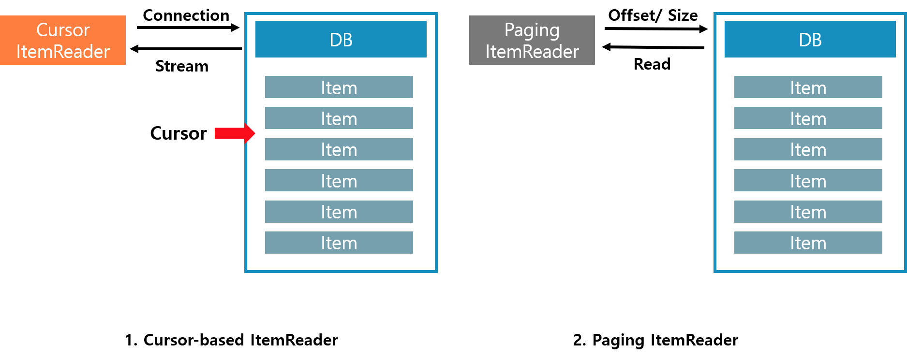

*Chapter 3에서는 Spring Batch의 DB ItemReader에 대한 이야기를 다룹니다*  

<br/>

## Spring의 JDBC ItemReader  

Spring은 사용자 편의를 위하여 `JDBC의 기능을 확장`해서 `추상화 서비스`로 제공합니다  
사용자는 이렇게 제공된 JDBC ItemReader 구현체로 간편하게 Item을 읽어올 수 있어 보다 서비스에 집중 할 수 있습니다  

그럼 Item의 읽어오는 방식을 먼저 생각해 보겠습니다  
앞서 [Chapter 1](https://renuevo.github.io/spring/batch/spring-batch-chapter-1/)에서 마지막에서 설명했듯 프로세스를 Spring Batch는 `Chuck 지향 처리`를 합니다  

```textbox
Spring Batch의 가장 큰 장점 중 하나는 `Chunk` 지향 처리입니다  
`Chunk`지향처리란 **한 번에 하나씩의 데이터를 읽어 Chunk라는 덩어리를 만든 뒤, Chunk 단위로 트랜잭션**을 다루는 것을 의미합니다  
그래서 트랜잭션을 수행시 `Chunk`단위로 수행하기 때문에 Chunk 만큼만 롤백 됩니다  
```
    
이러한 구조상 순차적으로 Item을 일정 사이즈 만큼 받아와서 처리해야 할 것입니다  
하지만 <span class='red_font'> Spring의 JdbcTemplate은 자체적으로 분할처리를 지원하지 않습니다</span>   
때문에 `limit`와 `offset`을 사용자가 직접지정하여 사용하는 작업이 필요합니다  

<br/>

Spring Batch는 이러한 구현을 사용자가 직접하지 않고 사용할 수 있도록 자체적으로 서비스를 `2가지 방식`으로 제공합니다

1. Cursor-based ItemReader  
2. Paging ItemReader  

<br/>

2가지 방식은 같은 데이터를 읽어 오지만 서로 다른 전략으로 DB의 데이터를 읽어 옵니다  


