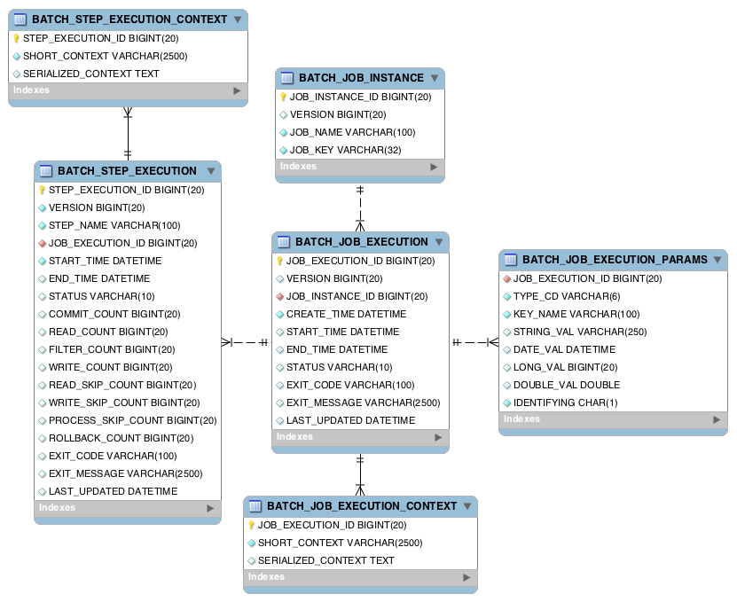
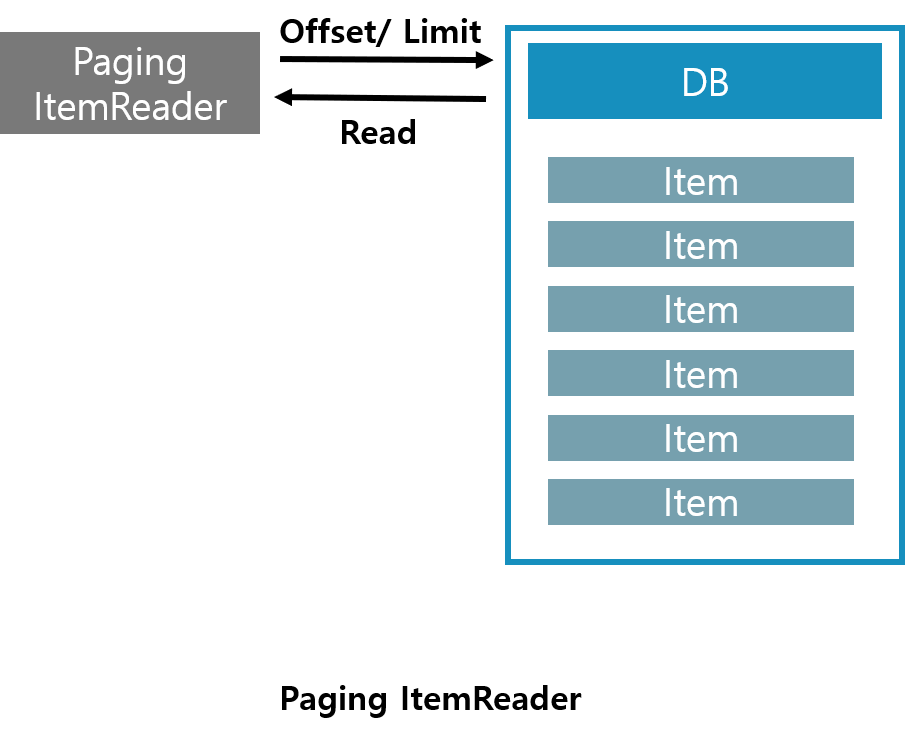

*Chapter 4에서는 Spring Batch의 File ItemWriter에 대한 이야기를 다룹니다*  

<br/>

## Spring의 ItemWriter  
File ItemWriter를 알기에 앞서 먼저 ItemWriter부터 살펴보겠습니다  

<br/>

**Data -> ItemReader -> ItemProcessor -> ItemWriter -> Data**

<br/>

여기서 `ItemWriter`는 앞서 처리되어진 데이터를 마지막에 처리하는 역할을 합니다  
Spring Batch에서는 다양한 데이터를 처리할 수 있도록 기본적인 구현체를 제공하고 있습니다  
또한  사용자 개인이 커스텀하여 다양한 형태의 데이터도 처리 할 수 있도록 확장성도 열어 두었습니다  

<br/>

### ItemWriter의 기본 구성
먼저 가장 기본적인 SpringBatch의 ItemReader인 `JdbcBatchItemWriter` 살펴 보며 ItemWriter의 구조를 알아 보겠습니다  

<br/>


<span class='img_caption'>JdbcBatchItemWriter UML</span>

<br/>

JdbcBatchItemWriter는 `InitializingBean`과 `ItemWriter` 2개의 인터페이스를 구현하고 있습니다  

  1. **InitializingBean**  
     Bean을 처음 초기화시 필수 인자들을 확인하는 메소드 afterPropertiesSet()를 가지고 있다  
     **ItemWriter를 구현후 afterPropertiesSet를 실행하여 필수 세팅값을 확인합니다**  
     ```java
     	/**
     	 * Check mandatory properties - there must be a SimpleJdbcTemplate and an SQL statement plus a
     	 * parameter source.
     	 */
     	@Override
     	public void afterPropertiesSet() {
     		Assert.notNull(namedParameterJdbcTemplate, "A DataSource or a NamedParameterJdbcTemplate is required.");
     		Assert.notNull(sql, "An SQL statement is required.");
     		List<String> namedParameters = new ArrayList<>();
     		parameterCount = JdbcParameterUtils.countParameterPlaceholders(sql, namedParameters);
     		if (namedParameters.size() > 0) {
     			if (parameterCount != namedParameters.size()) {
     				throw new InvalidDataAccessApiUsageException("You can't use both named parameters and classic \"?\" placeholders: " + sql);
     			}
     			usingNamedParameters = true;
     		}
     		if (!usingNamedParameters) {
     			Assert.notNull(itemPreparedStatementSetter, "Using SQL statement with '?' placeholders requires an ItemPreparedStatementSetter");
     		}
     	}
     ```
     
     <br/>
  2. **ItemWriter**
     실제 Writer 기능의 메소드를 가지고 있습니다  
     때문에 간편하게 ItemWriter의 write를 구현하여 Batch의 Writer기능을 커스텀 할 수 있습니다  
     
     ```java
      public interface ItemWriter<T> {
        /**
         * Process the supplied data element. Will not be called with any null items
         * in normal operation.
         *
         * @param items items to be written
         * @throws Exception if there are errors. The framework will catch the
         * exception and convert or rethrow it as appropriate.
         */
        void write(List<? extends T> items) throws Exception;
      }
     ```
     <br/>

<br/>

   


먼저 2개의 인터페이스중 ItemReader를 먼저 살펴 보겠습니다  

<br/>

**1. ItemReader는 Step에서 요구하는 필수적인 인터페이스입니다**  
```java

public interface ItemReader<T> {
    T read() throws Exception, UnexpectedInputException, ParseException, NonTransientResourceException;
} 

```
내부도 간단하게 Step에서 사용할 데이터를 가져오는 Read에 대한 역할에 충실하고 있습니다  
Step은 이런 ItemReader를 받아와서 데이터 Reader 업무를 수행합니다  

```java

public SimpleStepBuilder<I, O> reader(ItemReader<? extends I> reader) {
    this.reader = reader;
    return this;
}   

```
사용자 지정 Reader를  ItemReader를 구현할때 상속받아 read() 부분을 구현하시면 됩니다  

<br/>

**2. 다음은 ItemStream 입니다**  
구성은 다음과 같이 3가지의 메소드를 가지고 있습니다  

```java

public interface ItemStream {

	void open(ExecutionContext executionContext) throws ItemStreamException;

	void update(ExecutionContext executionContext) throws ItemStreamException;

	void close() throws ItemStreamException;
}

```

**ItemStream은 주기적으로 상태를 업데이트하고 오류가 발생하면 복원상태를 확인 가능하게 합니다**  
open과 close는 Stream에 열고 닫음을 설정합니다  
update는 상태를 주기적으로 업데이트 하는 역할을 담당합니다  

<br/>

기본 구성은 다음과 같고 다음으로 Spring Batch에서 제공하는 기본적인 ItemReader들과 커스텀 구현을 알아 보도록 하겠습니다  

<br/>

---

## Spring Batch의 ItemReader  

Spring Batch에서 제공하는 ItemReader는 2가지의 유형으로 나눠서 설명드리겠습니다  

**1. File 형식의 데이터 Reader (txt, csv, xml, json)**  
**2. DB접근을 통한 데이터 Reader**  

DB접근을 통한 데이터 Reader는 Chapter 3에서 설명드릴 예정입니다  
Chapter 2에서는 File Reader에 대해서 살펴보도록 하겠습니다  

<br/>

---

<br/>


## Sample DB Setting  
ItemReader를 테스트할 DB를 먼저 세팅해 보겠습니다  
테스트에 사용할 DB는 `H2`를 선택했습니다  
`MYSQL`을 사용하시고 싶으신 분들은 Meta Table을 생성하셔서 사용하셔도 됩니다  

  

`H2`의 경우 `Meta Table`을 자동으로 생성해주기 때문에 별다른 설정 없이 테스트 가능합니다  
다른 DB들 경우 각각의 쿼리로 해당 Table들을 생성해 주어야 정상적으로 작동합니다  

[MYSQL-Spring-Batch-SCHEMA](https://github.com/spring-projects/spring-batch/blob/master/spring-batch-core/src/main/resources/org/springframework/batch/core/schema-mysql.sql)  

<br/>

의존관계를 Gradle에 추가해 줍니다 :point_right: [Code](https://github.com/renuevo/spring-boot-in-action/blob/master/spring-boot-batch-in-action/build.gradle)     
```groovy

dependencies {
 ...
    implementation 'org.springframework.boot:spring-boot-starter-data-jdbc'
    implementation 'org.springframework.boot:spring-boot-starter-data-jpa'
    runtimeOnly 'com.h2database:h2'
 ...
}

```  

<br/>

그리고 `application-property`로 `DB설정`을 해주겠습니다 :point_right: [Code](https://github.com/renuevo/spring-boot-in-action/blob/master/spring-boot-batch-in-action/src/main/resources/application.yml)  
Spring Boot에서 간단한 property설정만으로 `DataSource`와 `EntityManagerFactory`를 생성해 주기 때문에 편합니다  
추가적으로 여러개의 Job을 각각 실행해보기 위해서 `batch-job-names`을 설정합니다  

```groovy

spring:
  datasource:
    hikari:
      driver-class-name: org.h2.Driver
        /* highlight-range{1-2} */  
      jdbc-url: jdbc:h2:mem:spring-batch #In-memory   
      #jdbc-url: jdbc:h2:file:./spring-boot-batch-in-action/data/spring-batch;AUTO_SERVER=TRUE; #File-based  
      username: sa
      password:
  jpa:
    show-sql: true
    hibernate:
      ddl-auto: create-drop
    database-platform: org.hibernate.dialect.H2Dialect
  batch:
    job:
      names: ${job.name:NONE}   #--job.name=jdbcCursorItemReaderJob /* highlight-line */  

```

<br/>

다음은 `Schema 설정`입니다 :point_right: [Code](https://github.com/renuevo/spring-boot-in-action/blob/master/spring-boot-batch-in-action/src/main/resources/schema.sql)   
`H2`를 사용하기 때문에 Batch관련 설정은 필요없지만 Sample 데이터를 설정해 주겠습니다  
Spring boot 초기데이터를 생성하도록 `src/main/resources/schema.sql`파일을 생성해 줍니다    
`in-memory`방식으로 해서 기존 테이블 확인은 필요없지만 `MYSQL`로 테스트 해볼수도 있기 때문에 <span class='red_font'>DROP</span> 조건을 추가하였습니다  

<span class='code_header'>schema.sql</span>
```sql

DROP TABLE IF EXISTS pay;
DROP TABLE IF EXISTS pay2;
DROP TABLE IF EXISTS tax;

create table pay (
  id         bigint not null auto_increment,
  amount     bigint,
  tx_name     varchar(255),
  tx_date_time datetime,
  primary key (id)
);

create table pay2 (
  id         bigint not null auto_increment,
  amount     bigint,
  tx_name     varchar(255),
  tx_date_time datetime,
  primary key (id)
);

create table tax (
  id        bigint not null auto_increment,
  pay_id    bigint,
  pay_tax   bigint,
  location  varchar(255),
  primary key (id)
);


insert into pay (amount, tx_name, tx_date_time) VALUES (1000, 'trade1', '2020-03-11 00:00:00');
insert into pay (amount, tx_name, tx_date_time) VALUES (2000, 'trade2', '2020-03-12 00:00:00');
insert into pay (amount, tx_name, tx_date_time) VALUES (3000, 'trade3', '2020-03-13 00:00:00');
insert into pay (amount, tx_name, tx_date_time) VALUES (4000, 'trade4', '2020-03-14 00:00:00');

```
이것으로 테스트를 돌리기 위한 초기 데이터 세팅이 끝났습니다  
다음은 이제 본격적으로 ItemReader의 살펴 보도록 하겠습니다  

<br/>

## Cursor-based ItemReader  
먼저 설명드릴 것은 Batch 시스템의 `default`로 쓰인다고 할 수 있는 `Cursor Based ItemReader`입니다  

<br/>

  

<br/>

Java의 `ResultSet`클래스는 `Cursor`를 조작하여 데이터를 읽어 옵니다  
데이터 베이스에 Cursor를 지정해 두고 `next`를 통해서 Cursor의 위치를 **이동해 가면서 차례대로** 가져옵니다  

<br/>

이러한 전략에 따라 장점과 단점 그리고 유의 해야할 점이 발생 합니다  
먼저 이러한 유의사항들을 알아보고 Spring Batch에 제공하는 **3가지**의 `Cursor-based ItemReader`에 대해 알아보겠습니다  

---

### 장점   

1. **뛰어난 퍼포먼스를 가진다**:thumbsup:  
    모든 데이터를 조회한 뒤 Cursor설정하고 이동하는 방식으로 데이터를 가져오는 방식은 `높은 성능`을 보여 줍니다   
    때문에 이슈가 되지 않는 한 `Default ItemReader`로 사용하기 좋습니다  
<br/>    
2. **Batch 프로세스 동작동안에 데이터 무결성이 유지된다**    
   스냅샷 방식으로 동작하기 때문에 데이터의 변경에 대해 안전합니다  
   Connection을 맺고 <span class='red_font'>Close</span>하기 전까지 DB 트랜잭션을 무시 합니다  

<br/>

### 단점  
1. **메모리 사용량이 높다**  
    스냅샷 방식을 사용하기 때문에 많은 메모리를 사용합니다   
<br/>    
2. **멀티 쓰레드 환경 사용 불가**    
    `단일 ResultSet`을 가지기 때문에 <span class='red_font'>Thread Safe 하지 않습니다</span>  
<br/>
3. **긴 Timeout 설정이 필요할 수 있다**  
    `Cursor`가 <span class='red_font'>Close</span>전까지 유지되기 때문에 충분한 `Timeout 시간`이 필요합니다  

<br/>
<br/>

**장점보다 단점이 많아 보이지만 `성능상 유리`하기 때문에 사용하기 좋습니다**  
멀티 쓰레드 환경이 아니고 메모리 사용량도 엄청큰 대량의 데이터가 아닌 이상 사용상 문제는 없습니다  

<br/>

---  

다음은 Spring Batch에서 제공하는 `Cursor-based ItemReader 3가지`에 대해 알아보겠습니다  

**Cursor-based ItemReader**  
>1. JdbcCursorItemReader   
>2. HibernateCursorItemReader  
>3. StoredProcedureItemReader  

<br/>

---

### 1. JdbcCursorItemReader
`JdbcCursorItemReader`는 가장 `기본`이 되는 `ItemReader`입니다 :point_right:  [Code](https://github.com/renuevo/spring-boot-in-action/blob/master/spring-boot-batch-in-action/src/main/java/com/github/renuevo/config/JdbcCursorItemReaderJobConfig.java)    
간편하게 구현 가능합니다  
먼저 데이터를 담을 `VO 객체`를 하나 만들어 줍니다  
여기서는 이후 예제들에서 사용할 JPA도 고려해서 `Entity`로 생성해 주었습니다  

[Pay.class](https://github.com/renuevo/spring-boot-in-action/blob/master/spring-boot-batch-in-action/src/main/java/com/github/renuevo/entity/Pay.java)  
```java

@Setter
@Getter
@Entity
@ToString
@NoArgsConstructor
public class Pay {

    private static final DateTimeFormatter DATE_TIME_FORMATTER = DateTimeFormatter.ofPattern("yyyy-MM-dd hh:mm:ss");

    @Id
    @GeneratedValue(strategy = GenerationType.IDENTITY)
    private Long id;
    private Long amount;
    private String txName;
    private LocalDateTime txDateTime;

    public Pay(Long amount, String txName, String txDateTime) {
        this.amount = amount;
        this.txName = txName;
        this.txDateTime = convertStringToTime(txDateTime);
    }

    public Pay(Long id, Long amount, String txName, String txDateTime) {
        this.id = id;
        this.amount = amount;
        this.txName = txName;
        this.txDateTime = convertStringToTime(txDateTime);
    }

    private LocalDateTime convertStringToTime(String txDateTime) {
        return LocalDateTime.parse(txDateTime, DATE_TIME_FORMATTER);
    }
}


```
:question: 참고로 어노테이션이 많은 게 보기 싫을 수도 있지만 `Entity`에 대해서는 `양방향 관계`로 `deadlock`이 생길 수 있어서 `@Data`을 사용하지 않고 있습니다  
[왜 @Data을 사용하지 않았는가?](https://www.inflearn.com/questions/5788)  

<br/>

다음은 드디어 `JdbcCursorItemReader`의 구현을 살펴 보겠습니다 :point_right: [Code](https://github.com/renuevo/spring-boot-in-action/blob/master/spring-boot-batch-in-action/src/main/java/com/github/renuevo/config/JdbcCursorItemReaderJobConfig.java)    
```java

@Slf4j
@Configuration
@AllArgsConstructor
public class JdbcCursorItemReaderJobConfig {

    private final DataSource dataSource;
    private static final int chunkSize = 10;    //트랜잭션 범위

    ...

    @Bean
    public Step jdbcCursorItemReaderStep() {
        return stepBuilderFactory.get("jdbcCursorItemReaderStep")   //step name
                .<Pay, Pay>chunk(chunkSize) //Reader의 반환타입 & Writer의 파라미터타입
                .reader(jdbcCursorItemReader())
                .writer(list -> list.stream()
                                    .map(Pay::toString)
                                    .forEach(log::info)
                ).build();
    }

    @Bean
    public JdbcCursorItemReader<Pay> jdbcCursorItemReader() {
        return new JdbcCursorItemReaderBuilder<Pay>() 
                .name("jdbcCursorItemReader")   //reader name
                .fetchSize(chunkSize) 
                .dataSource(dataSource)
                .rowMapper(new BeanPropertyRowMapper<>(Pay.class)) /* highlight-line */  
                .sql("SELECT id, amount, tx_name, tx_date_time FROM pay")
                .build();
    }

   ...
}

```
 
`JdbcCursorItemReaderBuilder`의 요소를 살펴 보겠습니다  
1. name : ItemReader의 이름  
2. fetchSize : 한번에 읽어올 Size  
3. dataSource : 연결할 DB의 dataSource  
4. rowMapper : 가져온 data를 Object로 바꿔줄 Mapper  
5. sql : 쿼리!  

각각의 요소들은 직관적이게 잘 만들어져 있어서 이해하는데 어려움은 없을 것입니다  

<br/>

**여기서 rowMapper만 좀더 살펴 보겠습니다**    
1. `BeanPropertyRowMapper`는 Class를 받아서 각각의 이름에 맞게 객체를 매핑해줍니다  
    `Converter`을 등록하여 타입 변환 전략도 확장 가능합니다 
    [BeanPropertyRowMapper 설명 더보기](https://github.com/benelog/spring-jdbc-tips/blob/master/spring-jdbc-core.md#beanpropertyrowmapper)  
    <br/>
2. `ColumnMapRowMapper`을 사용하면 Map의 형태로 받아 올 수 있습니다 
    [ColumnMapRowMapper 설명 더보기](https://github.com/benelog/spring-jdbc-tips/blob/master/spring-jdbc-core.md#columnmaprowmapper)   
    <br/>
3. `RowMapper Custom 구현`도 가능합니다  
    ```java

   public class CustomerPayRowMapper implements RowMapper<Pay> {
     
       public static final String ID_COLUMN = "id";
       public static final String AMOUNT_COLUMN = "amount";
       public static final String TX_NAME_COLUMN = "tx_name";
       public static final String TX_DATE_TIME_COLUMN = "tx_date_time";
   
       public Pay mapRow(ResultSet rs, int rowNum) throws SQLException {
           return new Pay(rs.getLong(ID_COLUMN),
                          rs.getLong(AMOUNT_COLUMN),
                          rs.getString(TX_NAME_COLUMN),
                          rs.getString(TX_DATE_TIME_COLUMN));
       }
   }
   
   ```

<br/>

그리고 `--job.name=jdbcCursorItemReaderJob`과 같이 실행해보면 다음과 같은 결과를 얻을 수 있습니다  

  

<br/>

---

### 2. HibernateCursorItemReader
다음은 `HibernateCursorItemReader`입니다   
HibernateCursorItemReader는 DataSource 대신에 SessionFactory를 사용합니다  
```java 
@Bean
public HibernateCursorItemReader hibernateCursorItemReader(SessionFactory sessionFactory) {
	return new HibernateCursorItemReaderBuilder<Pay>()
			.name("hibernateCursorItemReader")
			.sessionFactory(sessionFactory)
			.queryString("from Pay")
			.build();
}
```

<br/>

---

### 3. StoredProcedureItemReader [Docs](https://docs.spring.io/spring-batch/docs/current/reference/html/readersAndWriters.html#StoredProcedureItemReader)  
다음은 `StoredProcedureItemReader`입니다   
DB에 Procedure로 등록해둔 액션으로 가져오는 방식입니다  
개인적으로 별로 선호하지 않는 방법입니다  
관리 포인트도 2개로 나뉘어 있고 DB에 따라 Recruit 받는 값도 다릅니다  

```text
As a returned ResultSet (used by SQL Server, Sybase, DB2, Derby, and MySQL).
As a ref-cursor returned as an out parameter (used by Oracle and PostgreSQL).
```

<br/>

그리서 Document에 있는 설정 방법만을 보고 넘어가도록 하겠습니다  
```java 
@Bean
public StoredProcedureItemReader storedProcedureItemReader() {
	StoredProcedureItemReader storedProcedureItemReader = new StoredProcedureItemReader();
	storedProcedureItemReader.setDataSource(dataSource);
	storedProcedureItemReader.setProcedureName("sp_pay");
	storedProcedureItemReader.setRowMapper(new BeanPropertyRowMapper<>(Pay.class));
	return storedProcedureItemReader;
}
```

<br/>

이걸 `Cursor-based ItemReader`에 대한 설명이 끝났습니다  
마지막으로 정리해보면

<br/>

* **퍼포먼스가 우수하다**
* **지속적인 connection을 가지고 있어야 한다**
* **병렬처리가 불가능하다**

<br/>

라는 `특성`을 꼭 기억하고 사용하시기 바랍니다  
다음은 이어서 PagingItemReader를 알아 보도록 하겠습니다  

<br/>

---

## Paging ItemReader  
다음은 `Paging ItemReader`입니다  

<br/>

  

<br/>

`Paging ItemReader`는 이전 `Cursor방식`과는 다르게 매번 호출마다 `Connection`을 맺게 됩니다  
때문에 얻어지는 장점과 단점 그리고 <span class=red_font>주의</span>해야할 사항들이 생기게 됩니다  

---

### 장점   

1. **Timeout 설정에서 자유롭다**  
    한번의 `Connection`을 유지하는 방식이 아니기 때문에 Itmeout설정에 문제가 없습니다  
<br/>    
2. **매번 새로운 참조로 메모리 이슈가 없다**    
   이전 Cursor 방식과 달리 매번 새로운 연결로 실시간 데이터를 받아 오기 때문에 스냅샷 같은 상태값 저장을 하지 않습니다  
   하지만 이 `장점`때문에 데이터 <span clsss='red_font'>무결성이 깨지게</span> 됩니다    
<br/>   
3. **병렬처리가 가능하다** :twisted_rightwards_arrows:   
   병렬로 많은 양의 데이터를 빠르게 처리하는 경우 `Paging ItemReader`를 사용하셔야합니다    

### 단점  
1. **속도가 느리다**  
    매번 새로운 `Connection`과 `Sorting`으로 속도가 느린편입니다  
<br/>    
2. **Batch 프로세스 동작동안에 데이터 무결성이 유지되지 않는다**    
     실시간 데이터를 탐색하는 방식이기 때문에 중간에 데이터가 바뀔수 있습니다  
     이점을 유의해서 개발을 해야합니다 :point_right: [Paging Reader 주의사항](https://jojoldu.tistory.com/337)  
<br/>   
3. **정렬이 필수적으로 필요하다**  
    주의 사항과 같은 <span clsss='red_font'>단점</span>입니다  
    `offset방식`으로 값을 읽어오는 특성때문에 `Sorting`을 하지 않을 경우  차례로 데이터를 못 가져 옵니다  
<br/>   
<br/>   

**장점보다 단점이 많아 보이지만 `성능상 유리`하기 때문에 사용하기 좋습니다**  
멀티 쓰레드 환경이 아니고 메모리 사용량도 엄청큰 대량의 데이터가 아닌 이상 사용상 문제는 없습니다  

<br/>

---

이제 그럼 Spring Batch에서 제공하는 `Paging ItemReader`를 살펴 보겠습니다
일부 블로그 글에서는 `HibernatePagingItemReader`도 있지만 여기서는 [Document](https://docs.spring.io/spring-batch/docs/current/reference/html/readersAndWriters.html#database)에 나와있는 아래 `두가지`만 설명합니다  

**Paging ItemReader**  
>1. JdbcPagingItemReader  
>2. JpaPagingItemReader   

<br/>

---

### 1. JdbcPaingItemReader  
`JdbcPagingItemReader`는 PaingItemReader의 가장 기본적인 Reader 입니다 :point_right: [Code](https://github.com/renuevo/spring-boot-in-action/blob/master/spring-boot-batch-in-action/src/main/java/com/github/renuevo/config/JdbcPagingItemReaderJobConfig.java)  
앞서 Cursor-Base처럼 간편하게 구현 가능합니다  
예제 `데이터`와`VO`는 위에서 사용했던 `Pay.class`를 그대로 사용합니다  

```java

    @Bean
    public JdbcPagingItemReader<Pay> jdbcPagingItemReader() throws Exception {
        Map<String, Object> parameterValues = Maps.newHashMap();
        parameterValues.put("amount", 2000);    //조건절 파라미터
    
        return new JdbcPagingItemReaderBuilder<Pay>()
                /* highlight-range{1-2} */
                .pageSize(chunkSize)
                .fetchSize(chunkSize)
                .dataSource(dataSource)
                .rowMapper(new BeanPropertyRowMapper<>(Pay.class))
                /* highlight-range{1-2} */
                .queryProvider(createQueryProvider())
                .parameterValues(parameterValues)   //Provider Where에 조건 세팅
                .name("jdbcPagingItemReader")
                .build();
    }


    @Bean
    public PagingQueryProvider createQueryProvider() throws Exception {
        SqlPagingQueryProviderFactoryBean queryProviderFactoryBean = new SqlPagingQueryProviderFactoryBean();
        queryProviderFactoryBean.setDataSource(dataSource); //Datasource를 통한 DB Type 인식해서 Provider 자동 인식

        /* highlight-range{1-3} */
        queryProviderFactoryBean.setSelectClause("id, amount, tx_name, tx_date_time");
        queryProviderFactoryBean.setFromClause("from pay");
        queryProviderFactoryBean.setWhereClause("where amount >= :amount"); //조건

        Map<String, Order> sortKeys = Maps.newHashMap();

        //Paging은 매번 다른 Connection을 맺기 때문에 Order가 필수
        sortKeys.put("id", Order.ASCENDING); /* highlight-line */

        queryProviderFactoryBean.setSortKeys(sortKeys);
        return queryProviderFactoryBean.getObject();
    }

```
JdbcPageItemReader는 크게 2개의 메소드로 나눠서 구성합니다  
PagingItemReader는 `JdbcPagingItemReaderBuilder`로 틀을 구성하는데 주요설정은 2부분으로 나뉩니다  
Reader의 `Size`지정과 `QueryProvider`로 Query를 정의합니다  

<br/>

**Size는 `PageSize`와 `FetchSize` 2가지가 존재합니다**  
서로 다른의미를 가지며 같은 크기를 지정하는 것이 일반적이라 `chunkSize`를 똑같이 지정하였습니다  
관련해서 자세한 사항은 이전 포스팅을 참고해주세요 :point_right: [Chunk Size와 Paging Size](https://renuevo.github.io/spring/batch/spring-batch-chapter-1/#page-size-%EC%99%80-chunk-size)  

<br/>

`QueryProvider`는 `queryProviderFactoryBean`로 지정해 줍니다  
쿼리의 기본구조로 `setFromClause`, `setFromClause`, `setWhereClause`설정하여 쿼리를 생성합니다  
`JPQL`로 쿼리를 작성하였고 관련 유동적 Parameter는 parameterValues를 통해 지정해 주었습니다   

<br/>

**그리고 PagingItemReader의 <span class='red_font'>필수요소</span>인 `Sorting`이 필요합니다**  
`setSortKeys`를 통해 정렬을 설정하는 것으로 PagingItemReader의 생성이 끝이 납니다  

<br/>

다음과 같이 설정하면 정상적으로 Pay를 읽어서 출력됩니다  

  

<br/>

---

### 2. JpaPagingItemReader   
마지막으로 알아볼 `JpaPagingItemReader`입니다 [Code](https://github.com/renuevo/spring-boot-in-action/blob/master/spring-boot-batch-in-action/src/main/java/com/github/renuevo/config/JpaPagingItemReaderJobConfig.java)  
앞서 본 JdbcPagingItemReader 보다 직관적이여서 저는 이 방법을 더 선호합니다  

```java

    @Bean
    public JpaPagingItemReader<Pay> jpaPagingItemReader() {
        return new JpaPagingItemReaderBuilder<Pay>()
                .name("jpaPagingItemReader")
                .entityManagerFactory(entityManagerFactory) //DataSource가 아닌 EntityManagerFactory를 통한 접근 /* highlight-line */  
                .pageSize(chunkSize)
                .queryString("SELECT p FROM Pay p WHERE amount >= 2000 ORDER BY id ASC")  //ORDER 조건은 필수! /* highlight-line */  
                .build();
    }

```
다음과 같이 간편하게 구현 가능합니다  
<span class='red_font'>주의할 점</span>인 `정렬조건` 추가만 안 잊으면 됩니다   

<br/>

---

마지막으로 추가적으로 `JpaRepository`를 사용하는 방식입니다  
일반적으로 ItemReader를 따로 구현해서 Repository를 사용할 경우 일반적으로 `new ListItemReader<>(jpaRepository.findByAmount(amount))`와 같이 구현 할 경우 
<span class='red_font'>Batch의 장점인 Paging을 처리하지 않게 됩니다</span>  
그래서 JpaRepository 구현이 필요하신분은 기본적으로 Paging이 지원되는 `RepositoryItemReader`를 사용하는것을 추천드립니다 [RepositoryItemReader Example](https://stackoverflow.com/questions/43003266/spring-batch-with-spring-data/43986718#43986718)  

```java

    @Bean
    public RepositoryItemReader<Pay> reader() {
        RepositoryItemReader<Pay> reader = new RepositoryItemReader<>();
        reader.setRepository(payRepository);
        reader.setMethodName("findAll");
        reader.setSort(Collections.singletonMap("id", Sort.Direction.ASC));
        return reader;
    }

```

<br>

---

## 관련 참고  
[Spring Batch Docs](https://docs.spring.io/spring-batch/docs/current/reference/html/readersAndWriters.html#flatFiles)   