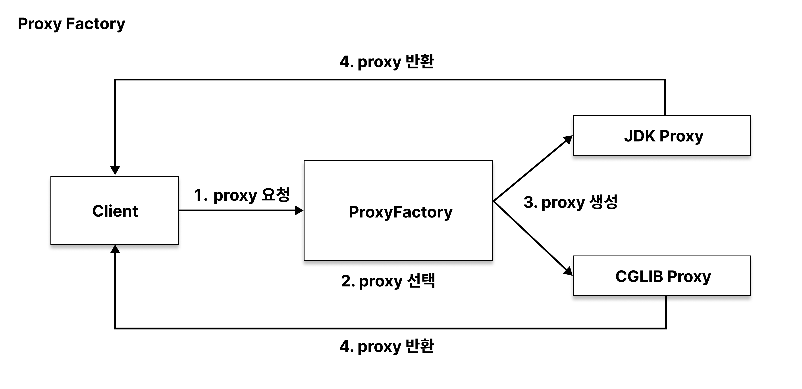
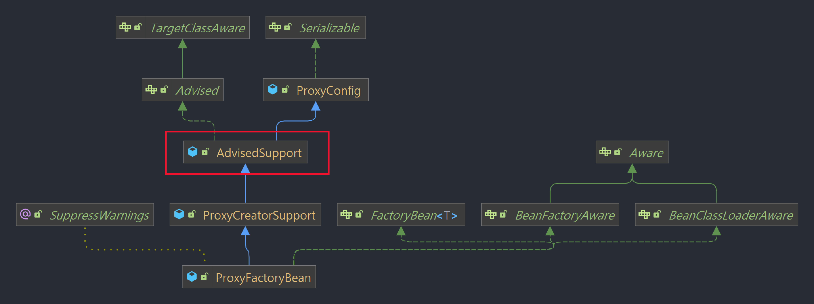
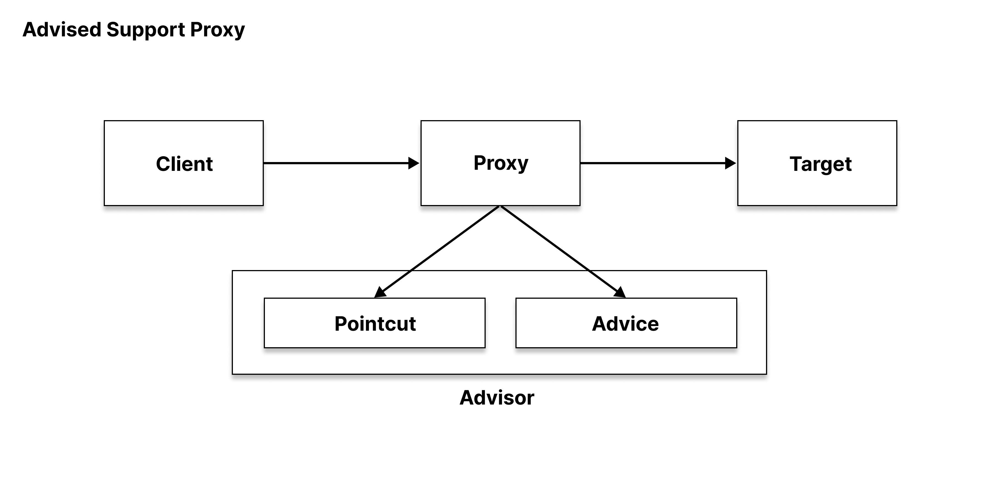
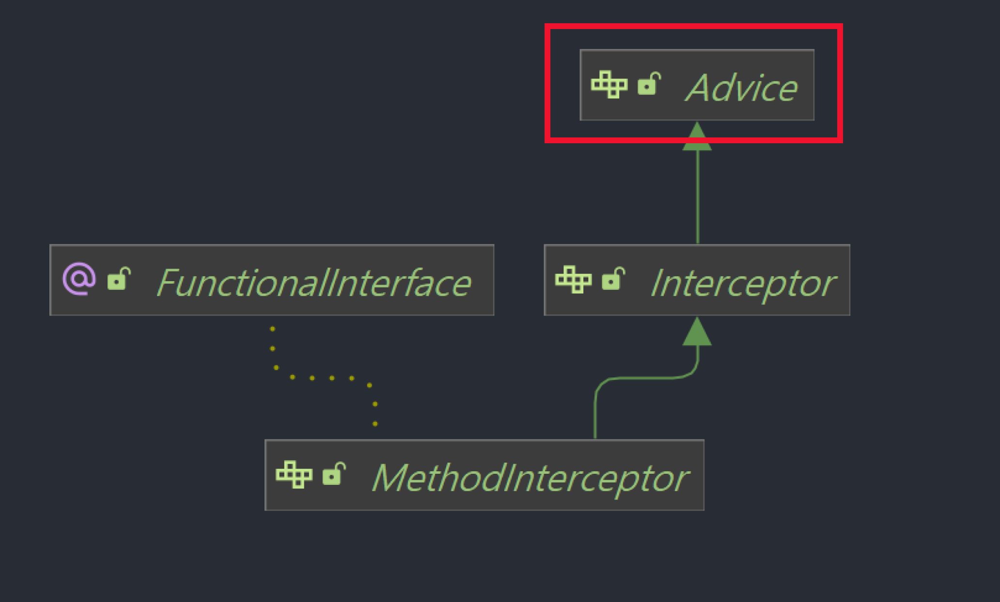

## Spring AOP에서 사용하는 Proxy  

**스프링에서 사용하는 프록시에 대해 알아볼 시간입니다**

총 3편으로 나누어서 구성하였습니다  

1. [Spring Proxy의 JDK Dynamic Proxy와 CGLIB](https://renuevo.github.io/spring/proxy/spring-proxy)  
> a. [Proxy 살펴보기](https://renuevo.github.io/spring/proxy/spring-proxy/#proxy-살펴보기)    
> b. [JDK Dynamic Proxy](https://renuevo.github.io/spring/proxy/spring-proxy/#jdk-dynamic-proxy)   
> c. [CGLIB](https://renuevo.github.io/spring/proxy/spring-proxy/#cglib)  
2. [Spring의 프록시 생성 (ProxyBeanFactory)](https://renuevo.github.io/spring/proxy/spring-proxy-factory)  
> a. [FactoryBean](https://renuevo.github.io/spring/proxy/spring-proxy-factory/#factory-bean)  
> b. [ProxyBeanFactory](https://renuevo.github.io/spring/proxy/spring-proxy-factory/#proxyfactorybean)  
3. [Spring Proxy의 빈 후처리기(BeanPostProcessor)]() :construction: 작성중  


## Proxy Factory 살펴보기  

이전 포스팅에서 프록시를 직접 생성해서 관리할때의 문제점을 마지막으로 살펴보았습니다  
1. 프록시가 중첩되면 코드가 복잡해진다  
2. target별로 프록시를 생성하는 코드 및 관리 포인트가 증가한다  
3. 사용하지 않는 메서드도 프록시에 구현해서 서빙해야 한다  
4. 같은 기능의 프록시 기능이 target별로 중복될 수 있다  

이러한 문제를 해결하기 위해 스프링에서는 `Proxy Factory`를 통해 프록시를 생성합니다  

<br/>


<span class='img_caption'>Proxy Factory</span>

**프록시 팩토리(Proxy Factory)는 스프링의 동적 프록시를 통합하여 생성하는 기능을 제공합니다**  
이를 통해 생성 방법을 하나로 통일하여 코드 중복과 관리포인트를 줄일 수 있습니다  
인터페이스의 유무에 따라서 JDK, CGLIB 프록시를 선택하여 생성해 줍니다  

```kotlin

@SpringBootTest
internal class SpringProxyBeanFactoryTest(
    private val factoryJdkProxyService: FactoryJdkProxyService,   <- 인터페이스
    private val factoryCglibService: FactoryCglibService          <- 서비스객체
) : ShouldSpec({

    val log = KotlinLogging.logger { }

    should("Factory Proxy Test") {
        log.info { factoryJdkProxyService.javaClass.toString() }  <- JDK 프록시
        log.info { factoryCglibService.javaClass.toString() }     <- CGLIB 프록시
    }

})


```

```text

INFO 28088 --- [pool-1-thread-1] c.g.r.proxy.SpringProxyBeanFactoryTest   : class com.sun.proxy.$Proxy60
INFO 28088 --- [pool-1-thread-1] c.g.r.proxy.SpringProxyBeanFactoryTest   : class com.github.renuevo.proxy.domain.factory.FactoryCglibService$$EnhancerBySpringCGLIB$$236a53fd

```

<br/>

그럼 스프링에서 내부적으로 사용하는 ProxyFactory의 대해 알아보도록 하겠습니다  

<br/>


---

<br/>

## Factory Bean
스프링이 사용하는 일반적인 객체는 new 연산자로 간당히 생성할 수 없을때가 있습니다  
DI(의존성 주입) 및 Bean으로 관리가 필요할 때가 그 이유입니다  
FactoryBean은 빈을 생성하는 팩토리역할을 제공하는 Interface입니다  

<br/>

**FactoryBean을 통해 객체를 DI 및 Bean으로 사용할 수 있게 되며 IoC에 맞게 구현이 가능하게 합니다**

```kotlin

public interface FactoryBean<T> {

	String OBJECT_TYPE_ATTRIBUTE = "factoryBeanObjectType";

	@Nullable
	T getObject() throws Exception; -> bean 생성

	@Nullable
	Class<?> getObjectType(); -> FactoryBean으로 생성되는 객체의 class type

	default boolean isSingleton() { return true; }  -> bean 생성 객체의 싱글톤 여부

}

```
이러한 FactoryBean을 통해서 프록시를 구성한다면 프록시의 생성을 잘 관리 할 수 있을 것 처럼 보입니다  
그러면 어떻게 FactoryBean을 통해 프록시를 구성할 수 있는지 확인해 보도록 하겠습니다  

<br/>
<br/>

### FactoryBean을 활용하여 Proxy를 구성해보기 :point_right: [Code](https://github.com/renuevo/spring-boot-kotlin-in-action/tree/master/spring-boot-aop-proxy-in-action)  

<span class='code_header'>**FactoryBean Proxy Code**</span>
```kotlin

    @Configuration
    class FactoryBeanConfig {
    
        @Bean
  (1)   fun jdkProxyService(): TestFactoryBean = TestFactoryBean(   -> FactoryBean을 통한 프록시 처리         /* highlight-line */
                interfaceType = JdkProxyService::class.java,
                target = JdkProxyServiceImpl()
            )
    
    }
    
    class TestFactoryBean(
        private val interfaceType: Class<*>,
        private val target: Any
    ) : FactoryBean<Any> {
    
        /* highlight-range{1-4} */
  (2)   override fun getObject(): Any = Proxy.newProxyInstance(
            interfaceType.classLoader,
            arrayOf(interfaceType),
            FactoryBeanInvocationHandler(target)
        )
    
        override fun getObjectType(): Class<*> = interfaceType
    
    }
    
    
    class FactoryBeanInvocationHandler(private val target: Any) : InvocationHandler {
    
        private val log = KotlinLogging.logger { }
    
        /* highlight-range{1-4} */
  (3)   override fun invoke(proxy: Any, method: Method, args: Array<out Any>?): Any? {
            log.info { "Factory Bean Invocation Handler" }
            return method.invoke(target, *(args ?: arrayOfNulls(0)))    //실제 target 호출
        }
    
    }

```

<span class='red_font'>(1)</span> ` fun jdkProxyService(): TestFactoryBean`  
> Bean 생성을 위해 TestFactoryBean을 return 하지만 Spring 내부 동작으로 interfaceType의 Bean이 등록됩니다  

<br/>

<span class='red_font'>(2)</span> `override fun getObject(): Any`  
> 실제적으로 Bean에 등록될 객체를 생성하는 부분입니다  
> Proxy.newProxyInstance를 통해서 프록시 객체를 생성하였습니다  

<br/>

<span class='red_font'>(3)</span> `override fun invoke(proxy: Any, method: Method, args: Array<out Any>?): Any?`
> FactoryBean에 등록하여 사용할 기능을 정의 합니다    

<br/>
<br/>


<span class='code_header'>**FactoryBean Proxy Test Code**</span>
```kotlin

@ContextConfiguration(classes = [FactoryBeanConfig::class])
internal class SpringBeanFactoryTest(
    private val jdkProxyService: JdkProxyService  -> 스프링 Bean DI  /* highlight-line */
) : ShouldSpec() {
    override fun extensions(): List<Extension> = listOf(SpringExtension)

    init {
        should("Factory Proxy Test") {
            jdkProxyService.methodA()
            jdkProxyService.methodB()
            jdkProxyService.methodC()
        }
    }
}

```

<span class='code_header'>**Result**</span>
```text

INFO com.github.renuevo.proxy.domain.factory.FactoryBeanInvocationHandler - Factory Bean Invocation Handler
INFO com.github.renuevo.proxy.domain.jdk.JdkProxyServiceImpl - I'm A
INFO com.github.renuevo.proxy.domain.factory.FactoryBeanInvocationHandler - Factory Bean Invocation Handler
INFO com.github.renuevo.proxy.domain.jdk.JdkProxyServiceImpl - I'm B
INFO com.github.renuevo.proxy.domain.factory.FactoryBeanInvocationHandler - Factory Bean Invocation Handler
INFO com.github.renuevo.proxy.domain.jdk.JdkProxyServiceImpl - I'm C

```
테스트로 스프링 Bean을 할당받아서 메소드를 호출하여 FactoryBeanInvocationHandler이 잘 적용된걸 확인 할 수 있습니다  
이를 통해 FactoryBean을 활용하여 프록시 생성을 한결 쉽게 할 수 있고 부가기능을 독립적으로 재사용하는게 가능해 집니다  

<br/>

### FactoryBean으로 Proxy구성시 한계점  
앞서 FactoryBean을 활용해 스프링의 프록시 팩토리를 구현해 보았습니다  
하지만 이러한 구현에도 <span class='red_font'>한계점</span>이 존재합니다  

1. **InvocationHandler 같은 부가기능을 적용할 타겟의 대한 관리**  
    > 부가 기능을 기준으로 여러 타겟에 적용할 때의 어려움이 들어남  

2. **타겟 기준으로 InvocationHandler 같은 부가기능을 여러게 등록**  
    > 타겟을 기준으로 InvocationHandler을 여러게 등록하려고 하면 FactoryBean을 계속해서 생성해 주어야함  

<br/>

결국 이러한 한계점으로 OCP(개방폐쇄 원칙)을 지키며 개발하기 힘들어 집니다  
프록시 Bean 설정의 대한 중복코드와 자유로운 확장이 어려워 지는 것입니다  


<br/>


## ProxyFactoryBean
이러한 문제점을 해결하기 위해서 스프링에서는 프록시 Bean을 생성해 주는 `ProxyFactoryBean`을 제공합니다  

```kotlin 

public class ProxyFactoryBean extends ProxyCreatorSupport
		implements FactoryBean<Object>, BeanClassLoaderAware, BeanFactoryAware {
		
		......
		
	public Object getObject() throws BeansException {
		initializeAdvisorChain();  <- 부가기능 체인     /* highlight-line */
		if (isSingleton()) {
			return getSingletonInstance();
		}
		else {
			if (this.targetName == null) {
				logger.info("Using non-singleton proxies with singleton targets is often undesirable. " +
						"Enable prototype proxies by setting the 'targetName' property.");
			}
			return newPrototypeInstance();
		}
	}


	public Class<?> getObjectType() {
		synchronized (this) {
			if (this.singletonInstance != null) {
				return this.singletonInstance.getClass();
			}
		}
		Class<?>[] ifcs = getProxiedInterfaces();
		if (ifcs.length == 1) {
			return ifcs[0];
		}
		else if (ifcs.length > 1) {
			return createCompositeInterface(ifcs);
		}
		else if (this.targetName != null && this.beanFactory != null) {
			return this.beanFactory.getType(this.targetName);
		}
		else {
			return getTargetClass();
		}
	}
	
	
	public boolean isSingleton() {
		return this.singleton;
	}
		
		......
		
}

```

---

<br/>

`FactoryBean<Object>`을 상속받고 있고 이전 임시로 구현해본 ProxyFactory와 같이 getObject()를 통해 프록시 객체를 리턴합니다  

<br/>

스프링에서 이러한 프록시에 대한 부가기능을 적용하기 위해 3가지 용어가 등장합니다  
AOP를 쓰다보면 자주 등장하는 용어인 `Advisor`, `Advice`, `Pointcut` 입니다  

1. **Advisor : Advice(부가기능) + Pointcut(적용대상)**  
2. **Advice** : 타겟에 적용할 부가기능  
3. **Pointcut** : 부가기능 적용대상을 지정  

프록시에는 `Advisor`와 `Adivce`를 등록할 수 있고 `initializeAdvisorChain()`을 통해 프록시의 부가기능이 적용됩니다  

<br/>

  
<span class='img_caption'>ProxyBeanFactory Dependency</span>  

ProxyBeanFactory의 디펜던시를 보게되면 `AdvisedSupport`가 존재합니다  
AdvisedSupport에서는 타겟과 부가기능(Advisor, Advice)를 등록하는 기능을 제공합니다  

```kotlin

public class AdvisedSupport extends ProxyConfig implements Advised {

   ......
   
   @Override
   public void setTarget(Object target) {
      setTargetSource(new SingletonTargetSource(target));
   }
   
   @Override
   public void addAdvisor(Advisor advisor) {
      int pos = this.advisors.size();
      addAdvisor(pos, advisor);
   }
   
   @Override
   public void addAdvice(Advice advice) throws AopConfigException {
      int pos = this.advisors.size();
      addAdvice(pos, advice);
   }
   
   ......

}

```
결론적으로 pointcut, advice등을 별도로 구성하여 등록하는 구조가 되면서  
부가기능을 독립적인 객체로 관리하며 사용할 수 있게 되었고 OCP 원칙에 맞게 구조가 갖추어 지게 되었습니다  

<br/>

그럼 간단한 코드를 통해 어떠한 구조가 된것 인지 확인해 보도록 하겠습니다  

<br/>
<br/>

### 코드를 통해 ProxyFactoryBean 살펴보기 :point_right: [Code](https://github.com/renuevo/spring-boot-kotlin-in-action/tree/master/spring-boot-aop-proxy-in-action)  

**프록시의 구현은 순서는 4가지로 분류됩니다**  
1. Pointcut으로 대상 선정  
2. Advice를 통한 기능 구현  
3. Advisor로 Pointcut과 Advice를 묶기  
4. ProxyFactoryBean을 통한 Proxy 등록  

이렇게 4개를 구현하게 되면 아래와 같은 flow를 통해 Proxy가 동작하게 됩니다  


<span class='img_caption'>Advised Support Proxy</span>

<br/>

먼저 구현해 줄것은 `MethodInterceptor`입니다  
여기서 말씀드리는 MethodInterceptor는 앞서 프록시에서 구현했것과는 다른 인터페이스입니다  

```java

package org.aopalliance.intercept;

@FunctionalInterface
public interface MethodInterceptor extends Interceptor {
	@Nullable
	Object invoke(@Nonnull MethodInvocation invocation) throws Throwable;
}


---------------------------------------------------------------------------------------------------

package org.springframework.cglib.proxy;

public interface MethodInterceptor extends Callback {
    Object intercept(Object var1, Method var2, Object[] var3, MethodProxy var4) throws Throwable;
}


```

1. `org.springframework.cglib.proxy.MethodInterceptor`  
   > 프록시 구현에서 사용, Callback을 상속받는 인터페이스  

2. `org.aopalliance.intercept.MethodInterceptor`  
   > 스프링 Advice를 상속하는 인터페이스  

<br/>

  
<span class='img_caption'>MethodInterceptor</span>

MethodInterceptor는 Adivce 인터페이스를 상속받고 있습니다  
ProxyBeanFactory에서 사용하는 MethodInterceptor는 org.aopalliance.intercept 패키지의 인터페이스를 사용합니다   

```kotlin

class CustomAdvice : MethodInterceptor {

    private val log = KotlinLogging.logger { }

    override fun invoke(invocation: MethodInvocation): Any? {

        log.info { "Proxy 부가기능" }
        
        return invocation.proceed()
    }
}

```
간단하게 MethodInterceptor의 기능으로 "Proxy 부가기능"이라고 출력하도록 작성하였습니다  

<br/>

이제 차례대로 프록시에서 사용할 빈으로 등록해 줍니다  

```kotlin

@Configuration
class CustomAdvisorConfig {

       @Bean
 (1)   fun targetPointcut(): Pointcut = NameMatchMethodPointcut().apply { addMethodName("method*") }
   
   
       @Bean
 (2)   fun customAdvice(): Advice = CustomAdvice()
   
   
       @Bean
 (3)   fun customAdvisor(): Advisor = DefaultPointcutAdvisor(targetPointcut(), customAdvice())
   
   
       @Bean
 (4)   fun proxyFactoryBean() = ProxyFactoryBean().apply {
            /* highlight-range{1-2} */
           setTarget(ProxyFactoryBeanTarget())  -> Target Class 지정
           setInterceptorNames("customAdvisor") -> 이름을 통한 Advisor 지정
       }

}

class ProxyFactoryBeanTarget : FactoryCglibService()

```

<br/>

<span class='red_font'>(1)</span> `Pointcut을 통한 적용대상 구현`  
> 함수명이 이름이 "method"로 시작하는 메소드에 부가기능이 적용됩니다  

<br/>


<span class='red_font'>(2)</span> `Advice를 통한 부가기능 구현`  
> 이전 MethodInterceptor를 상속받아 구현한 "Proxy 부가기능" 출력이 기능으로 들어갑니다  

<br/>

<span class='red_font'>(3)</span> `Advisor를 통한 적용대상과 기능 묶기`  
> 위에서 선언된 Pointcut의 적용대상과 Advice의 기능을 묶어서 Proxy에 등록하도록 생성됩니다  

<br/>

<span class='red_font'>(4)</span> `ProxyFactoryBean을 통한 Proxy 생성`  
> Target과 Adivsor를 등록하여 Target에 Proxy를 적용 시킵니다  


<br/>

인터페이스를 활용하여 각각의 역할을 분리하고 기능을 정의하므로 OCP원칙의 맞는 개발을 할 수 있습니다  
이렇게 인터페이스로 결합도를 낮추고 객체로 기능을 정의하고 포함시켜 코드를 재사용하는 방법을 **합성(Composition)**이라고 합니다  

<br/>

<span class='code_header'>프록시 확인 코드</span>
```kotlin

@SpringBootTest
internal class SpringProxyBeanFactoryTest(
    private val factoryJdkProxyService: FactoryJdkProxyService,
    private val factoryCglibService: FactoryCglibService,
    private val proxyFactoryBean: ProxyFactoryBeanTarget
) : ShouldSpec({

    val log = KotlinLogging.logger { }

    context("Proxy Bean Factory Test") {

        should("Factory Proxy Test") {
            log.info { factoryJdkProxyService.javaClass.toString() }
            log.info { factoryCglibService.javaClass.toString() }
            log.info { proxyFactoryBean.javaClass.toString() }
        }

        should("Call Proxy Bean Factory Method") {
            proxyFactoryBean.methodA()
            proxyFactoryBean.methodB()
            proxyFactoryBean.methodC()
        }

    }

})


```

```text

### Factory Proxy Test
INFO 20788 --- [pool-1-thread-1] c.g.r.proxy.SpringProxyBeanFactoryTest   : class com.sun.proxy.$Proxy60
INFO 20788 --- [pool-1-thread-1] c.g.r.proxy.SpringProxyBeanFactoryTest   : class com.github.renuevo.proxy.domain.factory.FactoryCglibService$$EnhancerBySpringCGLIB$$feeedfff
INFO 20788 --- [pool-1-thread-1] c.g.r.proxy.SpringProxyBeanFactoryTest   : class com.github.renuevo.proxy.domain.factory.config.ProxyFactoryBeanTarget$$EnhancerBySpringCGLIB$$5eee0c36


### Call Proxy Bean Factory Method
INFO 18716 --- [         task-4] c.g.r.p.d.factory.config.CustomAdvice    : Proxy 부가기능
INFO 18716 --- [         task-6] c.g.r.p.d.factory.config.CustomAdvice    : Proxy 부가기능
INFO 18716 --- [         task-5] c.g.r.p.d.factory.config.CustomAdvice    : Proxy 부가기능
INFO 18716 --- [         task-4] c.g.r.p.d.factory.FactoryCglibService    : I'm A
INFO 18716 --- [         task-5] c.g.r.p.d.factory.FactoryCglibService    : I'm B
INFO 18716 --- [         task-6] c.g.r.p.d.factory.FactoryCglibService    : I'm C

```


```kotlin

@SpringBootTest
internal class SpringProxyBeanFactoryTest(
    private val customAdvisor: Advisor
) : ShouldSpec({

    val log = KotlinLogging.logger { }

    context("Proxy Bean Factory Test") {

        should("JDK Proxy Factory Test") {
            val proxy = ProxyFactory(FactoryJdkProxyServiceImpl()).apply {
                addAdvisor(customAdvisor)
            }.proxy as FactoryJdkProxyService

            log.info { proxy.javaClass.toString() }

            proxy.methodA()
            proxy.methodB()
            proxy.methodC()
        }

        should("CGlib Proxy Factory Test") {
            val proxy = ProxyFactory(ProxyFactoryBeanTarget()).apply {
                isProxyTargetClass = true
                addAdvisor(customAdvisor)
            }.proxy as ProxyFactoryBeanTarget

            log.info { proxy.javaClass.toString() }

            proxy.methodA()
            proxy.methodB()
            proxy.methodC()
        }

        should("Interface Target To CGLIB Proxy Test") {
            val proxy = ProxyFactory(FactoryJdkProxyServiceImpl()).apply {
                isProxyTargetClass = true
                addAdvisor(customAdvisor)
            }.proxy as FactoryJdkProxyService

            log.info { proxy.javaClass.toString() }

            proxy.methodA()
            proxy.methodB()
            proxy.methodC()
        }

    }

})


```


```text

### JDK Proxy Factory Test
INFO 13840 --- [pool-1-thread-1] c.g.r.proxy.SpringProxyBeanFactoryTest   : class com.sun.proxy.$Proxy60
INFO 13840 --- [pool-1-thread-1] c.g.r.p.d.factory.config.CustomAdvice    : Proxy 부가기능
INFO 13840 --- [pool-1-thread-1] c.g.r.p.d.f.FactoryJdkProxyServiceImpl   : I'm A
INFO 13840 --- [pool-1-thread-1] c.g.r.p.d.factory.config.CustomAdvice    : Proxy 부가기능
INFO 13840 --- [pool-1-thread-1] c.g.r.p.d.f.FactoryJdkProxyServiceImpl   : I'm B
INFO 13840 --- [pool-1-thread-1] c.g.r.p.d.factory.config.CustomAdvice    : Proxy 부가기능
INFO 13840 --- [pool-1-thread-1] c.g.r.p.d.f.FactoryJdkProxyServiceImpl   : I'm C


### CGlib Proxy Factory Test
INFO 13840 --- [pool-1-thread-1] c.g.r.proxy.SpringProxyBeanFactoryTest   : class com.github.renuevo.proxy.domain.factory.config.ProxyFactoryBeanTarget$$EnhancerBySpringCGLIB$$a27f344b
INFO 13840 --- [pool-1-thread-1] c.g.r.p.d.factory.config.CustomAdvice    : Proxy 부가기능
INFO 13840 --- [pool-1-thread-1] c.g.r.p.d.factory.FactoryCglibService    : I'm A
INFO 13840 --- [pool-1-thread-1] c.g.r.p.d.factory.config.CustomAdvice    : Proxy 부가기능
INFO 13840 --- [pool-1-thread-1] c.g.r.p.d.factory.FactoryCglibService    : I'm B
INFO 13840 --- [pool-1-thread-1] c.g.r.p.d.factory.config.CustomAdvice    : Proxy 부가기능
INFO 13840 --- [pool-1-thread-1] c.g.r.p.d.factory.FactoryCglibService    : I'm C


### Interface Target To CGLIB Proxy Test
INFO 13840 --- [pool-1-thread-1] c.g.r.proxy.SpringProxyBeanFactoryTest   : class com.github.renuevo.proxy.domain.factory.FactoryJdkProxyServiceImpl$$EnhancerBySpringCGLIB$$1187480c
INFO 13840 --- [pool-1-thread-1] c.g.r.p.d.factory.config.CustomAdvice    : Proxy 부가기능
INFO 13840 --- [pool-1-thread-1] c.g.r.p.d.f.FactoryJdkProxyServiceImpl   : I'm A
INFO 13840 --- [pool-1-thread-1] c.g.r.p.d.factory.config.CustomAdvice    : Proxy 부가기능
INFO 13840 --- [pool-1-thread-1] c.g.r.p.d.f.FactoryJdkProxyServiceImpl   : I'm B
INFO 13840 --- [pool-1-thread-1] c.g.r.p.d.factory.config.CustomAdvice    : Proxy 부가기능
INFO 13840 --- [pool-1-thread-1] c.g.r.p.d.f.FactoryJdkProxyServiceImpl   : I'm C
```


## 관련 참고

[로키님 블로그](https://yejun-the-developer.tistory.com/7)  
[JiwonDev님 블로그](https://jiwondev.tistory.com/152)  
[Moon님 블로그](https://gmoon92.github.io/spring/aop/2019/02/23/spring-aop-proxy-bean.html)  
[다비드박의 개발이야기 블로그](https://davidpark20.tistory.com/48)  
[다비드박의 개발이야기 블로그](https://davidpark20.tistory.com/49)  