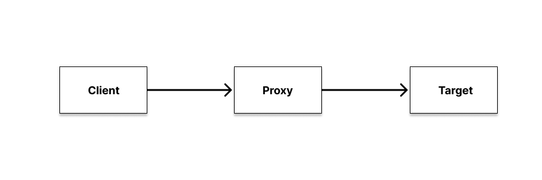
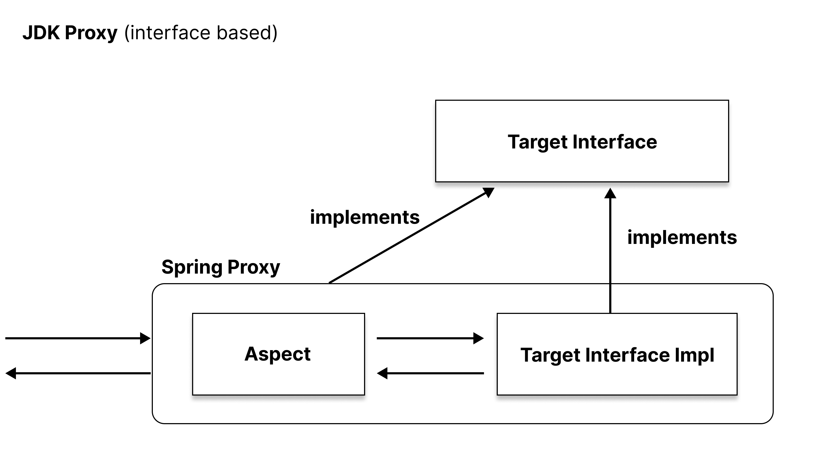
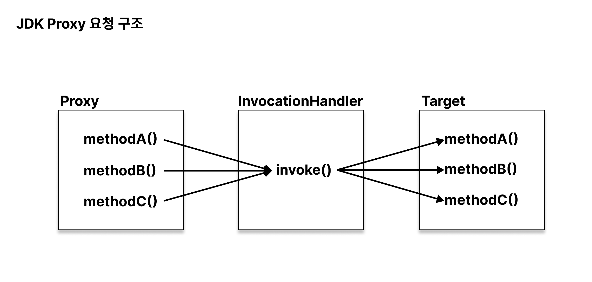

## Spring AOP에서 사용하는 Proxy

**스프링에서 사용하는 프록시에 대해 알아볼 시간입니다**

총 3편으로 나누어서 구성하였습니다

1. [Spring Proxy의 JDK Dynamic Proxy와 CGLIB](https://renuevo.github.io/spring/proxy/spring-proxy)  
> a. [Proxy 살펴보기](https://renuevo.github.io/spring/proxy/spring-proxy/#proxy-살펴보기)    
> a. [JDK Dynamic Proxy](https://renuevo.github.io/spring/proxy/spring-proxy/#jdk-dynamic-proxy)   
> b. [CGLIB](https://renuevo.github.io/spring/proxy/spring-proxy/#cglib)  
2. [Spring의 프록시 생성 (ProxyBeanFactory)]() :construction: 작성중
3. [Spring Proxy의 빈 후처리기(BeanPostProcessor)]() :construction: 작성중

## Proxy 살펴보기

일반적으로 스프링에서 말하는 기능적 프록시는 2가지 패턴의 기능 역할을 합니다

1. **데코레이션 패턴 (Decorator Pattern)** 👉 [데코레이션 포스팅](https://renuevo.github.io/design-pattern/decorator-pattern/)

> 부가적으로 기능을 부여한다

2. **프록시 패턴 (Proxy Pattern)**

> 접근에 대한 제어를 한다




프록시는 `OCP(개방-폐쇄 원칙)`을 지키는 아주 좋은 수단입니다  
클라이언트가 서비스 호출시 프록시를 통해 실제 target(서비스구현체)을 호출하도록 만듭니다  
중간에서 프록시는 **부가기능 or 접근제어** 등의 역할을 수행합니다

일반적으로 많이 사용하는 `@Transactional` 같은 애들이 이러한 프록시를 통해 구현되어 있으며  
이러한 트릭을 통해 개발자는 서비스 구현에만 더욱 집중할 수 있도록 만들어 줍니다

<br/>
<br/>

**👎하지만 프록시는 <span class='red_font'>단점</span>도 가지고 있습니다**

1. target(서비스)의 개수만큼 프록시가 생성되어야 한다
2. 같은 기능의 경우 코드 중복이 일어난다
3. 프록시를 사용하지 않는 메서드도 래핑처리되어 프록시를 통해 target에 도달한다

<br/>

이러한 단점들을 보완하기 위한 해결책이 다이나믹프록시입니다  
개발자가 프록시를 별도로 생성하는것이 아니라 런타임시 동적으로 가상 객체를 적용시킵니다  
이렇게 런타임시 동적으로 프록시 객체를 생성해서 적용하는 방식을 `런타임 위빙(Runtime Weaving)`이라고 합니다  

<br/>

그럼 다음으로 Spring AOP가 내부에서 동적으로 프록시를 생성할때 사용되는 `JDK Dynamic Proxy`와 `CGLIB`를 알아보겠습니다

<br/>

## JDK Dynamic Proxy

예전(🦷)에는 꼭 스프링 3.0에서는 @Service를 만들기전에 interface를 생성해야 한다고 배웠었습니다  
그 이유는 그때 당시에 스프링에서는 기본적으로 사용되던 프록시가 `JDK Dynamic Proxy`이기 때문입니다  
그럼 JDK Dynamic Proxy의 구조를 살펴 보며 왜 interface가 필요한지 알아보도록 하겠습니다

<br/>

### JDK Dynamic Proxy 구조 살펴보기

JDK Dynamic Proxy의 내부 구성부터 알아보겠습니다


<br/>


<span class='img_caption'>JDK Proxy</span>

실제적으로 서비스구현체와 같은 interface를 상속받아서 프록시가 구성됩니다  
같은 interface로 구현되면서 호출에 대한 메서드를 래핑해서 구현하는게 가능합니다  
이 과정에서 메서드정보등이 사용되면서 자바내의 리플렉션을 사용합니다

<br/>

**🏷️위의 구조로 JDK Dynamic Proxy의 특징을 살펴볼수 있습니다**

1. public 메서드만 proxy가 작동한다
2. 내부끼리의 메서드 호출로는 proxy를 타지 않기 때문에 aop가 동작하지 않는다
3. 리플렉션을 사용하면서 오버헤드가 발생한다
4. interface가 필수적으로 필요하다

<br/>
<br/>

### JDK Dynamic Proxy 소스로 확인하기

Proxy생성을 위해 java에서는 리플랙션 패키지내의 Proxy 클래스가 존재합니다  
내부적으로 target의 대한 메서드 호출을 위해 `InvocationHandler`만 구현하여 간단하게 프록시 생성이 가능합니다  

핵심 클래스는 아래 두개입니다  
>1. Proxy
>2. InvocationHandler  

```java

package java.lang.reflect;

public class Proxy implements java.io.Serializable {

    ......

    public static Object newProxyInstance(ClassLoader loader,       //프록시를 만들 Class Loader
                                          Class<?>[] interfaces,    //target interface
                                          InvocationHandler h)      //InvocationHandler 구현체

    ......
}


public interface InvocationHandler {

    public Object invoke(
                            Object proxy,   //프록시 객체 (this)
                            Method method,  //호출된 메서드 
                            Object[] args   //메서드의 매개변수
                        ) throws Throwable;
}


```
이 두개의 클래스를 통해 간단하게 JDK Proxy를 구현할 수 있고 메서드별 핸들링이 가능합니다  
내부적으로는 메서드 호출은 아래와 같은 플로우 구조를 가집니다  


<span class='img_caption'>JDK Proxy 호출구조</span>

<br/>
<br/>


**그럼 간단하게 프록시를 구현해 보겠습니다** :point_right: [Code](https://github.com/renuevo/spring-boot-kotlin-in-action/tree/master/spring-boot-aop-proxy-in-action)  
<span class='code_header'>**Target Code**</span>
```kotlin

interface JdkProxyService {
    fun methodA()
    fun methodB()
    fun methodC()
}


@Service
class JdkProxyServiceImpl : JdkProxyService {

    private val log = KotlinLogging.logger { }

    override fun methodA() = log.info { "I'm A" }
    override fun methodB() = log.info { "I'm B" }
    override fun methodC() = log.info { "I'm C" }

}
```

<span class='code_header'>**Proxy Test Code**</span>
```kotlin

internal class JdkProxyTest : ShouldSpec({

    context("JDK Proxy Test") {

        should("Invocation Handler") {
            val jdkProxyTarget: JdkProxyService = JdkProxyServiceImpl()

            val proxy = Proxy.newProxyInstance(
                jdkProxyTarget::class.java.classLoader,
                arrayOf(JdkProxyService::class.java),
                TestInvocationHandler(jdkProxyTarget)
            ) as JdkProxyService

            proxy.methodA()
            proxy.methodB()
            proxy.methodC()
        }

    }

})


internal class TestInvocationHandler constructor(jdkProxyService: JdkProxyService) : InvocationHandler {

    private val log = KotlinLogging.logger { }
    private val target = jdkProxyService

    override fun invoke(proxy: Any, method: Method, args: Array<out Any>?): Any? {

        when (method.name) {
            "methodA" -> log.info { "너는 A로 향하는군" }
            else -> log.info { "TestInvocationHandler 지나갑니다" }
        }

        return method.invoke(target, *(args ?: arrayOfNulls(0)))    //실제 target 호출
    }

}

```

<span class='code_header'>**Result**</span>
```text

INFO com.github.renuevo.proxy.TestInvocationHandler - 너는 A로 향하는군
INFO com.github.renuevo.proxy.domain.jdk.JdkProxyServiceImpl - I'm A
INFO com.github.renuevo.proxy.TestInvocationHandler - TestInvocationHandler 지나갑니다
INFO com.github.renuevo.proxy.domain.jdk.JdkProxyServiceImpl - I'm B
INFO com.github.renuevo.proxy.TestInvocationHandler - TestInvocationHandler 지나갑니다
INFO com.github.renuevo.proxy.domain.jdk.JdkProxyServiceImpl - I'm C

```
결과에서 프록시를 통해 순차적으로 잘 호출되는 것을 확인할 수 있습니다  

<br/>

### CGLIB  


<br/>

## 관련 참고

[baeldung](https://www.baeldung.com/spring-aop-vs-aspectj)
[Moon님 블로그](https://gmoon92.github.io/spring/aop/2019/04/20/jdk-dynamic-proxy-and-cglib.html)  
[keep going님 블로그](https://velog.io/@hanblueblue/Spring-Proxy-1-Java-Dynamic-Proxy-vs.-CGLIB)  
[JiwonDev님 블로그](https://jiwondev.tistory.com/151)  
[로키님 블로그](https://yejun-the-developer.tistory.com/6)  