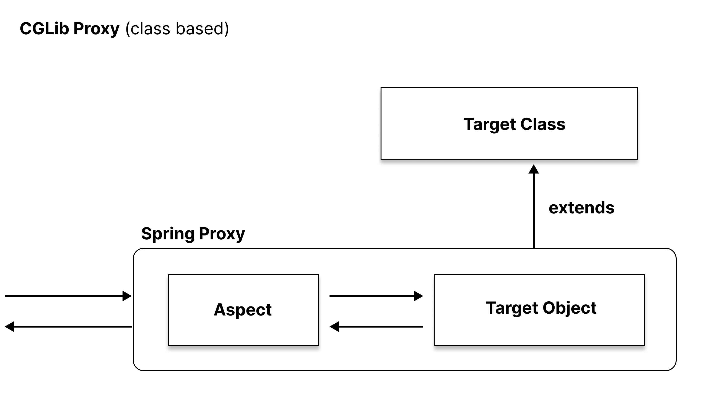
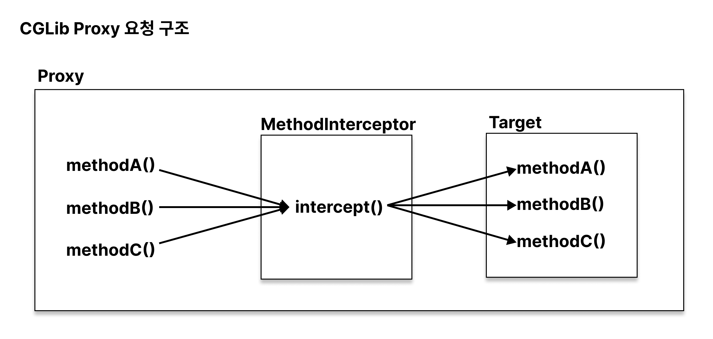
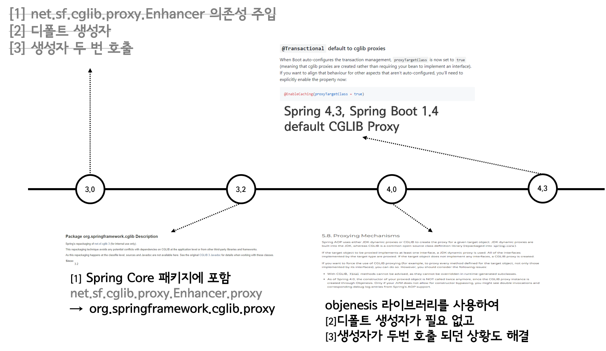

## Spring AOP에서 사용하는 Proxy  

**스프링에서 사용하는 프록시에 대해 알아볼 시간입니다**

총 3편으로 나누어서 구성하였습니다  

1. [Spring Proxy의 JDK Dynamic Proxy와 CGLIB](https://renuevo.github.io/spring/proxy/spring-proxy)  
> a. [Proxy 살펴보기](https://renuevo.github.io/spring/proxy/spring-proxy/#proxy-살펴보기)    
> b. [JDK Dynamic Proxy](https://renuevo.github.io/spring/proxy/spring-proxy/#jdk-dynamic-proxy)   
> c. [CGLIB](https://renuevo.github.io/spring/proxy/spring-proxy/#cglib)  
2. [Spring의 프록시 생성 (ProxyBeanFactory)](https://renuevo.github.io/spring/proxy/spring-proxy-factory/)
3. [Spring Proxy의 빈 후처리기(BeanPostProcessor)]() :construction: 작성중

## Proxy 살펴보기  

일반적으로 스프링에서 말하는 기능적 프록시는 2가지 패턴의 기능 역할을 합니다  

1. **데코레이션 패턴 (Decorator Pattern)** 👉 [데코레이션 포스팅](https://renuevo.github.io/design-pattern/decorator-pattern/)

> 부가적으로 기능을 부여한다

2. **프록시 패턴 (Proxy Pattern)**

> 접근에 대한 제어를 한다


프록시는 `OCP(개방-폐쇄 원칙)`을 지키는 아주 좋은 수단입니다  
클라이언트가 서비스 호출시 프록시를 통해 실제 target(서비스구현체)을 호출하도록 만듭니다  
중간에서 프록시는 **부가기능 or 접근제어** 등의 역할을 수행합니다  

일반적으로 많이 사용하는 `@Transactional` 같은 애들이 이러한 프록시를 통해 구현되어 있으며  
이러한 트릭을 통해 개발자는 서비스 구현에만 더욱 집중할 수 있도록 만들어 줍니다  

<br/>
<br/>

**👎하지만 프록시는 <span class='red_font'>단점</span>도 가지고 있습니다**  

1. target(서비스)의 개수만큼 프록시가 생성되어야 한다  
2. 같은 기능의 경우 코드 중복이 일어난다  
3. 프록시를 사용하지 않는 메서드도 래핑처리되어 프록시를 통해 target에 도달한다  

<br/>

이러한 단점들을 보완하기 위한 해결책이 다이나믹프록시입니다  
개발자가 프록시를 별도로 생성하는것이 아니라 런타임시 동적으로 가상 객체를 적용시킵니다  
이렇게 런타임시 동적으로 프록시 객체를 생성해서 적용하는 방식을 `런타임 위빙(Runtime Weaving)`이라고 합니다  

<br/>

그럼 다음으로 Spring AOP가 내부에서 동적으로 프록시를 생성할때 사용되는 `JDK Dynamic Proxy`와 `CGLIB`를 알아보겠습니다  

<br/>

## JDK Dynamic Proxy

예전(🦷)에는 꼭 스프링 3.0에서는 @Service를 만들기전에 interface를 생성해야 한다고 배웠었습니다  
그 이유는 그때 당시에 스프링에서는 기본적으로 사용되던 프록시가 `JDK Dynamic Proxy`이기 때문입니다  
그럼 JDK Dynamic Proxy의 구조를 살펴 보며 왜 interface가 필요한지 알아보도록 하겠습니다  

<br/>

### JDK Dynamic Proxy 구조 살펴보기  

JDK Dynamic Proxy의 내부 구성부터 알아보겠습니다  


<br/>


<span class='img_caption'>JDK Proxy</span>

실제적으로 서비스구현체와 같은 interface를 상속받아서 프록시가 구성됩니다  
같은 interface로 구현되면서 호출에 대한 메서드를 래핑해서 구현하는게 가능합니다  
이 과정에서 메서드정보등이 사용되면서 자바내의 리플렉션을 사용합니다  

<br/>

**🏷️위의 구조로 JDK Dynamic Proxy의 특징을 살펴볼수 있습니다**  

1. public 메서드만 proxy가 작동한다  
2. 내부끼리의 메서드 호출로는 proxy를 타지 않기 때문에 aop가 동작하지 않는다  
3. 리플렉션을 사용하면서 오버헤드가 발생한다  
4. interface가 필수적으로 필요하다  

<br/>
<br/>

### JDK Dynamic Proxy 소스로 확인하기  

Proxy생성을 위해 java에서는 리플랙션 패키지내의 Proxy 클래스가 존재합니다  
내부적으로 target의 대한 메서드 호출을 위해 `InvocationHandler`만 구현하여 간단하게 프록시 생성이 가능합니다  

핵심 클래스는 아래 두개입니다  
>1. Proxy  
>2. InvocationHandler  

```java

package java.lang.reflect;

public class Proxy implements java.io.Serializable {

    ......

    public static Object newProxyInstance(ClassLoader loader,       -> 프록시를 만들 Class Loader
                                          Class<?>[] interfaces,    -> target interface
                                          InvocationHandler h)      -> InvocationHandler 구현체

    ......
}


public interface InvocationHandler {

    public Object invoke(
                            Object proxy,   -> 프록시 객체 (this)
                            Method method,  -> 호출된 메서드 
                            Object[] args   -> 메서드의 매개변수
                        ) throws Throwable;
}


```
이 두개의 클래스를 통해 간단하게 JDK Proxy를 구현할 수 있고 메서드별 핸들링이 가능합니다  
내부적으로는 메서드 호출은 아래와 같은 플로우 구조를 가집니다  


<span class='img_caption'>JDK Proxy 호출구조</span>

<br/>
<br/>


**그럼 간단하게 프록시를 구현해 보겠습니다** :point_right: [Code](https://github.com/renuevo/spring-boot-kotlin-in-action/tree/master/spring-boot-aop-proxy-in-action)  
<span class='code_header'>**Target Code**</span>
```kotlin

interface JdkProxyService {
    fun methodA()
    fun methodB()
    fun methodC()
}


@Service
class JdkProxyServiceImpl : JdkProxyService {

    private val log = KotlinLogging.logger { }

    override fun methodA() = log.info { "I'm A" }
    override fun methodB() = log.info { "I'm B" }
    override fun methodC() = log.info { "I'm C" }

}
```

<span class='code_header'>**Proxy Test Code**</span>
```kotlin

internal class JdkProxyTest : ShouldSpec({

    context("JDK Proxy Test") {

        should("Invocation Handler") {
            val jdkProxyTarget: JdkProxyService = JdkProxyServiceImpl()

            val proxy = Proxy.newProxyInstance(
                jdkProxyTarget::class.java.classLoader,
                arrayOf(JdkProxyService::class.java),
                TestInvocationHandler(jdkProxyTarget)
            ) as JdkProxyService

            proxy.methodA()
            proxy.methodB()
            proxy.methodC()
        }

    }

})


internal class TestInvocationHandler constructor(jdkProxyService: JdkProxyService) : InvocationHandler {

    private val log = KotlinLogging.logger { }
    private val target = jdkProxyService

    override fun invoke(proxy: Any, method: Method, args: Array<out Any>?): Any? {

        when (method.name) {
            "methodA" -> log.info { "너는 A로 향하는군" }
            else -> log.info { "TestInvocationHandler 지나갑니다" }
        }

        return method.invoke(target, *(args ?: arrayOfNulls(0)))    -> 실제 target 호출
    }

}

```

<span class='code_header'>**Result**</span>
```text

INFO com.github.renuevo.proxy.TestInvocationHandler - 너는 A로 향하는군
INFO com.github.renuevo.proxy.domain.jdk.JdkProxyServiceImpl - I'm A
INFO com.github.renuevo.proxy.TestInvocationHandler - TestInvocationHandler 지나갑니다
INFO com.github.renuevo.proxy.domain.jdk.JdkProxyServiceImpl - I'm B
INFO com.github.renuevo.proxy.TestInvocationHandler - TestInvocationHandler 지나갑니다
INFO com.github.renuevo.proxy.domain.jdk.JdkProxyServiceImpl - I'm C

```
결과에서 프록시를 통해 순차적으로 잘 호출되는 것을 확인할 수 있습니다  

<br/>

## CGLIB  
다음으로 알아볼 것은 CGLIB입니다  
현재 스프링에서 defulat로 채택되어 사용되고 있는 프록시 방식이기도 합니다  
`CGLIB`은 바이트코드 연산으로 JDK Proxy보다 빠른 프록시를 지원합니다  
그럼 CGLIB의 구조를 살펴 보며 왜 interface가 필요없고 더 빠르게 동작할 수 있는지 알아보도록 하겠습니다  

<br/>

### CGLIB 구조 살펴보기  
CGLIB의 내부 구성을 알아보겠습니다  

<br/>


<span class='img_caption'>CGLib Proxy</span>

CGLIB은 기본 클래스를 상속받아서 Proxy를 구현합니다  
이러한 구조 덕분에 별도의 interface 없이도 프록시 생성이 가능합니다  
또한 CGLIB을 이용한 리플렉션 활용으로 빠른 메서드 호출도 지원합니다  

<br/>

**🏷️위의 구조로 CGLIB Proxy의 특징을 살펴볼수 있습니다**  

1. public, protected 메서드에서 proxy가 작동한다    
2. 내부끼리의 메서드 호출로는 proxy를 타지 않기 때문에 aop가 동작하지 않는다  
3. 내부에서 CGLIB을 이용해 리플렉션을 사용한다  
4. 상속을 통해 프록시를 만들어서 interface가 필요하지 않다 (상속이기 때문에 final, private ❌)  

<br/>
<br/>

### CGLIB 소스로 확인하기  

CGLIB Proxy구현을 위해서는 CGLIB 라이브러리가 필요합니다 (Spring 3.2부터는 Core패키지에 cglib.proxy가 포함)  
CGLIB에서도 JDK Proxy와 같이 CGLIB 패키지내의 `InvocationHandler`를 구현하여 프록시 생성이 가능합니다  
하지만 일반적으로 사용되고 있는 `MethodInterceptor`를 구현하여 프록시를 생성해 보겠습니다  

핵심 클래스는 아래 두개입니다  
>1. Enhancer  
>2. MethodInterceptor  
<span class='red_font'>이곳에서 사용하는 MethodInterceptor는 ProxyFactoryBean에서 사용하는 것과는 다릅니다!!</span>  


```java

package org.springframework.cglib.proxy;

public class Enhancer extends AbstractClassGenerator {

    ......

    public static Object create(Class superclass, Callback callback) {
		Enhancer e = new Enhancer();
		e.setSuperclass(superclass);      -> 프록시를 만들 Class
		e.setCallback(callback);          -> MethodInterceptor 구현체
		return e.create();
	}

    ......
}


package org.springframework.cglib.proxy;

import java.lang.reflect.Method;

public interface MethodInterceptor extends Callback {
    Object intercept(Object var1, Method var2, Object[] var3, MethodProxy var4) throws Throwable;
}


```
이 두개의 클래스를 통해 CGLIB을 구현할 수 있습니다  
filter를 통해 메서드별 interceptor를 컨트롤 가능하며 `MethodProxy var4`를 통해 빠른 메서드 invoke가 가능합니다  
호출 구조는 아래와 같습니다  


<span class='img_caption'>CGLib 호출구조</span>

<br/>
<br/>


**그럼 간단하게 프록시를 구현해 보겠습니다** :point_right: [Code](https://github.com/renuevo/spring-boot-kotlin-in-action/tree/master/spring-boot-aop-proxy-in-action)  
<span class='code_header'>**Target Code**</span>
```kotlin

@Service
class CglibService {

    private val log = KotlinLogging.logger { }

    fun methodA() = log.info { "I'm A" }
    fun methodB() = log.info { "I'm B" }
    fun methodC() = log.info { "I'm C" }

}
```

<span class='code_header'>**Proxy Test Code**</span>
```kotlin

internal class CglibTest : ShouldSpec({

    context("Cglib Test") {

        should("Method Interceptor") {
            val enhancer = Enhancer()
            enhancer.setSuperclass(CglibService::class.java)
            enhancer.setCallbacks(
                arrayOf(
                    TestCglibMethodInterceptor("0"),    //0
                    TestCglibMethodInterceptor("1"),    //1
                )
            )
            
            //필터를 통해 A만 1번 Interceptor로
            enhancer.setCallbackFilter {
                if (it.name == "methodA") 1
                else 0
            }

            val proxy = enhancer.create() as CglibService

            proxy.methodA()
            proxy.methodB()
            proxy.methodC()
        }

    }

})


internal class TestCglibMethodInterceptor(private val number: String) : MethodInterceptor {

    private val log = KotlinLogging.logger { }

    override fun intercept(obj: Any, method: Method, args: Array<out Any>?, proxy: MethodProxy): Any? {

        log.info { "interceptor number is $number" }

        //성능상 이점을 가진다
        return proxy.invokeSuper(obj, (args ?: arrayOfNulls(0)))
    }

}

```
이전 InvocationHandler와는 다르게 method를 invoke하지 않고 **proxy의 invokeSuper**를 사용합니다  

```kotlin

private void init() {
    /*
     * Using a volatile invariant allows us to initialize the FastClass and
     * method index pairs atomically.
     *
     * Double-checked locking is safe with volatile in Java 5.  Before 1.5 this
     * code could allow fastClassInfo to be instantiated more than once, which
     * appears to be benign.
     */
    if (fastClassInfo == null) {
        synchronized (initLock) {
            if (fastClassInfo == null) {
                CreateInfo ci = createInfo;

                FastClassInfo fci = new FastClassInfo();
                fci.f1 = helper(ci, ci.c1);
                fci.f2 = helper(ci, ci.c2);
                fci.i1 = fci.f1.getIndex(sig1);
                fci.i2 = fci.f2.getIndex(sig2);
                fastClassInfo = fci;
                createInfo = null;
            }
        }
    }
}


public Object invokeSuper(Object obj, Object[] args) throws Throwable {
    try {
        /* highlight-range{1-2} */
        init();
        FastClassInfo fci = fastClassInfo;
        return fci.f2.invoke(fci.i2, obj, args);
    }
    catch (InvocationTargetException e) {
        throw e.getTargetException();
    }
}

```
MethodProxy는 내부적으로 FastClassInfo를 처음 호출시에만 init()하여 보관하며 invoke를 호출합니다  
FastClass의 invoke를 호출하여 기존 method invoke보다 빠른 함수 호출을 사용합니다  


<span class='code_header'>**Result**</span>
```text

INFO com.github.renuevo.proxy.TestCglibMethodInterceptor - interceptor number is 1
INFO com.github.renuevo.proxy.domain.cglib.CglibService - I'm A
INFO com.github.renuevo.proxy.TestCglibMethodInterceptor - interceptor number is 0
INFO com.github.renuevo.proxy.domain.cglib.CglibService - I'm B
INFO com.github.renuevo.proxy.TestCglibMethodInterceptor - interceptor number is 0
INFO com.github.renuevo.proxy.domain.cglib.CglibService - I'm C

```
결과에서 프록시가 잘 호출되는 것을 확인할 수 있습니다  

<br/>

### CGLIB 부가 설명  
현재 `Spring은 4.3, Spring-boot는 1.4`부터 CGLIB을 Proxy생성에 defulat로 사용되고 있습니다  
CGLIB에 있던 문제들이 아래와 같이 해결되었기 때문입니다  

  
<span class='img_caption'>Source : [Moon Blog](https://gmoon92.github.io/spring/aop/2019/04/20/jdk-dynamic-proxy-and-cglib.html)</span>  

<br/>

---

<br/>

### One More Thing 🤔  
JDK Proxy와 CGLIB Proxy로 스프링에서 사용하는 Proxy에 대해 알아 보았습니다  
하지만 이렇게 간단히 프록시 생성이 가능하지만 관리 및 생성의 문제가 있습니다  

1. 프록시가 중첩되면 코드가 복잡해진다  
2. target별로 프록시를 생성하는 코드 및 관리 포인트가 증가한다  
3. 사용하지 않는 메서드도 프록시에 구현해서 서빙해야 한다  
4. 같은 기능의 프록시 기능이 target별로 중복될 수 있다  

<br/>

이러한 문제를 해결하기 위해 Spring은 내부적으로 `ProxyBeanFactory`를 통해 Proxy를 생성합니다  

Spring은 내부적으로 인터페이스가 있으면 JDK Proxy, 없으면 CGLIB으로 프록시를 생성합니다  
사용자는 간단하게 Spring AOP를 통해 Proxy 기능을 사용할 수 있습니다  

<br/>

**다음 포스팅에서는 ProxyBeanFactory에 대해 알아보도록 하겠습니다**  

<br/>

## 관련 참고

[baeldung cglib](https://www.baeldung.com/cglib)  
[baeldung spring-aop-vs-aspectj](https://www.baeldung.com/spring-aop-vs-aspectj)  
[suhongkim98님 블로그](https://velog.io/@suhongkim98/JDK-Dynamic-Proxy%EC%99%80-CGLib)  
[Moon님 블로그](https://gmoon92.github.io/spring/aop/2019/04/20/jdk-dynamic-proxy-and-cglib.html)   
[keep going님 블로그](https://velog.io/@hanblueblue/Spring-Proxy-1-Java-Dynamic-Proxy-vs.-CGLIB)  
[JiwonDev님 블로그](https://jiwondev.tistory.com/151)  
[로키님 블로그](https://yejun-the-developer.tistory.com/6)  