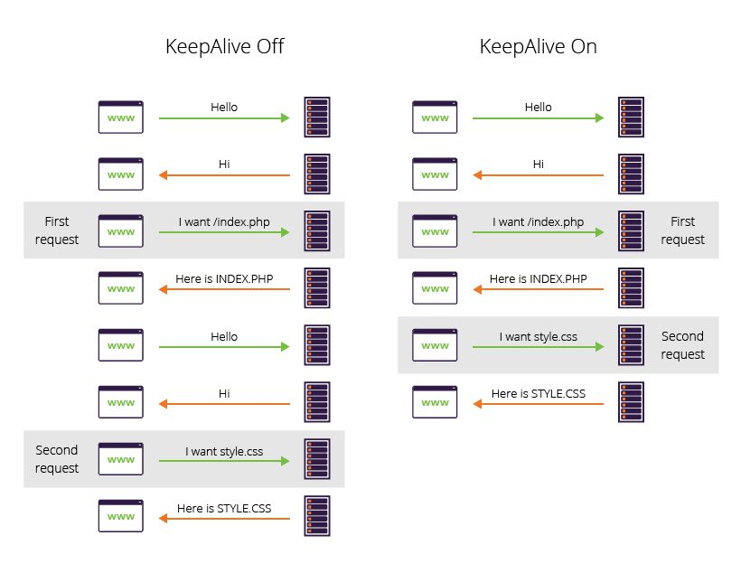

***RestTemplate은*** Spring에서 지원하는 http를 유용하게 쓸 수 있는 템플릿입니다  
결론부터 말씀 드리자면 RestTemplate은 Thread Safe하게 설계 되어 만들어 졌습니다 [Spring3 : RestTemplate](https://spring.io/blog/2009/03/27/rest-in-spring-3-resttemplate)  
하지만 프로젝트에서 한번씩의 호출은 문제가 없었지만 연속적인 호출이 있을때 제대로 Connection을 맺지 못하고 <span class='red_font'>Error</span>가 나는 상황이 있었습니다  
그래서 간단하게 해당 이슈에 관해 알아본 내용을 정리한 포스팅 입니다    

## RestTemplate은 Thread Safe 하다?
**맞습니다 RestTempalte은 Thread Safe 합니다**  
그래서 흔히들 아래와 같이 `@Bean`으로 선언하여 사용해서 자원을 아끼는 구조로 설계합니다  

```java

@Configuration
public class RestConfig{
    @Bean
    RestTemplate restTemplate(){
        return new ResteTemplate();
    }
}

```
이렇게 선언하게 되면 `@Autowired`를 통해 하나의 RestTemplate으로 http 통신을 처리 할 수 있습니다   

<br/>

## RestTemplate의 Http 프로토콜 요청
RestTemplate은 [동작원리](https://skasha.tistory.com/48)를 살펴보면 기본적으로 Http 프로토콜의 요청을 보낼때 `SimpleClientHttpRequestFactory`을 활용하여 처리합니다

이때 SimpleClientHttpRequestFactory에서 고려해야 할 점이 `2가지`가 있습니다

> #### 1. Timeout
> SimpleClientHttpRequestFactory의 기본 Timeout 시간은 다음과 같습니다 :point_right: [Default Timeout](https://howtodoinjava.com/spring-boot2/resttemplate/resttemplate-timeout-example/) 
> ```java 
>private int connectionTimeout = -1; 
>private int readTimeout = -1;
> ```
>그래서 Timeout설정을 하지 않으면 `무한정`으로 connection을 물고 있는 상태가 발생하여 <span class='red_font'>시스템 오류</span>를 불러 일으킬 수 있습니다  
>이를 방지하기 위해서 일반적으로 아래와 같이 `Timeout`을 따로 지정합니다
>```java
>@Configuration
>public class RestConfig{
>    @Bean
>    RestTemplate restTemplate(){
>        SimpleClientHttpRequestFactory factory = new SimpleClientHttpRequestFactory();
>        factory.setConnectTimeout(5000);    //5초
>        factory.setReadTimeout(5000);   //5초
>        return new ResteTemplate(factory);  /* highlight-line */
>    }
>}
>```

<br/>

> #### 2. Connection 방식
> SimpleClientHttpRequestFactory의 Connection 방식은 매번 새로운 Connection을 만들어서 통신합니다  
>이 방식은 계속해서 통신을 해야하는 서비스 구조해서는 효율적이지 못한 방식입니다  
>그래서 `Connection pool`을 적용하기 위해서 `HttpComponentsClientHttpRequestFactor`을 `SimpleClientHttpRequestFactory`대신해서 사용합니다  
>```java
>@Configuration
>public class RestConfig{
>    @Bean
>    RestTemplate restTemplate(){
>       HttpComponentsClientHttpRequestFactory factory = new HttpComponentsClientHttpRequestFactory();
>       factory.setConnectTimeout(5000);  //5초
>       factory.setReadTimeout(5000);     //5초
>       HttpClient httpClient = HttpClientBuilder.create()
>               .setMaxConnTotal(100)
>               .setMaxConnPerRoute(5)
>               .build();
>       factory.setHttpClient(httpClient);
>       return new ResteTemplate(factory);  /* highlight-line */
>    }
>}
>```
>이렇게 하면 Connection을 유지하면서 빠른 통신이 가능해 집니다


<br/>

## RestTemplate 오류의 원인은? <span class='red_font'>Keep-Alive</span>  
마침내 결론으로 어디서 문제가 발생하였는지 입니다  
오류의 원인은 바로 `HttpComponentsClientHttpRequestFactory`을 도입하면 일어났습니다  
Connection을 유지하면서 빠르게 처리하는 Http의 connection 방법을 `Keep-Alive`라고 합니다  


<span class='img_caption'>source : [imperva keep-alive](https://www.imperva.com/learn/performance/http-keep-alive)</span>

**Keep-Alive는 통신을 받는 쪽에서 해당 Connection 유지를 위해서 지원여부를 확인해야 합니다**  
하지만 지원하지 않는 솔루션 제품을 사용하고 있었고 <span class='red_font'>Connection 오류</span>가 발생하여 연속적인 호출에 있어서만 오류가 발생했던 것입니다  
효율이 떨어지지만 SimpleClientHttpRequestFactory로 수정하였고 이후 문제없이 잘 작동되었습니다


<br/>

신규 개발 서비스에서는 WebClient를 도입하기를 권장드립니다 :point_right:
[RestTemplate 말고 WebClient](https://junebuug.github.io/2019-02-11/resttemplate-vs-webclient)

---

## 참고 사이트  
[REST in Spring 3: RestTemplate](https://spring.io/blog/2009/03/27/rest-in-spring-3-resttemplate)  
[imperva keep-alive](https://www.imperva.com/learn/performance/http-keep-alive/)  
[카샤의 만개시기 블로그](https://skasha.tistory.com/48)  
[HowToDoInJava](https://howtodoinjava.com/spring-boot2/resttemplate/resttemplate-timeout-example/)  