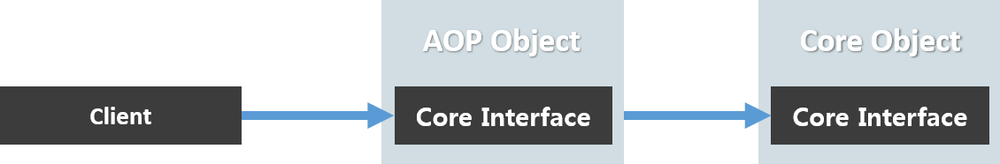

## AOP <span class="sub_header">(Aspect-Oriented Programming)</span>
> AOP는 ***관점 지향 프로그래밍***으로 **핵심 비즈니스 기능과 공통기능을 분리**하여 공통기능의 중복을 없애고 객체들간의 관계 복잡도를 줄이는데 사용된다  
> **위빙(Weaving)**을 통해 핵심기능에서 벗어난 공통기능을 정의하고 사용할 수 있다록 한다  

이렇게 해서 얻을 수 있는 이점을 크게 두가지이다  
```textbox
1. 요청으로 부터 핵심기능으로 접근하는 방법을 제어하기 위해
2. 핵심기능에 대해서 추가적인 기능을 주여해주기 위해
```

---
## Spring AOP
>Spring에서는 **Proxy**를 이용하여 AOP서비스를 제공한다  
>
**1. JDK 동적 프록시**
>>java 리플렉션을 이용하여 개체를 만드는 프록시
>
**2. CGLIB 프록시**
>> 바이트 코드를 조작하여 만드는 프록시
>
_예전에는 AOP를 위해 interface를 구현해야 했지만, Spring3.2부터 CGLIB가 Spring core에 포함되면서 필요없어 졌다_

  
AOP Object는 마치 자신인 핵심 Core Object처럼 꾸며서 흐름을 제어한다 

---
###Spring AOP를 사용하기 위한 주요 요건
- **Aspect <span class="sub_header">(@Aspect)</span>**
>공통 관심사를 모듈화 한 자바 클래스
- **Advice <span class="sub_header">(@Advice)</span>**
>무엇(What)이 실행될 것인지의 공통기능담은 구현체를 의미
- **Pointcut <span class="sub_header">(@Pointcut)</span>**
>어디에서(Where) Advice를 실행할 것인지를 정의

<br/>

###Advice  
>1. **Before** : 메서드 호출 이전  
>2. **After** : 메서드 호출 이후  
>3. **AfterReturning** : 메서드가 예외없이 실행된 이후  
>4. **AfterThrowing** : 메서드에 예외가 발생한 이후  
>5. **Around** : 메서드의 실행 전/후   

<br/>

###Pointcut

<div class="table-wrapper" markdown="block">

Pointcut|Joinpoints
-----|-----
execution(public * *(..))|public 메소드 실행
execution(* set*(..))|이름이 set으로 시작하는 모든 메소드명 실행
|execution(* set*(..))|이름이 set으로 시작하는 모든 메소드명 실행|
|execution(* com.xyz.service.AccountService.*(..))|AccountService 인터페이스의 모든 메소드 실행|
|execution(* com.xyz.service.\*.\*(..))|service 패키지의 모든 메소드 실행|
|execution(* com.xyz.service..\*.\*(..))|service 패키지와 하위 패키지의 모든 메소드 실행|
|within(com.xyz.service.*)|service 패키지 내의 모든 결합점 (클래스 포함)|
|within(com.xyz.service..*)|service 패키지 및 하위 패키지의 모든 결합점 (클래스 포함)|
|this(com.xyz.service.AccountService)|AccountService 인터페이스를 구현하는 프록시 개체의 모든 결합점|
|target(com.xyz.service.AccountService)|AccountService 인터페이스를 구현하는 대상 객체의 모든 결합점|
|args(java.io.Serializable)|하나의 파라미터를 갖고 전달된 인자가 Serializable인 모든 결합점|
|@target(org.springframework.transaction.annotation.Transactional)|대상 객체가 @Transactional 어노테이션을 갖는 모든 결합점|
|@within(org.springframework.transaction.annotation.Transactional)|대상 객체의 선언 타입이 @Transactional 어노테이션을 갖는 모든 결합점|
|@annotation(org.springframework.transaction.annotation.Transactional)|실행 메소드가 @Transactional 어노테이션을 갖는 모든 결합점|
|@args(com.xyz.security.Classified)|단일 파라미터를 받고, 전달된 인자 타입이 @Classified 어노테이션을 갖는 모든 결합점|
|bean(accountRepository)|“accountRepository” 빈|
|!bean(accountRepository)|“accountRepository” 빈을 제외한 모든 빈|
|bean(*)|모든 빈|
|bean(account*)|이름이 'account'로 시작되는 모든 빈|
|bean(*Repository)|이름이 “Repository”로 끝나는 모든 빈|
|bean(accounting/*)|이름이 “accounting/“로 시작하는 모든 빈|
|bean(*dataSource)  bean(*DataSource)|이름이 “dataSource” 나 “DataSource” 으로 끝나는 모든 빈|

</div>

<span class="sub_header">출처 : [얼청뚱땅 개발자 블로그](https://devjms.tistory.com/70)</span>

<br/>

###Simple Source

<br/>

***SpringBootApplication***
```java

@EnableAspectJAutoProxy //AOP 활성화
@SpringBootApplication
public class SpringBootTestApplication implements CommandLineRunner {
    ...
    public static void main(String[] args) {
        SpringApplication.run(SpringBootTestApplication.class, args);
    }
    
    @Override
    public void run(String... args) throws Exception {
        simpleSource.test();
    }
    ...
 }

```

<br/>


***AopClass***
```java
@Slf4j
@Aspect
@Component
public class AopTest {
    @Before("execution(* com.service.SimpleSource.test(..))")
    public void aopBefore(){
        log.info("aop before");
    }
}
```

<br/>

---
***Pointcut Recycle***

```java
@Aspect
@Component
public class AopTest {
    ...
    @Pointcut("execution(* *.*(..))")
    private void logging(){}
    
    @Around("logging()")
    public void aopAround(ProceedingJoinPoint joinPoint) throws Throwable {
        log.info("aop around");
        return joinPoint.proceed();
    }
    ...
}
```


<br/>

---
***Pointcut Exclude***

```java

@Service
public class SimpleSource {
    ...
    @NoLogging
    public void logNo(){
       ...
    }
    ...
}
-------------------------------------------------------
@Aspect
@Component
public class AopTest {
    ...
    
    @Pointcut("execution(* *.*(..)) && !@target(com.annotation.NoLogging)")
    private void logging(){}
    
    ...
}
```
*annotation을 구현해서 pointcut에 예외처리 지정하기*


