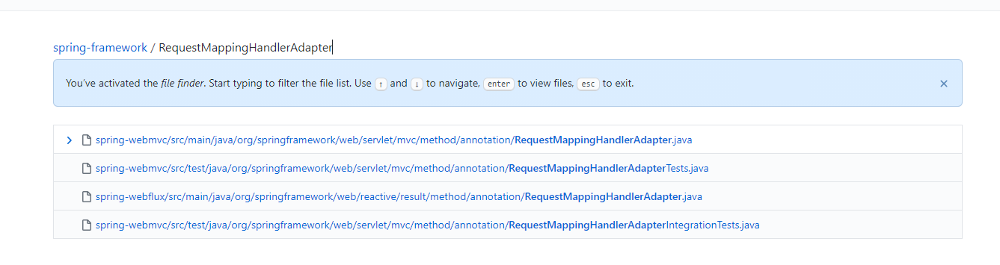

얼마전 회사에서 이상한 이야기를 들었습니다  
새로 들어온 직원이 Spring의 RestController에서 모델을 받을 때 `@ModelAttribute`를 사용해 본적이 없다는 이야기 였습니다 :thinking:  

그래서 이번 기회에 Spring에서 바뀐 모델 binding을 확인하려고 포스팅을 쓰게 되었습니다  


---

## 이전까지 내가 알던 Model Binding  
일단 제가 아는 Spring의 모델 바인딩은 다음과 같습니다  
1. model 앞에 `@ModelAttribute`를 어노테이션을 기입해야 한다  
2. request 모델을 기본 생성자를 가지고 있어야 한다  
3. request 모델의 binding은 `setter`를 통해 이루어 진다  

<br/>

먼저 `ModelAttribute`가 필요한지 부터 살펴보겠습니다  
매핑되는 데이터들의 리졸버들이 등록되는 [RequestMappingHandlerAdapter.class](https://github.com/spring-projects/spring-framework/blob/master/spring-webmvc/src/main/java/org/springframework/web/servlet/mvc/method/annotation/RequestMappingHandlerAdapter.java)를 살펴 보겠습니다


<span class='img_caption'>스프링의 RequestMappingHandlerAdapter</span>

위와 같이 같은 클래스명이 패키지로 나뉘어서 mvc와 webflux를 구분하여 구현되어 있고 데이터 바인딩도 각각 다른 클래스에서 이루어 집니다    

<br/>

---

<br/>

### MVC의 경우  
먼저 MVC는 RequestMappingHandlerAdapter 클래스 내부에서 리졸버들을 등록합니다  

```java

private List<HandlerMethodArgumentResolver> getDefaultArgumentResolvers() {
		List<HandlerMethodArgumentResolver> resolvers = new ArrayList<>();
		
		// Annotation-based argument resolution
		resolvers.add(new RequestParamMethodArgumentResolver(getBeanFactory(), false));
		resolvers.add(new RequestParamMapMethodArgumentResolver());    /* highlight-line */  
		resolvers.add(new PathVariableMethodArgumentResolver());
		resolvers.add(new PathVariableMapMethodArgumentResolver());
		resolvers.add(new MatrixVariableMethodArgumentResolver());
		resolvers.add(new MatrixVariableMapMethodArgumentResolver());
		resolvers.add(new ServletModelAttributeMethodProcessor(false));  /* highlight-line */  
		resolvers.add(new RequestResponseBodyMethodProcessor(getMessageConverters(), this.requestResponseBodyAdvice));
		resolvers.add(new RequestPartMethodArgumentResolver(getMessageConverters(), this.requestResponseBodyAdvice));
		resolvers.add(new RequestHeaderMethodArgumentResolver(getBeanFactory()));
		resolvers.add(new RequestHeaderMapMethodArgumentResolver());
		resolvers.add(new ServletCookieValueMethodArgumentResolver(getBeanFactory()));
		resolvers.add(new ExpressionValueMethodArgumentResolver(getBeanFactory()));
		resolvers.add(new SessionAttributeMethodArgumentResolver());
		resolvers.add(new RequestAttributeMethodArgumentResolver());

		// Type-based argument resolution
		resolvers.add(new ServletRequestMethodArgumentResolver());
		resolvers.add(new ServletResponseMethodArgumentResolver());
		resolvers.add(new HttpEntityMethodProcessor(getMessageConverters(), this.requestResponseBodyAdvice));
		resolvers.add(new RedirectAttributesMethodArgumentResolver());
		resolvers.add(new ModelMethodProcessor());
		resolvers.add(new MapMethodProcessor());
		resolvers.add(new ErrorsMethodArgumentResolver());
		resolvers.add(new SessionStatusMethodArgumentResolver());
		resolvers.add(new UriComponentsBuilderMethodArgumentResolver());

		// Custom arguments
		if (getCustomArgumentResolvers() != null) {
			resolvers.addAll(getCustomArgumentResolvers());
		}

        /* highlight-range{1-3} */  
		// Catch-all
		resolvers.add(new RequestParamMethodArgumentResolver(getBeanFactory(), true));
		resolvers.add(new ServletModelAttributeMethodProcessor(true));

		return resolvers;
}

```
다음과 같이 스프링에는 많은 리졸버들을 등록하여 데이터를 바인딩합니다  
여기서 살펴볼게 ServletModelAttributeMethodProcessor, RequestParamMethodArgumentResolver 입니다  

각각 위와 아래 객체를 2번을 생성해서 등록하고 있습니다  
// Catch-all 쪽에 선언된 객체들이 Controller에 어노테이션이 붙지 않았을때 catch해서 바인딩합니다  
때문에 `@ModelAttribute`이 붙지 않아도 정상적으로 데이터 바인딩이 이루어 집니다

<br/>  

때문에 딱히 @ModelAttribute를 붙일 필요없고 예전 책으로 배운사람들만 붙이는 느낌이.. :older_adult: :disappointed_relieved:  

<br/>

---

<br/>

### WEBFLUX의 경우  
RequestMappingHandlerAdapter의 ModelInitializer를 통해서 바인딩이 이루어 집니다  


```java

public class ServletModelAttributeMethodProcessor extends ModelAttributeMethodProcessor {
}

```
ServletModelAttributeMethodProcessor는 mvc에서 모델을 바인딩하는 


mvc -> ServletModelAttributeMethodProcessor, ModelAttributeMethodProcessor
webflux -> ModelInitializer, ModelAttributeMethodArgumentResolver


```java

public class ServletModelAttributeMethodProcessor extends ModelAttributeMethodProcessor {
}


public class ModelAttributeMethodProcessor implements HandlerMethodArgumentResolver, HandlerMethodReturnValueHandler {

......

    @Override
	@Nullable
	public final Object resolveArgument(MethodParameter parameter, @Nullable ModelAndViewContainer mavContainer,
			NativeWebRequest webRequest, @Nullable WebDataBinderFactory binderFactory) throws Exception {

		Assert.state(mavContainer != null, "ModelAttributeMethodProcessor requires ModelAndViewContainer");
		Assert.state(binderFactory != null, "ModelAttributeMethodProcessor requires WebDataBinderFactory");

		String name = ModelFactory.getNameForParameter(parameter);
		ModelAttribute ann = parameter.getParameterAnnotation(ModelAttribute.class);
		if (ann != null) {
			mavContainer.setBinding(name, ann.binding());
		}

		Object attribute = null;
		BindingResult bindingResult = null;

		if (mavContainer.containsAttribute(name)) {
			attribute = mavContainer.getModel().get(name);
		}
		else {
			// Create attribute instance
			try {
				attribute = createAttribute(name, parameter, binderFactory, webRequest);
			}
			catch (BindException ex) {
				if (isBindExceptionRequired(parameter)) {
					// No BindingResult parameter -> fail with BindException
					throw ex;
				}
				// Otherwise, expose null/empty value and associated BindingResult
				if (parameter.getParameterType() == Optional.class) {
					attribute = Optional.empty();
				}
				bindingResult = ex.getBindingResult();
			}
		}

		if (bindingResult == null) {
			// Bean property binding and validation;
			// skipped in case of binding failure on construction.
			WebDataBinder binder = binderFactory.createBinder(webRequest, attribute, name);
			if (binder.getTarget() != null) {
				if (!mavContainer.isBindingDisabled(name)) {
					bindRequestParameters(binder, webRequest);
				}
				validateIfApplicable(binder, parameter);
				if (binder.getBindingResult().hasErrors() && isBindExceptionRequired(binder, parameter)) {
					throw new BindException(binder.getBindingResult());
				}
			}
			// Value type adaptation, also covering java.util.Optional
			if (!parameter.getParameterType().isInstance(attribute)) {
				attribute = binder.convertIfNecessary(binder.getTarget(), parameter.getParameterType(), parameter);
			}
			bindingResult = binder.getBindingResult();
		}

		// Add resolved attribute and BindingResult at the end of the model
		Map<String, Object> bindingResultModel = bindingResult.getModel();
		mavContainer.removeAttributes(bindingResultModel);
		mavContainer.addAllAttributes(bindingResultModel);

		return attribute;
	}
	
......

}

```