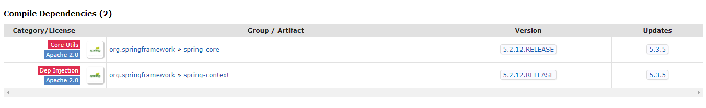

## Spring Boot 2.3.x 버젼 업그레이드 주의사항

해당 포스터는 회사에서 Spring Boot 버젼 업데이트를 진행한 경험을 바탕으로 작성하였습니다  
하나하나 모든 내용을 세세하게 작성하지 않고 문제가 발생한거 위주로 작성하였습니다 :sweat:

<br/>

---

<br/>

### Spring Boot 2.3.x의 Gradle 버젼

```text
Gradle 6.3+ (if you are building with Gradle). 5.6.x is also supported but in a deprecated form.  
```

기본적으로 6.3버젼 이상으로 Gradle을 올려주어야 합니다

---

<br/>

### Validation Starter 제외

Spring Boot에서 Compile Dependencies의 optional로 지정되던 것들이 많이 정리 되었습니다


<span class='img_caption'>Spring Boot 2.2.13.RELEASE</span>

<br/>


<span class='img_caption'>Spring Boot 2.3.8.RELEASE</span>

<br/>


Web과 WebFlux Starter의 Validation관련 디펜던시가 제외되었습니다  
그래서 다음과 같이 의존성을 추가해 주어야 합니다

```groovy
implementation ("org.springframework.boot:spring-boot-starter-validation")
```

---

<br/>

### lombok 버젼에 대한 사이드 이펙트

버젼이 올라가면서 [lombok v1.18.16](https://projectlombok.org/changelog)에 `mapstruct`대한 의존성이 분리되었습니다

```text
BREAKING CHANGE: mapstruct users should now add a dependency to lombok-mapstruct-binding.  
This solves compiling modules with lombok (and mapstruct).  
```

프로젝트 내에서 mapstruct를 사용하시면 추가적으로 다음 의존성을 기입해야 합니다

```groovy
annotationProcessor("org.projectlombok:lombok-mapstruct-binding:${lombokMapstructVersion}")  
```

---

<br/>

### QueryDsl AnnotationProcessor로 변경
기본적으로 이전에는 `com.ewerk.gradle.plugins.querydsl`  플러그인을 사용해서 querydsl의 설정을 해주었습니다  

그렇지만 해당 플러그인을 사용하므로 부과적인 script를 작성해야하고  
gradle 6.3 + multi module 환경에서 querydsl script가 제대로 작동하지 않는 문제가 있었습니다  

<br/>

그래서 gradle 4.x사용 가능한 annotationProcessor를 사용해서 깔끔하게 querydsl설정을 추가하였습니다  
```groovy
    // jdk 9 이상의 버젼에서 추가
    implementation("javax.annotation:javax.annotation-api:${annotationApiVersion}")
    annotationProcessor("javax.annotation:javax.annotation-api:${annotationApiVersion}")

    implementation("com.querydsl:querydsl-jpa:${querydslVersion}")
    annotationProcessor("com.querydsl:querydsl-apt:${querydslVersion}:jpa")
    testImplementation("com.querydsl:querydsl-jpa:${querydslVersion}")
    testAnnotationProcessor("com.querydsl:querydsl-apt:${querydslVersion}:jpa")
```
위의 설정으로 추가적인 script 작성없이 querydsl 잘 작동합니다    

<br/>  

추가적으로 intellij의 경우 build 설정에 따라서 QClass가 생성 경로가 달라집니다


<span class='img_caption'>Intellij Build Setting</span>

위의 Build and run using 설정에 따라서 QClass가 생성됩니다  
> Gradle : `build/generated/sources/annotationProcessor/java/main`  
> Intellij : `src/main/generated`  

문제는 Gradle 설정을 사용하지 않을 경우 build내의 생성되는게 아니여서 clean과 같은 작업에서 QClass가 삭제되지 않습니다  
그래서 아래 추가적으로 clean을 도와주는 script를 생성해 주어야 합니다  

```groovy

    // clean 태스크와 cleanGeneatedDir 태스크 중 취향에 따라서 선택하세요.
    /** clean 태스크 실행시 QClass 삭제 */
    clean {
        delete file('src/main/generated') // 인텔리제이 Annotation processor 생성물 생성위치
    }
    
    /**
     * 인텔리제이 Annotation processor 에 생성되는 'src/main/generated' 디렉터리 삭제
     */
    task cleanGeneatedDir(type: Delete) { // 인텔리제이 annotation processor 가 생성한 Q클래스가 clean 태스크로 삭제되는 게 불편하다면 둘 중에 하나를 선택 
        delete file('src/main/generated')
    }

```

때문에 일반적으로는 Gradle로 설정하여 사용하는 방법을 추천드리며 보다 자세한 QueryDsl 설정은 :point_right: [honeymon.io님의 블로그](http://honeymon.io/tech/2020/07/09/gradle-annotation-processor-with-querydsl.html)  

<br/>

부가적인 설정으로 intellij로 build 이후 계속해서 프로젝트에 <span class='red_font'>duplication class error</span>가 발생 할 수 있습니다  
실제로 프로젝트의 build를 살펴보면 다음과 같이 2개의 중복된 generated class가 생성된게 보입니다  


<span class='img_caption'>Querydsl Generated Class</span>  

<br/>

generated 패키지의 class는 intellij 툴 자체에서 build하며 쓸데없이 class를 생성해서 만들어 집니다  
때문에 아래와 같이 설정에서 auto build를 꺼주므로 duplication class가 생기는걸 방지 할 수 있습니다 :wrench:  

  

---

<br/>

### ActiveProfile의 변경  
테스트에서 많이 사용하던 ActiveProfile Annotation에 변화가 있었습니다  
:point_right: [Activating multiple profiles with @ActiveProfiles](https://github.com/spring-projects/spring-boot/wiki/Spring-Boot-2.3-Release-Notes#activating-multiple-profiles-with-activeprofiles)  

<br/>

이전에는 단일로 쓰던 `@ActiveProfile`이 배열로 여러 설정을 받을 수 있게 되었습니다  
덕분에 생각지도 못한 에러를 경험하였습니다  

```java
@ActiveProfile("test")
@SpringBootTest
class Test(){
 ...... 
}
```
테스트에서 어노테이션을 사용중에 서비스에서 Environment로 active profile을 가지고 오는 곳에서 에러가 발생했습니다  
아래와 같이 spring.profiles.active로 가지고 오던 active profile 값을 가지고 올 수 없게 되었습니다
```java
environment.getProperty("spring.profiles.active") X
```

실제로 내부적으로 application.yml은 test의 property를 잘 읽어오지만 Environment 내에는 이전과 달리 배열 형식으로 들어가게 됩니다  
```java
environment.getProperty("spring.profiles.active") -> null
environment.getProperty("spring.profiles") -> test
environment.getProperty("spring.profiles.active[0]") -> test
```

<br/>

그래서 정상적인 동작을 위해 수정이 필요합니다   
1. 내부적으로 environment.getProperty("spring.profiles.active")을 사용하는 로직을 수정한다  
2. environment.getProperty("spring.profiles")로 정의부 프로파일을 가져온다  
3. @ActiveProfile을 제거하고 test task에서 `spring.profiles.active를 test로 강제한다`   
```groovy
    test {
        useJUnitPlatform()
        systemProperty "spring.profiles.active", "test"
    }
```

<br/>

추가적으로 이후 [spring boot 2.4.x](https://spring.io/blog/2020/08/14/config-file-processing-in-spring-boot-2-4)에서는 spring.profiles에 많은 부분이 변경됩니다  

1. `spring.profiles.active` :point_right: `spring.config.activate.on-profile`  
2. New feature `spring.profiles.group`  

등등 계속해서 변경되고 추가되는 기능으로 Spring Release Notes에 관심을 기울여 분기에 한번씩은 살펴 봐야 겠습니다 :smiley:  
